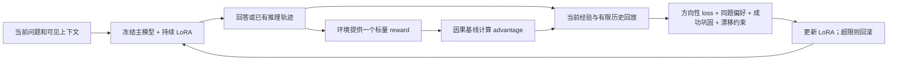

# CL：经验学习实验与从零复现

整理时间：2026-09-24T10:10:56.794237+00:00。本文件是本项目实验说明的统一入口。历史说明全文在末尾按原路径归档；旧报告中的“正在运行”“尚未启动”只代表当时状态，当前进度以本节与原始 JSON 为准。

本 Git 仓库只包含代码、实验说明、环境版本和重跑配方，不提交模型权重、训练数据、原始轨迹、运行结果或本机凭据。历史实验结论保留在本文；clone 不会恢复旧 checkpoint 或原始分数。

## 1. 研究目标与目录

主线是冻结 Qwen3-4B-Instruct-2507 执行模型，训练经验生成器根据已完成的轨迹、反馈和旧经验生成可供后续任务使用的经验。早期 Online LoRA、Delta-Mem、SEAL、RAMP 也包含直接更新参数的路线，不应和外部经验生成器混称为同一种训练。

| 路径 | 内容 |
|---|---|
| `ttcl/` | 自有方法实现、启动器、分析和测试 |
| `results/` | 本地运行输出，Git 忽略；`ttcl/results` 由准备脚本建立兼容链接 |
| `data/` | 数据集、标注和下载缓存，Git 忽略 |
| `models/` | 底座、检索模型和实验权重，Git 忽略 |
| `current_work/` | CLBench、Delta-Mem、SEAL、GenericAgent、REEF、Reflexion、ExpeL 上游源码及模型 |
| `config/` / `scripts/` | 环境清单、上游版本、资产布局、下载、检查和重跑工具 |

`Delta-Mem` 上游方法与本项目的 `旧 Delta writer` 是不同对象。后者位于 `ttcl/results/experience_evolution/alfworld_delta_20260922/training/delta/adapter`。

## 2. 实验沿革与主要结论

| 阶段 / 实现目录 | 实验内容 | 已有结论与边界 |
|---|---|---|
| `online_lora` / `delta_mem` / `seal` | 原始轨迹参数更新、Delta-Mem 与 SEAL 迁移 | 协议、提示和更新预算不同；不能混合排名 |
| `ramp` / `reward_policy` | reward 直接驱动参数更新、观测及反馈记忆消融 | 匹配实验中外部记忆有收益，尚未证明参数更新的额外收益 |
| `generic_agent` / `icl` / `llm_memory` | 原生工具、自主记忆、全历史和通用摘要 | 冻结模型基线与多种经验呈现方式；保留全部负结果 |
| `structured_memory` | 结构化经验、任务针对性经验和反馈可见性 | 更详细或更聚焦的经验不一定更有效，存在错误规则与负迁移 |
| `memory_writer` | SGD／合成数据 SFT、效用 DPO 和打乱标签对照 | 合成记忆任务有改善；BSM 没有相应提升 |
| `openrouter_memory` | GPT-6 同时执行及总结经验 | 不同 actor 与轨迹，不能单独归因于 writer 能力 |
| `experience_training` | 以后续任务收益筛选经验，utility SFT 与随机候选对照 | 只有 8 条训练标签，队列主题集中；未建立稳定收益 |
| `experience_diagnostic` | 同历史的数据库／队列经验诊断及动作关联补充 | 观察到证据误读、适用范围错误；补充动作参数有正向信号，小样本探索 |
| `experience_evolution` | ALFWorld Delta / Absolute RL；跨任务迁移 | 首轮 ALFWorld Delta 与未训练生成器均 12/48；训练增益未确立 |
| `experience_v2` | 同类任务课程、K1 / K2、两个训练种子 | 新独立 ALFWorld：旧 Delta 13/72，未训练 15/72，K2-924 17/72；尚不稳定 |
| `experience_feedback` | 七组逐任务公开 reward 反馈评估 | 3500 条全部结束；扑克旧 Delta 有正均值收益，但受大收益事件影响 |
| `reflexion_expel` | Reflexion、仅重试、ExpeL、无经验 | 1600 条全部结束；重试预算与在线更新协议须单独比较 |
| `reef` | REEF 原生 GEPA 的本地 CLBench 适配 | 小样本、部分任务失败；不是全部 REEF 方法或完整复现 |
| `experience_repair` | 32 历史固定经验诊断 + 两个 SFT + 新任务评估 | 已完成；校正文本有小幅优势，但训练后未显示泛化增益 |
| `experience_design` | 128 条多域数据 + 三种 reward + 连续更新评估 | 训练全部完成，评估状态见下一节 |

### 2.1 2026-09-23 七组反馈评估与基线

完整七组共同可评分、排除每个种子的首条空经验记录。频谱 178、扑克 238、数据库 37、队列 37 个配对。不同任务 reward 量纲不同，不求跨域总均分。

| 方法 | 频谱 | 扑克 | 数据库 | 队列 |
|---|---:|---:|---:|---:|
| 无经验 | 0.219544 | 0.359244 | 0.046849 | -0.018174 |
| 未训练生成器 | 0.219544 | -0.834034 | 0.000000 | -0.021029 |
| 旧 Delta | 0.219533 | 1.220588 | 0.010811 | -0.050059 |
| 旧 Absolute | 0.219544 | -0.913866 | 0.000000 | -0.006292 |
| 新版 K1 | 0.219544 | -0.388655 | 0.005405 | -0.035237 |
| 新版 K2-923 | 0.219544 | 0.067227 | 0.019819 | -0.025947 |
| 新版 K2-924 | 0.219544 | -0.659664 | 0.030632 | -0.018254 |

Reflexion／ExpeL 按各任务后 80% 测试集和自身无经验对照计算。Reflexion 同题最多三次尝试，ExpeL 测试经验库冻结，因此不能直接与上表当成严格等预算比较。完整结果、全部方法同题对齐及 8 条不可计分记录见附录的 `combined_clbench_20260924/REPORT.md`。

### 2.2 32 段历史修复实验（已完成）

32 段 ALFWorld 训练历史，成功／失败各 16；每段 2 个另选同类训练任务 × 2 个种子 × 4 组，共 512 次执行。四组共享同一道目标题和种子；经验在执行探测任务前固定，不将第一个探测任务轨迹传给第二个。

| 条件 | 成功 / 执行 | 成功率 |
|---|---:|---:|
| 无经验 | 39/128 | 30.47% |
| 保留旧经验 | 49/128 | 38.28% |
| 旧 Delta 更新一次 | 50/128 | 39.06% |
| Codex 根据公开轨迹校正的经验 | 54/128 | 42.19% |

旧经验本身也是此前算法产物。49→50 是再更新一次的边际收益，不能否定 39→49 的已有经验价值。校正组为 Codex 编写的监督文本，不是模型自主学会的经验，也非独立人工盲审。

两个 32 样本 SFT 均完成。`valid_unseen` 的 12 个两题序列 × 2 个种子：无经验 4/24、旧 Delta 4/24、原始经验 SFT 5/24、校正 SFT 4/24。这一评估由模型在新任务后现场生成经验。校正文本的诊断优势尚未转化为已验证的训练收益。

### 2.3 128 条数据和 reward 改进实验

状态：`complete`；评估 **1288/1288 已全部结束**（2026-09-24 更新）。训练两组 SFT、三组 RL 均完成。

数据：48 ALFWorld、48 独立 SQLite、32 本地工具接口；更新类型为纠错 48、成功提取 32、保持 24、适用范围修订 24。48 个 ALF 输入源自 32 段独立历史及受控旧经验变体，不是 48 段独立轨迹。SQL／工具源历史是实际执行的脚本示范，不冒充模型自主发现。

两组 SFT 使用相同历史、旧 Delta 初始化和训练预算，分别学习原始生成文本与改进监督文本。三组 RL 从同一个改进 SFT 出发：

- Absolute：`mean(R_new)`。
- 相对空经验：`mean(R_new - R_empty)`。
- 相对旧经验：`mean(R_new - R_previous)`。

每个候选由两个后续训练任务、两个执行采样种子评分；每组 256 次 writer 动作、64 次优化、2048 次环境执行，总计 6144 次。执行模型冻结，KL 参考也冻结，零优势样本仍有 KL 项。三个 reward 的差异不等于理论最优策略一定不同。

评估七组：无经验、旧 Delta、原始 SFT、改进 SFT、三种 RL。ALF 使用修复实验同一保留测试划分，不声称是第二份全新测试集。SQL／工具每条链 A×4→B×3→A×3，每个任务后根据实际轨迹更新经验，检查长期更新和返回旧环境时的保持能力。这些合成环境是机制测试，不是 CLBench 数据库成绩。

最终共同配对结果（排除每条合成任务链首题；ALF 仅计目标任务）：

| 方法 | ALFWorld 成功 | 合成 SQL 成功 | 合成工具成功 |
|---|---:|---:|---:|
| 无经验 | 2/24 | 0/72 | 72/72 |
| 旧 Delta | 2/24 | 0/72 | 72/72 |
| 原始经验 SFT | 3/24 | 0/72 | 71/72 |
| 改进监督 SFT | 4/24 | 0/72 | 71/72 |
| 改进 SFT → 绝对奖励 RL | 3/24 | 0/72 | 72/72 |
| 改进 SFT → 相对无经验奖励 RL | 3/24 | 0/72 | 72/72 |
| 改进 SFT → 相对旧经验奖励 RL | 4/24 | 2/72 | 72/72 |

新 checkpoint 尚未进行 CLBench 评估。SQL 接近全失败、工具接近满分，限制了该轮机制测试的区分能力；小样本 ALF 优势不能据此称为稳定提升。

### 2.4 ALFWorld：Delta、Reflexion、ExpeL 同条件扩展评估

2026-09-24 新增评估，入口 `ttcl.alfworld_comparison.run`，当前恢复目录 `ttcl/results/alfworld_comparison/20260924_parserfix`。状态以该目录的 `status.json`、`evaluation_status.json` 和 `summary.json` 为准。原 `20260924` 目录保留首次运行故障：单链训练题预检通过后，正式三链并发初始化触发 TextWorld 共享 TatSu 解析器冲突，正式完整记录与回合均为 0。修复只对环境创建、重置、执行和关闭加进程内锁，模型请求仍并行；加入六类训练题的三线程环境回归。恢复时逐项断言原测试题顺序、种子、方法、模型及预算一致，原样复用通过哈希校验的 20 条 ExpeL 规则与 43 个成功示例，不重新生成经验库。原故障日志和冻结哈希不修改。

使用官方 **全部 134 个 valid_unseen 任务 × 3 个采样种子**。审计覆盖旧 Delta、V2、32 历史修复和多域改进的训练、筛选、校准及训练探测清单：451 个历史任务均在 train，测试任务与其路径、完整文件 SHA256、规范化完整 PDDL 场景及目标均无交集。此前评估或保留过 114 个测试任务；另有 20 个从未用于旧评估，单列结果。这 20 个任务的类型不均衡，不单独宣称覆盖六类。

五组：仅重试、未训练生成器、旧 Delta、Reflexion、ExpeL。每组每个种子完整覆盖 134 题，共 **2010 个方法／任务／种子单元**，最多 6030 次逻辑环境执行。每题最多三次尝试，每次最多 50 个动作，成功立即停止。所有组共用冻结 Qwen3-4B、同一可用动作接口、同一任务重置、同一采样种子、相同动作与上下文预算。仅重试组的首次尝试同时提供无经验单次对照。额外模型调用和实际环境执行成本分别记录。

Delta 与未训练生成器使用同一原始 writer 提示；前者仅 writer 加载旧 Delta LoRA，执行模型始终不加适配器。每次完成的轨迹可更新自身经验，包括失败后重试之前。Reflexion 复用官方 ALFWorld 反思提示，仅保留同题失败反思，换题清空。ExpeL 用原始 Delta 训练中的 144 个任务、240 条公开执行／空经验基线轨迹离线提取规则，成功示例按任务类型与 all-mpnet-base-v2 相似度检索；测试开始前冻结规则和示例库，测试轨迹不进入该库。离线任务暴露相同不等于 writer 输入或离线计算预算完全相同。

报告首次成功率、三次内成功率、逐类型／逐种子结果、排除类型序列首题结果、20 题子集结果和按任务聚类的配对区间。首次成绩来自同一三次预算在线流程，此前任务可能已经重试，不能称为另一份独立单次预算实验。共享 actor 适配保留三种方法的经验机制差异，不声称原论文配置或分数复现。方法输出、失败和超预算记录均保留，不用未来成绩挑经验或检查点。

复现命令（先按第 4 节恢复底座、旧 Delta 和必要历史轨迹）：

```bash
python -m ttcl.alfworld_comparison.run prepare
python -m ttcl.alfworld_comparison.run launch
python -m ttcl.alfworld_comparison.run report
```

准备步骤生成并冻结 `split_manifest.json`、运行计划、源码、官方方法片段与适配器哈希。启动后先构建并冻结 ExpeL 经验库，再用独立训练题进行小型集成检查，最后执行正式测试。默认 GPU 3、端口 18267；新机器须在冻结计划前按资源调整配置。

### 2.5 独立探索：经后续任务确认的经验训练

2026-09-24 新建 `ttcl/experience_lab/`，不改写旧算法或旧运行。首轮循环目录为 `results/experience_lab/20260924_r01`；源码、计划、训练初始化和划分冻结，每轮产物放在 `round_001`、`round_002`。仅使用空闲 GPU 1、端口 18277，与 GPU 3 上的 ALFWorld 三次尝试对照独立。运行状态以该目录 JSON 为准，启动不表示已有正结果。

动机来自已有负结果：相对旧经验 RL 的 256 个候选中，138 个为零优势；ALFWorld 为正 19／负 28／零 49，工具为正 0／负 3／零 61。合成 SQL 的训练收益未迁移到真实 CLBench，因此这轮直接使用官方 CLBench 环境。候选奖励为同题同采样种子的官方 reward 差，另惩罚相对保留旧经验的负变化；不同领域的原始 reward 不混合求均值。

本轮预先限定两次训练—开发循环，每轮 80 段现场采集历史：48 个不同 ALFWorld source（六类各 8），以及四个 CLBench 领域各 8 次 source 执行。后者不是各 8 道独立题：数据库／队列各只有 2 道训练题，重复采样不扩大独立样本数。每段先完成 warmup 并用当前 writer 得到旧经验，再完成 source；ALFWorld 的 warmup、source 和两个 future probe 均不同，两个小 CLBench 训练池只能使用另一个任务作 probe。

同一 writer 输入生成三个候选：当前 writer 的 greedy／随机采样，以及底座按证据约束提示生成的候选；另加保留旧经验、空经验对照。最多两个后续训练任务、两个采样种子配对执行。只用第一种子选候选，第二种子确认其优于落选文本且不损害保留旧经验／空经验对照；无差异、缺失分数和未确认偏好不强造正标签。监督完全来自自动匹配的环境结果，并绑定完整公开 writer 输入摘要及原始来源哈希；不复用旧人工监督目标，不把模型自己判断的“好经验”直接当正确答案。

每轮对照 `filtered_sft`、`random_sft`、`dpo`：前两组使用相同已确认历史、初始化、领域均衡抽样、轮数和步数，分别学习胜出经验或预先固定随机选择的候选；DPO 使用同一经验对和冻结的初始化参考，附加较小的 chosen NLL 项，计算成本单列。所有组只训练 writer LoRA；actor 和底座权重不更新。第二轮使用新的 ALF source／probe 和新的采样种子，保留第一轮通过确认的训练对作 replay；单轮不足 12 对则跳过优化，记录信号不足。

ALF 开发集是在官方 train 内新留出的 48 个任务，排除历次训练、探测、校准和正式 valid_unseen，并按完整场景哈希去重；两轮新采集任务也与开发集互斥。CLBench 沿用 ExpeL 的前 20% 开发池，再拆训练／开发：频谱 12／6、扑克 16／8、数据库 2／2、队列 2／2；后 80% 仅用于最终确认。CLBench 的小开发池是已知限制，不能因为多个采样种子就声称验证样本很多。

每轮开发评估从空经验开始逐题在线更新，两个采样种子，包含无经验、未训练 writer、旧 Delta、三个新训练组；下一轮另加入现任候选对照。筛选门槛是 ALF 均值提升且两个种子均不退步，四个 CLBench 领域均不退步且至少一个提升。该门槛仅作开发筛选，不是显著性结论。循环结束后最多选择一版，使用全部 134 道 ALF valid_unseen、200 道 CLBench 后缀题和三个种子作一次最终确认，继续保留无经验／未训练／旧 Delta 对照，报告按任务聚类的配对区间。若开发门槛未通过，保留负结果，不宣称已取得双基准提升。正式测试不回流训练或检查点选择。

这里采用每题单次尝试，和 2.4 的每题最多三次尝试属于不同协议，不直接拼表比较。ALF 与 CLBench 正式题已有历史评估暴露，称为“训练隔离的确认评估”，不声称研究者从未见过。cohort 的终局标量供 writer 使用，延续本仓库 reward-visible 协议。

方法参考：[SEAL](https://arxiv.org/abs/2506.10943) 用适应后的下游表现训练自编辑；本项目借鉴效用筛选，仍冻结执行模型。[Memory-R1](https://arxiv.org/abs/2508.19828) 学习 ADD／UPDATE／DELETE／NOOP；本轮把原样保留加入可获胜候选。[ExpeL](https://arxiv.org/abs/2308.10144) 从经历提取可复用经验；本轮另外训练 writer 参数，不声称复现论文结果。

```bash
python -m ttcl.experience_lab.run prepare --gpu 1 --port 18277
python -m ttcl.experience_lab.run launch
python -m ttcl.experience_lab.run status
```

模型和数据仍在 Git ignore 覆盖的资产目录中，探索代码及本说明可以 clone。

## 3. 统一统计与解释约定

- 以每轮明确的共同任务／种子交集计算配对差值；缺失分数不补零。
- 区分无经验、未训练生成器、已积累旧经验和本次更新；它们不是同一基线。
- 区分固定轨迹诊断与各组自行执行的在线序列；同题同种子不保证动作轨迹相同。
- 区分经验文本有效、训练带来额外收益、跨任务泛化和长期积累四个问题。
- 报告训练种子、执行采样种子、任务数量和重复次数；重复执行不是独立新任务。
- 不把暂时排序、少量成功差或训练奖励当成稳定效果；既有负结果保留。

## 4. 从 GitHub clone 后重新实验

### 4.1 仓库边界与准备

目标仓库为 `https://github.com/Boyu-Feng/cl`。`current_work/` 中原有 7 个 `.git` 已移除，源码作为普通文件随本仓库管理；保留上游 LICENSE 和来源版本 `config/upstreams.json`，不依赖子模块。此处的“移除 Git”只涉及嵌套版本库，不涉及服务器 SSH 权限或账户。

根目录的 `models/`、`data/`、`results/` 只提交 `.gitkeep`。所有旧资产路径也有独立 ignore 规则，因此原机器暂未迁移的文件、兼容符号链接均不会上传。运行中的旧实验可以继续使用原路径；不要为了整理目录中断任务。`scripts/prepare_workspace.py --organize` 仅用于已明确允许本地迁移时将资产集中存放，不是 clone 后的必要步骤。

```bash
git clone https://github.com/Boyu-Feng/cl.git
cd cl
python3 scripts/prepare_workspace.py
python3.12 -m venv ttcl/.runtime/alf_delta_env
source ttcl/.runtime/alf_delta_env/bin/activate
python -m pip install -r config/environments/requirements-alf_delta.txt
python -m pip install --no-deps --target ttcl/.runtime/structured_memory_deps \
  -r config/environments/requirements-structured-memory.txt
export TTCL_WORKSPACE="$PWD"
export TTCL_PYTHON="$PWD/ttcl/.runtime/alf_delta_env/bin/python"
export ALFWORLD_DATA="$PWD/data/ttcl/alfworld_delta"
export PYTHONPATH="$PWD:$PWD/current_work/continual-learning-bench"
```

以上主线采用 Python 3.12。旧 CLBench 通用 CLI 和部分 Delta-Mem 原生入口使用 Python 3.13，各自依赖在 `config/environments/`，不应混装到同一环境。需要与 PyTorch/vLLM 匹配的 NVIDIA 驱动。完整版本表来自原环境，不代表目标服务器已经安装验证。若新服务器不能访问软件源/Hugging Face/GitHub，需要由可联网机器下载相应安装包和公开资源；只 clone 代码不会消除这些外部依赖。

### 4.2 下载权重与数据

```bash
# 只下载公开的基础模型和任务数据，不下载任何私有历史结果
python scripts/fetch_assets.py base alfworld locomo
# 要跑 CLBench 或 ExpeL 时再准备
python scripts/fetch_assets.py clbench-data embedding
```

资源来源：

| 资源 | 来源 / 本地位置 |
|---|---|
| Qwen3-4B-Instruct-2507 | Hugging Face `Qwen/Qwen3-4B-Instruct-2507` → `models/delta_mem/Qwen3-4B-Instruct-2507` |
| ALFWorld | 官方 0.4.2 release 的 `json_2.1.3_tw-pddl.zip` → `data/ttcl/alfworld_delta`，内部任务路径为 `json_2.1.1` |
| LoCoMo | `snap-research/locomo` 的 `data/locomo10.json` → `data/delta_mem/data/locomo10.json` |
| CLBench | `config/upstreams.json` 记录版本的公开 `data/`；大型数据库还需官方 `clbench setup database_exploration` |
| ExpeL 检索模型 | Hugging Face `sentence-transformers/all-mpnet-base-v2` → `models/embedding/all-mpnet-base-v2` |
| 历史 Delta / Absolute / SFT / RL checkpoint | 不上传、不作为公开基础模型下载；按后续顺序重新训练 |
| 32 条修复实验监督目标 | 不上传；在新的真实轨迹上重新审核，写入 `data/annotations/experience_repair_reviewed.json` |

原始 SEAL / Delta-Mem 训练权重也不上传；其重训配方保留在相应上游源码和本文历史说明中。获取某个公开底座并不等于恢复这些已训练权重。

REEF 与 Reflexion 有 4 个未随上游根仓库提供的可选依赖，原始 URL 和 commit 已记录。需要对应功能时使用：

```bash
python scripts/fetch_upstream_dependency.py reef third_party/reef-client
# 其他可用 repository/path 组合见 config/upstreams.json
```

该脚本检出固定版本、复制源码并去掉临时 `.git`，不会在本仓库创建 gitlink。GenericAgent Desktop 2.0 的 dist 是上游唯一附带的桌面运行资产，并非本机缓存，连同第三方声明保留；ExpeL 的 `models/` 是 Python 源码，不能按名字误删。

### 4.3 从零训练依赖顺序

```text
公开底座 + ALFWorld
  → experience_evolution：初始 Delta / Absolute
  → experience_v2：课程筛选、continued_k1、K2
      ├→ experience_feedback：七组 CLBench 反馈评估
      └→ 新轨迹选择、逐条重新审核监督目标
           → experience_repair：固定经验诊断、SFT、新任务评估
           → experience_design：128 条多域数据、三种 reward RL、连续更新评估
```

最早阶段可从空结果目录启动。下面沿用代码中的默认实验目录名以便后续阶段定位；日期目录名是实验标识，不表示重跑发生在该日期。

```bash
python -m ttcl.experience_evolution.run prepare \
  --data "$PWD/data/ttcl/alfworld_delta" \
  --root "$PWD/ttcl/results/experience_evolution/alfworld_delta_20260922"

# 单独终端运行冻结 actor 服务；GPU 编号按新服务器资源调整
CUDA_VISIBLE_DEVICES=0 python -m vllm.entrypoints.openai.api_server \
  --model "$PWD/models/delta_mem/Qwen3-4B-Instruct-2507" \
  --served-model-name frozen-actor --host 127.0.0.1 --port 18197 \
  --dtype bfloat16 --max-model-len 32768 --gpu-memory-utilization .88 \
  --max-num-seqs 16 --enable-prefix-caching --enforce-eager --disable-log-requests
```

服务启动后，在另一个已激活同环境的终端依次执行：

```bash
TASK_RUN="$PWD/ttcl/results/experience_evolution/alfworld_delta_20260922"
python -m ttcl.experience_evolution.run calibrate --root "$TASK_RUN"
python -m ttcl.experience_evolution.freeze
CUDA_VISIBLE_DEVICES=1 python -m ttcl.experience_evolution.run train --root "$TASK_RUN" --arm delta
CUDA_VISIBLE_DEVICES=1 python -m ttcl.experience_evolution.run train --root "$TASK_RUN" --arm absolute
# 五组均需执行；不要按中途结果选组或挑 checkpoint
for arm in none untrained delta absolute delta_reset; do
  CUDA_VISIBLE_DEVICES=1 python -m ttcl.experience_evolution.run evaluate --root "$TASK_RUN" --arm "$arm"
done
python -m ttcl.experience_evolution.analyze --root "$TASK_RUN"
```

原 `experience_evolution.launch` 预设 GPU 0/2/3，且不负责启动 actor 服务；不要在只有两张卡的新服务器直接照搬。手动顺序入口可避免这个资源假设。后续各阶段 GPU/端口/预算记录在 prepare 生成的 plan 中，启动前应检查可用设备，冻结计划后再正式执行。

第二阶段从 `python -m ttcl.experience_v2.launch prepare` 开始，随后使用该模块的 `training` 命令完成新课程和 K1/K2；具体参数以 `--help` 为准。七组反馈和 Reflexion/ExpeL 的入口分别是 `ttcl.experience_feedback`、`ttcl.reflexion_expel`；其原协议全文保留在后面的原文索引。

### 4.4 新轨迹必须重新审核标注

修复实验不依赖 `/tmp/experience_repair_histories.json`。`annotations.py` 只保留通用加载、内容绑定检查和经验构造逻辑，真实 32 条监督目标存放在 ignored 的 `data/annotations/experience_repair_reviewed.json`；可用 `TTCL_REPAIR_ANNOTATIONS` 指定另一份审核文件。

新服务器的 agent 必须先从新训练轨迹选取历史，读取旧经验、公开动作、观察和 reward，再重新编写监督文本并计算规范输入摘要。不能只因历史 ID 同为 `h00` 就复用旧目标。校验器会拒绝输入内容与已审核摘要不一致的目标；不要通过删掉校验绕过重新审核。标注文件的实际 schema 和构造规则以 `ttcl/experience_repair/annotations.py` 为准。

审核完成后才运行 `experience_repair.run prepare/supervise`，再运行 `experience_design.run prepare/supervise`。后者的 SQL/工具 80 条数据由执行代码生成；ALF 的 48 个输入仍依赖已审核的修复历史，不能凭空重建。历史正文里的分数是原机结果，不应作为新服务器重跑分数填入报告。

### 4.5 上传和检查

```bash
# 检查本地暂存内容，不应出现模型、数据、运行结果、凭据或子模块
python3 scripts/check_repository.py
# 不需要下载模型的路径与纯逻辑检查；缺历史数据的集成测试会明确跳过
python -m unittest discover -s scripts -p 'test_*.py'
python -m unittest ttcl.experience_repair.test_run ttcl.experience_design.test_design
```

仅修改说明、代码和配方后正常 git add/commit/push。不要使用 `git add -f` 上传被忽略的资产或兼容链接，不需要 Git LFS。上游许可继续适用；移除旧 `.git` 不改变代码来源或许可证。

## 5. 历史实验原文索引

以下保存各轮原始设定、命令、参数、完整表格和限制。已失效的原机命令仅作历史记录；在新服务器先按第 4 节准备环境并重新实验。历史结果链接指向被 Git 忽略的本地资料，clone 后不一定存在。点击原路径跳到同一文档中的原文，避免跨多份报告查找。

- [memory_controller_research_report.md](#doc-001)
- [ttcl/README.md](#doc-002)
- [ttcl/delta_mem/README.md](#doc-003)
- [ttcl/docs/GENERAL_MEMORY_DESIGN_20260918.md](#doc-004)
- [ttcl/docs/LEGACY_METHODS.md](#doc-005)
- [ttcl/experience_diagnostic/PROTOCOL.md](#doc-006)
- [ttcl/experience_evolution/PROTOCOL.md](#doc-007)
- [ttcl/experience_training/PROTOCOL.md](#doc-008)
- [ttcl/generic_agent/README.md](#doc-009)
- [ttcl/icl/README.md](#doc-010)
- [ttcl/llm_memory/README.md](#doc-011)
- [ttcl/memory_writer/README.md](#doc-012)
- [ttcl/memory_writer/UTILITY_EXPERIMENT.md](#doc-013)
- [ttcl/online_lora/README.md](#doc-014)
- [ttcl/openrouter_memory/README.md](#doc-015)
- [ttcl/ramp/RAMP_EXPERIMENTS.md](#doc-016)
- [ttcl/ramp/REWARD_MEMORY.md](#doc-017)
- [ttcl/reef/README.md](#doc-018)
- [ttcl/results/RAMP_FINDINGS_20260917.md](#doc-019)
- [ttcl/results/combined_clbench_20260924/REPORT.md](#doc-020)
- [ttcl/results/experience_comparison_20260922/REPORT.md](#doc-021)
- [ttcl/results/experience_design/20260924/PROTOCOL.md](#doc-022)
- [ttcl/results/experience_design/20260924/REPORT.md](#doc-023)
- [ttcl/results/experience_diagnostic/fixed_history_20260922/AUDIT_NOTES.md](#doc-024)
- [ttcl/results/experience_diagnostic/fixed_history_20260922/INTERPRETATION.md](#doc-025)
- [ttcl/results/experience_diagnostic/fixed_history_20260922/PROTOCOL.md](#doc-026)
- [ttcl/results/experience_diagnostic/fixed_history_20260922/REPORT.md](#doc-027)
- [ttcl/results/experience_diagnostic/fixed_history_20260922/supplement_raw_actions/PROTOCOL.md](#doc-028)
- [ttcl/results/experience_evolution/alfworld_delta_20260922/REPORT.md](#doc-029)
- [ttcl/results/experience_evolution/alfworld_delta_20260922/REPRODUCE.md](#doc-030)
- [ttcl/results/experience_evolution/clbench_transfer_20260922/PROTOCOL.md](#doc-031)
- [ttcl/results/experience_evolution/clbench_transfer_20260922/REPORT.md](#doc-032)
- [ttcl/results/experience_feedback/20260923/PROTOCOL.md](#doc-033)
- [ttcl/results/experience_feedback/20260923/README.md](#doc-034)
- [ttcl/results/experience_feedback/20260923/feedback_transfer/REPORT.md](#doc-035)
- [ttcl/results/experience_feedback/20260923/smoke/REPORT.md](#doc-036)
- [ttcl/results/experience_repair/20260924/PROTOCOL.md](#doc-037)
- [ttcl/results/experience_repair/20260924/REPORT.md](#doc-038)
- [ttcl/results/experience_training/next_reward_sft_20260921/PROTOCOL.md](#doc-039)
- [ttcl/results/experience_training/next_reward_sft_20260921/REPORT.md](#doc-040)
- [ttcl/results/experience_v2/20260923/PROTOCOL.md](#doc-041)
- [ttcl/results/experience_v2/20260923/REPORT.md](#doc-042)
- [ttcl/results/experience_v2/20260923/frozen_transfer/REPORT.md](#doc-043)
- [ttcl/results/experience_v2/20260923/improved_transfer/REPORT.md](#doc-044)
- [ttcl/results/generic_agent/comparison_20260917/report.md](#doc-045)
- [ttcl/results/icl/qwen3_full_history_12_20260918/report.md](#doc-046)
- [ttcl/results/llm_memory/qwen3_generic_12_20260918/report.md](#doc-047)
- [ttcl/results/memory_writer/sgd_mixed_sft_20260918/ANALYSIS_20260920.md](#doc-048)
- [ttcl/results/memory_writer/sgd_mixed_sft_20260918/RESULT.md](#doc-049)
- [ttcl/results/memory_writer/utility_stage2_20260920/RESULT.md](#doc-050)
- [ttcl/results/openrouter_memory/gpt6_bank_20260921/PROTOCOL.md](#doc-051)
- [ttcl/results/openrouter_memory/gpt6_bank_20260921/REPORT.md](#doc-052)
- [ttcl/results/ramp_experiments_backtrack_pilot_20260917/report.md](#doc-053)
- [ttcl/results/ramp_experiments_full_sampling_20260917/report.md](#doc-054)
- [ttcl/results/ramp_experiments_mutation_pilot_20260917/report.md](#doc-055)
- [ttcl/results/ramp_experiments_pilot_20260917/report.md](#doc-056)
- [ttcl/results/ramp_experiments_selection_pilot_20260917/report.md](#doc-057)
- [ttcl/results/ramp_experiments_summary_retry_20260917/report.md](#doc-058)
- [ttcl/results/ramp_feedback_memory_pilot_20260917/report.md](#doc-059)
- [ttcl/results/reef/gepa_20260921/REPORT.md](#doc-060)
- [ttcl/results/reef/gepa_v2_20260921/REPORT.md](#doc-061)
- [ttcl/results/reef/gepa_v2_20260921/database_exploration/REPORT.md](#doc-062)
- [ttcl/results/reflexion_expel_clbench/20260923/PROTOCOL.md](#doc-063)
- [ttcl/results/reflexion_expel_clbench/20260923/REPORT.md](#doc-064)
- [ttcl/results/reflexion_expel_clbench/20260923/smoke/PROTOCOL.md](#doc-065)
- [ttcl/results/reflexion_expel_clbench/20260923/smoke/REPORT.md](#doc-066)
- [ttcl/results/seal_bsm_full_20260916/report.md](#doc-067)
- [ttcl/results/structured_memory/database_procedure_20260920/RESULT.md](#doc-068)
- [ttcl/results/structured_memory/database_procedure_20260920/database_exploration/RESULT.md](#doc-069)
- [ttcl/results/structured_memory/experience_ablation_20260920/FINDINGS.md](#doc-070)
- [ttcl/results/structured_memory/experience_ablation_20260920/RESULT.md](#doc-071)
- [ttcl/results/structured_memory/experience_ablation_20260920/cohort_studies/RESULT.md](#doc-072)
- [ttcl/results/structured_memory/experience_ablation_20260920/database_exploration/RESULT.md](#doc-073)
- [ttcl/results/structured_memory/experience_ablation_20260920/exploitable_poker/RESULT.md](#doc-074)
- [ttcl/results/structured_memory/llm_online_bank_20260920/PROTOCOL.md](#doc-075)
- [ttcl/results/structured_memory/llm_online_bank_20260920/REPORT.md](#doc-076)
- [ttcl/results/structured_memory/llm_online_bank_20260920_v2/PROTOCOL.md](#doc-077)
- [ttcl/results/structured_memory/llm_online_bank_20260920_v2/REPORT.md](#doc-078)
- [ttcl/results/structured_memory/python_multitask_20260920/RESULT.md](#doc-079)
- [ttcl/results/structured_memory/python_multitask_20260920_v2/RESULT.md](#doc-080)
- [ttcl/results/structured_memory/python_multitask_20260920_v2/exploitable_poker/RESULT.md](#doc-081)
- [ttcl/results/structured_memory/verified_experience_20260920/DIAGNOSTICS.md](#doc-082)
- [ttcl/results/structured_memory/verified_experience_20260920/PROTOCOL.md](#doc-083)
- [ttcl/results/structured_memory/verified_experience_20260920/REPORT.md](#doc-084)
- [ttcl/reward_policy/REWARD_POLICY.md](#doc-085)
- [ttcl/seal/README.md](#doc-086)
- [ttcl/structured_memory/README.md](#doc-087)

<a id="doc-001"></a>

## 原文：memory_controller_research_report.md

<details>
<summary>展开完整设置、结果与运行说明</summary>

# 可训练记忆控制器：面向大模型智能体的文本、潜空间与混合长期记忆

**研究报告 / proposal v0.1**  
**日期：2026-09-07**

## 摘要

本项目研究一个独立于大模型主体的“小型记忆控制器”（memory controller）。大模型负责理解问题、规划和执行任务；控制器负责从交互轨迹中判断哪些内容值得写入记忆、应当新增/合并/覆盖/保留版本/删除，如何处理实体和时间冲突，以及查询时使用纯文本记忆、latent memory 还是二者的组合。

核心假设是：长期记忆的瓶颈不只是存储容量，而是**记忆操作策略**。当前系统通常把一条轨迹直接放入向量库，或让一个强 LLM 用 prompt 生成摘要；这可以解决“能否找到相似文本”，但不能稳定解决“新信息是否真的覆盖旧信息”“同名实体是否被误合并”“旧流程是否仍适用”“一次错误经验是否会被反复复制”等问题。项目的目标是训练一个参数量较小、可审计、可迁移的控制器，把文本记忆的可解释性、latent memory 的容量和效率结合起来。

第一阶段论文主张不是“重新训练一个会记忆的大模型”，而是：**在相同的大模型、相同记忆预算和相同交互序列下，学习到的记忆控制策略能减少冲突和错误经验传播，并提高未来任务收益；混合记忆在准确性、成本和可审计性之间取得更好的 Pareto trade-off。**

## 1. 研究动机

### 1.1 企业智能体中的实际问题

以企业知识/流程助手为例，系统会持续接收会议纪要、工单、代码变更、客户信息和执行轨迹：

- “客户 A 的合同联系人是张三”后来变成李四；这是**状态更新**，不是简单地同时保留两条事实。
- 两位不同员工都叫“王伟”；这是**实体冲突**，不能只根据字符串相似度合并。
- “报销上限为 5000 元”来自旧制度，而新制度为 8000 元；这是**带生效时间和版本的规则覆盖**。
- 某次自动化脚本偶然成功，但前置条件特殊；如果直接存成“通用经验”，以后会造成**经验误迁移**。
- 文本摘要说“部署成功”，原始日志却显示回滚；这是**摘要与证据冲突**。
- 多条相似记忆占据上下文，真正的关键记忆反而无法被检索；这是**冗余和覆盖**问题。

在交互式系统里，错误经验会改变后续动作，后续动作又产生新的轨迹，因此错误可能被自我强化。2026 年的实证研究把这一现象称为 *experience-following*，并观察到 error propagation 和 misaligned experience replay；未来任务的评测结果可以作为存储经验的“免费质量标签”[How Memory Management Impacts LLM Agents](https://aclanthology.org/2026.acl-long.27/)。

### 1.2 为什么需要小型控制器

让每次记忆操作都调用大模型存在四个问题：

1. **成本和延迟**：每个会话都要抽取、归纳、查找冲突并重写记忆。
2. **决策不稳定**：同一条证据在不同 prompt、上下文顺序或模型温度下可能得到不同的更新结果。
3. **目标不一致**：摘要质量不等于未来任务收益；一个表述漂亮的总结可能丢失时间、来源和适用条件。
4. **难以优化离散操作**：ADD、UPDATE、SUPERSEDE、NOOP 等动作的正确性由未来任务决定，不能只用即时语言损失训练。

一个 0.3B–3B 的小模型或轻量模块可以承担结构化、重复且高频的决策；大模型只在真正需要复杂推理时读取被选出的记忆。这样既能训练控制器，又可以冻结主模型，清楚地测量“记忆管理”本身的贡献。

## 2. 问题定义

设第 `t` 次交互产生一个事件：

```text
e_t = (observation_t, action_t, reward_t, time_t, scope_t, provenance_t)
```

其中 `observation_t` 是观察，`action_t` 是动作，`reward_t` 是环境反馈，`time_t` 是时间，`scope_t` 是作用域（用户、团队、项目或组织），`provenance_t` 是来源和权限信息。第 `t` 时刻的记忆状态写成：

```text
M_t = (M_text_t, M_latent_t, G_entity_t)
```

- `M_text`：带证据、时间、来源和版本的文本事实/经验；
- `M_latent`：用于压缩、相似检索和快速策略调用的向量或 latent slots；
- `G_entity`：实体、别名、关系、作用域和有效时间的图结构。

小控制器 `C_phi` 接收新事件和当前候选记忆，输出写操作和查询路由：

```text
(write_operation_t, query_route_t) = C_phi(event_t, memory_{t-1})
```

其中 `write_operation_t` 是写操作，`query_route_t` 决定查询 text、latent 还是 hybrid。建议的操作集合为：

`ADD`、`MERGE`、`UPDATE`、`SUPERSEDE`、`VERSION`、`LINK`、`DELETE/DECAY`、`NOOP`、`ABSTAIN`。

策略大模型保持冻结，或只做极少量适配，使用控制器选出的上下文执行任务。训练目标可以直接写成一个可读的打分函数：

```text
总分 = 未来任务收益
     - λ_conflict × 冲突惩罚
     - λ_storage  × 存储成本
     - λ_latency  × 延迟成本
     - λ_forget   × 遗忘惩罚
```

训练时最大化“总分”。`λ_conflict`、`λ_storage`、`λ_latency` 和 `λ_forget` 是四个可调权重，用于控制准确性、安全性和成本之间的取舍。

这里的“正确记忆”不是简单地追求与新输入相似，而是追求在未来任务中产生更高的决策收益。

## 3. 记忆形态与现有方法

| 形态 | 代表方法 | 优势 | 主要缺陷 |
|---|---|---|---|
| 纯文本/向量记忆 | Mem0、A-MEM、Memory-R1 | 可读、可追溯、容易删除和版本化 | token 成本高；写入和摘要依赖 LLM；实体/时间冲突处理通常是启发式 |
| 参数化/latent 记忆 | MEMORYLLM、Larimar、M+ | 固定或较小存储，读取快，可连续写入 | 难以定位单一事实、精确覆盖和回滚；表示漂移，解释性弱 |
| 压缩记忆 | ICAE、Gist Tokens、xRAG、COCOM | 减少上下文和检索成本 | 压缩损失可能隐藏来源、否定词、时间和条件；通常没有显式冲突操作 |
| 混合记忆 | LatentMem、部分 graph-RAG/agent memory | 可将文本作为证据、latent 作为索引或经验缓存 | 文本和 latent 的一致性、更新顺序、失效和删除尚未形成统一训练目标 |

已有工作的启示：

- **Memory-R1** 已经把记忆管理建模为 ADD、UPDATE、DELETE、NOOP，并用 PPO/GRPO 根据最终问答结果训练 manager；它证明“学习记忆操作”是可行的，但研究重点仍是通用文本记忆的增删改查，不足以覆盖实体版本、来源冲突、latent-text 对齐和多步工具任务。[Memory-R1](https://aclanthology.org/2026.acl-long.583/)
- **A-MEM** 用 Zettelkasten 风格生成带关键词、标签和链接的动态笔记，并允许新记忆改变旧记忆的表示；它说明组织结构很重要，但主要是 agent-driven 的 LLM 流程，控制决策不一定是一个可独立训练、可衡量成本的小模块。[A-MEM](https://proceedings.neurips.cc/paper_files/paper/2025/hash/19909c36f51abc4856b4560aff3d36d6-Abstract-Conference.html)
- **MEMORYLLM** 在 Transformer latent space 中放置固定大小的可自更新 memory pool，并报告长期更新能力；它是参数化记忆的重要基线，但不天然提供事实级来源、实体 ID、时间区间和安全回滚。[MEMORYLLM](https://proceedings.mlr.press/v235/wang24s.html)
- **LatentMem** 将原始轨迹和由 memory composer 产生的 latent memory 用于多智能体系统；它与本项目的 latent 分支接近，但需要进一步研究小控制器如何判断经验的适用范围、冲突关系和何时不应抽象。[LatentMem](https://arxiv.org/abs/2602.03036)
- 最新综述将 agent memory 概括为 Storage（保存轨迹）、Reflection（精炼轨迹）和 Experience（抽象可迁移经验），并指出跨轨迹抽象和主动探索是下一步重点。[From Storage to Experience](https://aclanthology.org/2026.findings-acl.2069/)

## 4. 现有方法的关键缺口

### 4.1 “相似”不等于“应当合并”

向量检索只能回答“哪些内容语义相近”。它不能可靠区分：

- 同一实体的时间更新；
- 同名但不同实体；
- 同一规则的不同版本；
- 事实冲突和不同适用条件；
- 一次成功案例和可复用的程序性经验。

因此，检索器、记忆写入器、实体解析器和版本管理器不能完全由一个相似度分数替代。

### 4.2 覆盖通常是不可逆的

很多系统用“新摘要替换旧摘要”处理更新。一旦覆盖，系统无法回答“旧事实在什么时候仍然有效”“为什么发生更新”“新事实是否来自高权限来源”。企业场景应优先使用 `SUPERSEDE/VERSION`，而不是物理删除。

### 4.3 经验抽象容易产生负迁移

把完整轨迹总结成一句“遇到 X 就做 Y”会丢掉前置条件。看似正确的经验在新任务中可能误导 agent；这正是 misaligned replay。经验应保存适用条件、反例、支持次数、失败次数和证据链接，而不是只保存自然语言结论。

### 4.4 latent memory 缺乏事实级控制

latent memory 适合压缩和快速读取，但对“删除某个客户的过期电话”“保留两个同名实体”“撤销某条错误规则”不够可控。若没有文本锚点、槽位 ID、版本和 tombstone，latent 更新可能造成不可解释的干扰或灾难性覆盖。

### 4.5 评测常偏向问答，缺少持续更新协议

LoCoMo 评估约 600 轮、平均约 16K token 的长期对话，覆盖问答、事件总结和多模态对话；LongMemEval 覆盖信息抽取、多会话推理、时间推理、知识更新和拒答；MemoryAgentBench 则采用增量多轮交互，包含检索、测试时学习、长程理解和冲突解决。这些基准适合评估“记忆能否被使用”，但仍应增加严格的写入操作、版本保留、实体消歧和成本指标。[LoCoMo](https://aclanthology.org/2024.acl-long.747/)、[LongMemEval](https://arxiv.org/abs/2410.10813)、[MemoryAgentBench](https://arxiv.org/abs/2507.05257)

## 5. 拟研究方法：Trainable Hybrid Memory Controller（THMC）

### 5.1 总体架构

```text
交互轨迹/反馈
       │
       ▼
事件规范化器 ──► 实体-时间-作用域解析器
       │                         │
       └──────────────► 冲突分类器
                                  │
                                  ▼
                    记忆操作策略 Cφ（小模型）
              ┌──────────────┼──────────────┐
              ▼              ▼              ▼
      文本事实层/证据层   latent 经验层     实体版本图
              └──────────────┬──────────────┘
                             ▼
                    查询路由与可审计读取
                             ▼
                         大模型执行
```

### 5.2 三层记忆设计

**(1) Canonical Text/Evidence Layer。** 维护原子事实或程序性经验，每条记录包含：

```json
{
  "subject": "canonical_entity_id",
  "predicate": "contract_owner",
  "object": "Li_Si",
  "valid_time": "[2026-05-01, +inf)",
  "scope": "account_A",
  "source": "ticket_1842",
  "authority": 0.9,
  "support": 3,
  "failure": 0,
  "status": "active",
  "supersedes": ["memory_91"]
}
```

原始证据不被删除；摘要只作为派生视图。这样可以解释“为什么更新”、恢复被覆盖版本，并支持离线审计。

**(2) Latent Utility Layer。** 存储压缩后的情境、策略或跨轨迹经验。每个 latent slot 绑定到一个或多个文本证据 ID、实体集合和适用条件；更新使用 residual/delta 写入或门控合并，而不是无条件平均。查询时 latent 主要承担快速召回和策略先验，最终事实可回指文本层。

**(3) Entity-Version Graph。** 节点是规范化实体，边包括 `alias_of`、`same_as`、`related_to`、`supersedes`、`valid_during`。实体解析和时间解析先于事实合并，避免用字符串相似度直接覆盖。

### 5.3 控制器输出

控制器先对候选记忆对 `(event_t, memory_j)` 预测关系：

`duplicate`、`temporal_update`、`contradiction`、`scope_mismatch`、`entity_ambiguous`、`policy_revision`、`exception`、`unrelated`。

然后选择操作：

- `ADD`：没有相关记忆或证据不足；
- `MERGE`：同一事实的表达差异，且实体、作用域、时间一致；
- `UPDATE`：同一实体的当前状态变化；
- `SUPERSEDE/VERSION`：新规则替代旧规则，但保留历史；
- `LINK`：两个记忆相关但不能合并；
- `DECAY/DELETE`：低价值、过时或被验证错误的记忆；
- `NOOP/ABSTAIN`：不确定时不修改，转交大模型或保留待验证状态。

查询控制器输出 `text-only`、`latent-only`、`hybrid` 或 `abstain`，并给出每条记忆的证据和有效时间。

### 5.4 方法创新点（拟主张）

本项目的创新不在于单独提出一个新的向量库或新的摘要 prompt，而在于把“记忆是什么”和“记忆应该如何被操作”分离开来，并把操作策略作为可以独立训练和评测的对象。具体包括以下七点。

#### 创新点一：把记忆管理从“检索问题”提升为“受约束的决策问题”

现有 RAG 或 memory pipeline 通常隐含如下规则：找到相似内容，然后把它放入 prompt。我们的控制器显式做两次决策：

1. 新事件与已有记忆到底是什么关系；
2. 在这个关系下应该执行什么操作。

例如，“客户联系人从张三变为李四”应当得到 `SUPERSEDE(old_fact)`，而不是 `ADD(new_fact)`；“两个不同的王伟”应当得到 `LINK/ABSTAIN`，而不是 `MERGE`。这样可以直接评估操作准确率，而不必只看最终答案是否碰巧正确。

#### 创新点二：把文本层定义为事实锚点，把 latent 层定义为效用缓存

很多 hybrid memory 只是把文本和向量并列存储。本项目进一步规定两层的职责：

- 文本/证据层负责“什么事实成立、何时成立、来自哪里、被什么替代”；
- latent 层负责“什么经验值得快速召回、如何压缩跨轨迹模式、对当前任务是否有用”。

因此 latent 向量不被当作不可解释的唯一真相，而必须指向文本证据、实体集合和适用条件。删除或修正事实时，可以沿证据指针使相关 latent slot 失效；读取 latent 经验时，可以回查证据。这一设计同时解决了 latent memory 的效率问题和企业应用需要的审计/回滚问题。

#### 创新点三：引入带类型的记忆操作，而不是简单的覆盖或删除

控制器的动作不是一个无结构的“写入分数”，而是有语义的操作类型：`ADD`、`MERGE`、`UPDATE`、`SUPERSEDE`、`VERSION`、`LINK`、`DECAY` 和 `ABSTAIN`。不同操作对应不同安全约束：

- `MERGE` 必须满足实体、作用域和有效时间兼容；
- `UPDATE` 必须指向同一个规范实体；
- `SUPERSEDE` 必须保留旧版本和来源；
- `ABSTAIN` 允许系统在证据不足时不做不可逆修改。

这使系统可以分别测量“实体解析错了”“关系分类错了”和“操作选择错了”，而不是把所有错误混在最终问答分数中。

#### 创新点四：用未来任务收益训练记忆操作，而不是用摘要相似度训练

记忆写得像原文，并不代表它会帮助未来任务。我们使用后续任务的 reward 作为延迟监督，并对每条记忆做反事实比较：

```text
记忆贡献(memory_i)
  = 后续任务有 memory_i 时的收益
  - 后续任务移除 memory_i 时的收益
```

如果一次成功轨迹只在特殊前置条件下有效，它在其他任务中造成失败，控制器会学到降低其泛化权重；如果一个抽象规则持续提高未来任务收益，它会获得更高支持度。这比让强 LLM 主观判断“这条经验看起来是否重要”更接近真正的 continual learning 目标。

#### 创新点五：将“经验抽象”与“事实更新”分开

同一条轨迹同时包含事实、事件和策略经验。项目不把它们压成一条摘要，而是分成三种对象：

- **事实记忆**：谁、什么属性、何时、在哪个作用域成立；
- **事件记忆**：某次具体交互发生了什么；
- **程序性经验**：在什么前置条件下采取什么动作更可能成功。

只有跨多个轨迹、在相似条件下重复得到正向结果的模式，才允许升级为程序性经验；单次偶然成功保留为 episodic memory，并带有低泛化置信度。这样可降低“把一次成功当成通用规则”的负迁移。

#### 创新点六：为 text-latent 不一致设计显式生命周期

每条 latent memory 都有来源、支持度、失败度、最后验证时间和失效状态。文本事实发生版本替换或被后续任务证伪时，控制器执行：

```text
文本事实更新
    → 找到关联 latent slots
    → 重新打分或写入 delta
    → 低置信 slot 标记为 stale
    → 后续检索时降低权重或回到文本证据
```

这不是简单地“同时更新两个数据库”，而是一个可追踪的跨表示一致性协议，可专门评估 stale latent、错误回指和修正延迟。

#### 创新点七：小控制器与大模型解耦，支持跨 backbone 和低成本部署

大模型承担开放式推理，控制器承担高频、结构化的记忆决策。控制器的输入输出使用统一事件 schema 和 memory API，因此可以在一个 backbone 上训练，在另一个 backbone 上测试。论文可以报告控制器参数量、每次写入成本、大模型调用次数减少量、长期任务收益，以及更换大模型后的策略迁移能力。

综合来说，方法的核心新颖性可以概括为：

```text
结构化冲突判断
  + 可逆的版本化操作
  + text 证据锚点
  + latent 效用缓存
  + 未来收益信用分配
  + 小模型模块化部署
```

这六个部分必须在同一套实验中联合验证；只实现其中一个组件，难以证明对长期记忆的整体改进。

## 6. 训练方案

目标是尽量不依赖人工逐条标注，也不把一个强大 LLM 当成唯一裁判。

### 6.1 阶段 A：自监督表示学习

使用历史轨迹构造以下任务：

1. **实体对比学习**：同一实体的别名、跨会话提及拉近；同名不同作用域拉远。
2. **时间顺序学习**：预测两条事实的先后和有效区间关系。
3. **证据回指**：从摘要或 latent slot 恢复支持它的原始片段 ID。
4. **文本- latent 对齐**：从 latent 检索正确的文本证据，并用 cycle consistency 约束重构。
5. **经验条件抽取**：从多条成功/失败轨迹中学习“动作—前置条件—结果”结构。

### 6.2 阶段 B：自动构造冲突训练样本

不需要人工逐条筛选，可从原始轨迹自动生成：

- 精确事实更新：同一主体、同一属性、不同时间值；
- 同名实体：替换作用域或实体 ID；
- 规则版本：同一规则增加生效时间和版本号；
- 摘要冲突：让摘要丢失否定词、数字或条件；
- 错误经验：将低 reward 轨迹与高 reward 轨迹混合；
- latent 碰撞：选择近邻 embedding 但不同实体/作用域的记录。

这些样本用于预训练冲突分类器和操作策略；标签由构造过程自动产生，不需要人工或另一个 LLM 逐条决定答案。

### 6.3 阶段 C：基于未来收益的训练

对离散操作使用 policy gradient、GRPO/PPO 或 contextual bandit。关键是用**反事实记忆收益**分配信用：

```text
记忆贡献(memory_i)
  = 运行时保留 memory_i 的任务收益
  - 运行时移除 memory_i 的任务收益
```

并结合后续任务奖励，而非把“写得像摘要”作为目标。若某条记忆被检索后导致失败，则降低其质量分数；若某条记忆提高了未来任务成功率，则增加支持度。可使用 replay buffer、target controller 和 conservative update，避免一次偶然反馈覆盖长期策略。

### 6.4 阶段 D：混合记忆联合优化

固定文本层作为可审计锚点，先训练 latent encoder/router，再联合训练：

```text
总训练损失 = 任务损失
           + λ_entity × 实体/时间损失
           + λ_evidence × 文本- latent 证据对齐损失
           + λ_conflict × 冲突分类损失
           + λ_compression × 压缩损失
           + λ_cost × 存储与调用成本损失
```

训练目标是最小化“总训练损失”。每个 λ 是可调权重，用来控制相应目标的重要性。

建议把 `ABSTAIN` 作为显式动作；不确定时保留两个版本并要求检索时显示冲突，通常比错误覆盖更安全。

## 7. 实验设计

### 7.1 研究问题与假设

- **RQ1 / H1**：学习到的控制器是否比“直接追加 + 向量检索”减少错误经验传播并提高长期任务收益？
- **RQ2 / H2**：显式实体、时间和来源字段是否能显著提高冲突解决和实体消歧？
- **RQ3 / H3**：latent-only 在存储/延迟上更优，但 hybrid 在实体更新、版本恢复和可审计性上更优？
- **RQ4 / H4**：利用未来任务反馈做信用分配，是否比即时摘要损失更能提高经验迁移？
- **RQ5 / H5**：小控制器能否在更换大模型 backbone、用户或任务域后保持收益？

### 7.2 数据集与评测协议

**公开基准：**

1. **LoCoMo**：长对话、多会话事件、总结和多模态信息；测试长期事实和事件记忆。
2. **LongMemEval**：信息抽取、多会话推理、时间推理、知识更新和 abstention；重点测试更新和拒答。
3. **MemoryAgentBench**：增量多轮交互，包含检索、测试时学习、长程理解和冲突解决；适合检验“边交互边写入”。
4. **MemBench**：从 effectiveness、efficiency、capacity 等维度评估 agent memory；用于成本和容量对比。
5. **LoCoMo-Plus**：增加语义断开、隐含约束和认知记忆测试；用于检验不能靠表面字符串匹配的记忆。

**专门的冲突评测集：** 在上述对话或轨迹上增加一个 Conflict/Entity/Version split，至少包含：

- 同一实体属性多次更新；
- 同名实体和别名；
- 来源权限冲突；
- 过期流程与新流程并存；
- 摘要与原文矛盾；
- 成功但不可泛化的偶然轨迹；
- 恶意或低可信来源注入；
- 多个 latent 近邻发生碰撞。

训练、验证、测试必须按时间切分，避免将未来版本泄漏到写入器；测试查询按增量方式到达，而不是一次把全部历史塞进上下文。

### 7.3 Baseline

1. **No memory**：只使用当前上下文。
2. **Full history**：在上下文窗口允许时提供完整历史，作为上限参考。
3. **Raw RAG**：BM25、dense retrieval、hybrid retrieval，不做记忆整理。
4. **Heuristic text memory**：追加、相似合并、固定长度摘要、FIFO/时间衰减。
5. **LLM-managed memory**：Mem0、A-MEM 等公开实现或同等 prompt pipeline。
6. **Learned text manager**：Memory-R1 风格的 ADD/UPDATE/DELETE/NOOP。
7. **Latent baseline**：ICAE/Gist-style 压缩，或 MEMORYLLM/LatentMem 风格 latent memory。
8. **Proposed ablations**：text-only、latent-only、hybrid；去掉实体图、时间、来源、ABSTAIN、版本保留和未来反馈。

所有方法需要固定：大模型 backbone、最大记忆字节数、索引大小、top-k、写入调用次数、训练数据量和评测交互序列。否则 latent 的优势可能只是因为存储预算或调用次数不同。

### 7.4 指标

**任务效果**：最终成功率、累计 reward、regret、跨会话性能、前向/后向迁移。  
**记忆检索**：Recall@k、MRR、NDCG、正确证据回指率、stale-memory use rate。  
**冲突处理**：冲突检测 F1/AUROC、实体链接 F1、最新有效事实准确率、版本恢复准确率、误覆盖率、正确 abstention 率。  
**经验抽象**：规则 precision、适用条件召回率、反例识别率、跨任务迁移收益。  
**稳定性**：长期更新后的遗忘、冲突累积曲线、相同输入下操作一致性、错误经验传播深度。  
**成本**：记忆字节数、输入 token、写入/读取延迟、LLM 调用次数、GPU/CPU 成本。  
**可审计性**：证据覆盖率、来源覆盖率、时间字段完整率、回滚成功率。

### 7.5 必做消融

- 去掉时间字段：测量把更新误当矛盾的比例；
- 去掉 entity graph：测量同名实体误合并；
- 去掉来源/权限：测量低可信事实覆盖高可信事实；
- 禁止 `VERSION/SUPERSEDE`：测量不可逆覆盖；
- 禁止 `ABSTAIN`：测量不确定场景的错误写入；
- 去掉 latent-text evidence link：测量 latent 幻觉和不可追溯率；
- 只用即时 reward vs 使用未来反事实收益；
- 小模型规模 0.3B/1.5B/3B；
- 在线冻结控制器 vs 持续更新控制器；
- memory budget 从极小到充足，画准确率—成本 Pareto 曲线。

## 8. 实验安排（8 周）

| 周期 | 工作 | 产出 |
|---|---|---|
| 第 1 周 | 统一 LoCoMo、LongMemEval、MemoryAgentBench 的输入格式、actor、检索接口和日志格式；确定一个固定的大模型 backbone | 可运行评测脚本、统一数据协议 |
| 第 2 周 | 构造 Conflict/Entity/Version split；实现时间、来源、实体和版本的自动生成器 | 冲突评测集 v1、自动检查脚本 |
| 第 3 周 | 实现 no-memory、raw RAG、启发式 text memory 和 LLM-managed memory 基线 | 基线结果、错误案例库 |
| 第 4 周 | 训练 text-only 小型控制器：候选配对、冲突分类、ADD/MERGE/UPDATE/SUPERSEDE/ABSTAIN | text-only 主结果 |
| 第 5 周 | 加入反事实记忆移除和未来任务收益，训练操作策略；完成实体、时间、来源消融 | 记忆操作收益曲线、消融结果 |
| 第 6 周 | 加入 latent encoder、slot 更新和 text evidence pointer；实现 latent-only 与 hybrid router | latent/hybrid 初始结果、对齐指标 |
| 第 7 周 | 做存储预算、控制器规模、冲突类型、跨任务/跨 backbone 和 5-seed 重复实验 | 主结果表、成本—性能 Pareto 曲线 |
| 第 8 周 | 失败分析、统计检验、案例可视化、整理代码和配置、撰写论文/技术报告 | 完整报告、可复现实验包 |

8 周版本的取舍是：先完成可发表的 text controller 和冲突协议，再把 latent 作为轻量的 evidence-linked cache；不在第一轮同时训练大型参数化记忆模型。每个主实验至少 5 个随机种子，报告均值、置信区间和按交互时间的学习曲线，而不是只报告最终单点分数。

## 9. 风险与应对

**奖励稀疏/信用分配困难。** 使用反事实 memory ablation、短期代理指标和分层 replay；不要只用最终问答结果。  
**错误经验导致奖励投机。** 保留原始证据和失败轨迹；对“看似成功但后续失败”的经验降低支持度。  
**latent 不可解释或塌缩。** 强制 slot-to-text pointer、重构和检索对齐；把 latent 作为缓存而非唯一事实源。  
**实体解析错误。** 不确定时 `ABSTAIN`，保留候选实体，不做不可逆合并。  
**记忆无限增长。** 采用版本压缩、支持度/失败度衰减和容量约束，报告容量—性能曲线。  
**基准污染。** 按时间流式输入，不让 controller 看到测试答案；训练只使用自动生成标签和环境反馈，人工标签只用于独立评测。

## 10. 最小可行论文与长期扩展

### 最小可行版本

第一篇论文建议只做：

1. 小型 text memory controller；
2. 实体—时间—来源结构；
3. `ADD/MERGE/UPDATE/SUPERSEDE/ABSTAIN` 五类动作；
4. LoCoMo、LongMemEval、MemoryAgentBench；
5. 与 raw RAG、启发式 memory、LLM-managed memory、Memory-R1 风格 manager 比较；
6. latent 层先作为一个可插拔的 evidence-linked cache，不要一开始同时解决所有参数化记忆问题。

若第一阶段证明冲突和长期收益有效，再加入 latent slot 的联合训练。这样论文的因果链更清晰：先证明“控制器解决了记忆管理问题”，再证明“混合表示进一步改善成本和容量”。

### 预期贡献

- 一个明确区分事实、事件、程序性经验和 latent cache 的统一记忆模型；
- 一个可独立训练、可冻结大模型的记忆操作控制器；
- 面向覆盖、实体、时间、来源和经验迁移的冲突协议；
- text-only、latent-only、hybrid 在相同预算下的系统比较；
- 通过反事实未来收益训练，而不是只依赖人工摘要或强模型筛选。

## 11. 参考文献与基准

- Yan et al. (ACL 2026), [Memory-R1: Enhancing Large Language Model Agents to Manage and Utilize Memories via Reinforcement Learning](https://aclanthology.org/2026.acl-long.583/)
- Xu et al. (NeurIPS 2025), [A-Mem: Agentic Memory for LLM Agents](https://proceedings.neurips.cc/paper_files/paper/2025/hash/19909c36f51abc4856b4560aff3d36d6-Abstract-Conference.html)
- Wang et al. (ICML 2024), [MEMORYLLM: Towards Self-Updatable Large Language Models](https://proceedings.mlr.press/v235/wang24s.html)
- Li et al. (2026), [LatentMem: Customizing Latent Memory for Multi-Agent Systems](https://arxiv.org/abs/2602.03036)
- Xiong et al. (ACL 2026), [How Memory Management Impacts LLM Agents](https://aclanthology.org/2026.acl-long.27/)
- Luo et al. (Findings ACL 2026), [From Storage to Experience](https://aclanthology.org/2026.findings-acl.2069/)
- Maharana et al. (ACL 2024), [Evaluating Very Long-Term Conversational Memory of LLM Agents / LoCoMo](https://aclanthology.org/2024.acl-long.747/)
- Wu et al. (ICLR 2025), [LongMemEval](https://arxiv.org/abs/2410.10813)
- Wang et al. (ICLR 2026), [MemoryAgentBench](https://arxiv.org/abs/2507.05257)
- [MemBench: Towards More Comprehensive Evaluation on Memory of LLM-based Agents](https://arxiv.org/abs/2506.21605)


</details>

<a id="doc-002"></a>

## 原文：ttcl/README.md

<details>
<summary>展开完整设置、结果与运行说明</summary>

# TTCL 实验入口

每种方法有自己的目录、启动入口和测试。`common/` 放公共解析工具和冻结本地模型后端；既有 `results/` 保留原路径，便于追溯已有结果。

| 目录 | 方法 | 入口 |
|---|---|---|
| [generic_agent/](#doc-009) | GenericAgent 原生工具、自进化与记忆；本地 Qwen3 | `bash ttcl/generic_agent/run.sh` |
| [icl/](#doc-010) | 冻结 Qwen3，保留全部历史上下文 | `bash ttcl/icl/run.sh` |
| [structured_memory/](#doc-087) | 多场景 Python 结构化经验，冻结 Qwen3 与逐样本独立对照 | `bash ttcl/structured_memory/run.sh --root <新结果目录>` |
| [llm_memory/](#doc-011) | Qwen3 生成通用经验摘要，可选已有 reward | `bash ttcl/llm_memory/run.sh` |
| [memory_writer/](#doc-012) | 通用结构化记忆写入器 LoRA；后台训练与评测 | `bash ttcl/memory_writer/run.sh` |
| [ramp/](#doc-017) | 自己的 RAMP reward 学习及记忆消融 | `python ttcl/ramp/run_reward_benchmark.py ...` |
| [seal/](#doc-086) | SEAL 材料生成与在线 LoRA | `bash ttcl/seal/run_seal_benchmark.sh` |
| [delta_mem/](#doc-003) | Delta-Mem | `bash ttcl/delta_mem/run_deltamem_background.sh` |
| [online_lora/](#doc-014) | 原始轨迹 Online LoRA | `python ttcl/online_lora/run_benchmark.py ...` |
| [reward_policy/](#doc-085) | Reward 策略梯度版本 | `bash ttcl/reward_policy/run_reward_policy_benchmark.sh` |
| [reef/](#doc-018) | REEF-GEPA 原生提示词优化；官方 CLBench 配对评测 | `ttcl/.runtime/reef_env/bin/python ttcl/reef/run_gepa.py --output <新结果目录>` |

GenericAgent 不导入 RAMP 的观测摘要、反馈记忆或参数训练代码。它使用 `current_work/GenericAgent` 原有实现，仅新增本地模型后端和基准输入输出适配。

记忆写入器的第二轮（补充数据适配 + 后续效用偏好/随机标签对照）使用独立入口 `bash ttcl/memory_writer/run_utility.sh --root <新结果目录>`，见 [实验定义](#doc-013)。

```bash
# 先验证相同前 12 条，分别逐样本独立运行和保留 GenericAgent 状态。
CUDA_VISIBLE_DEVICES=0 NUM_SCANS=12 bash ttcl/generic_agent/run.sh

# 完整 90 条。
CUDA_VISIBLE_DEVICES=0 NUM_SCANS=90 bash ttcl/generic_agent/run.sh

# 所有方法的 CPU 测试。
/home/fengboyu/miniconda3/envs/seal_env/bin/python -m unittest discover -s ttcl -t . -q
```

文件整理对应关系见 [MIGRATION.json](ttcl/docs/MIGRATION.json)。旧的根目录脚本已移动，命令请使用表中的新路径；已有实验快照和日志不改写。旧 `ga_bsm_runner.py` 已删除，因为它手工拼接历史评分且另写评分器，不代表 GenericAgent 原方法。


</details>

<a id="doc-003"></a>

## 原文：ttcl/delta_mem/README.md

<details>
<summary>展开完整设置、结果与运行说明</summary>

# Delta-Mem

`run_deltamem_benchmark.py` 调用 CLBench；`run_deltamem_standalone.py` 是旧的独立评估版本，两者都保留，不能混用其提示与得分口径。

启动：`bash ttcl/delta_mem/run_deltamem_background.sh`。
详细参数见 [原有方法说明](#doc-005)。


</details>

<a id="doc-004"></a>

## 原文：ttcl/docs/GENERAL_MEMORY_DESIGN_20260918.md

<details>
<summary>展开完整设置、结果与运行说明</summary>

# 通用结构化经验记忆：跨任务调研与训练方案

日期：2026-09-18。状态：本地源码、公开输入格式和数据结构调研，以及待验证设计；本轮没有训练新模型或运行其他任务的成绩实验。

## 已核查的共同结构

核查了六个任务的 README、任务代码、公开反馈模板；检查了数据库问题文本、代码任务的问题描述、销售数据面板字段及生成可见数据室的映射、五类 cohort 数据库的公开列元数据。没有把数据文件中的参考 SQL、参考补丁、未来销售量或 population ground truth 当作学习器输入。

| 任务 | 可积累的信息 | 需要的记忆操作 | 公开反馈与边界 |
|---|---|---|---|
| BSM | 多轮测量、对象是否可能持续存在、测量不确定性 | 提取、关联、累计、区分当前状态与长期假设 | 默认只确认报告已记录；外部 scalar reward 需作为独立增强协议 |
| Database exploration | 表与列、连接关系、编码/单位、有效查询过程、迁移后的变化 | 格式映射、保存可执行过程、纠错、按版本失效 | SQL 查询结果、正确/错误及错误时的正确答案；当前模板不展示参考 SQL |
| Sales prediction | 产品/地点/年份的观测、不同数据源的字段映射、预测残差、可复用分析代码 | 统一概念、追加数据、按时间维护估计、验证模型 | 展示已结算年份的实际值及误差；不能向学习器注入完整未来五年评分或实际值 |
| Codebase adaptation | 项目结构、函数关系、复现命令、测试命令、失败原因、验证过的操作 | 操作记忆、前置条件、验证状态、按仓库/版本隔离 | 命令输出与提交 PASSED/FAILED；数据集中的官方 patch/test_patch 不作为记忆输入 |
| Cohort studies | 变量语义、编码、量表差异、适用人群、样本偏差、跨研究统计证据 | 关联但保留差异、记录来源/适用范围、维护统计假设 | 工具查询及样本内拟合信息；提交只确认收件，不公开最终 population 分数 |
| Exploitable poker | 对手在不同可见条件下的行为、行动历史、摊牌信息及收益 | 条件统计、更新策略假设、按对手分离、变化与回归识别 | 对手行动、净筹码变化及实际发生的摊牌；不能直接读取隐藏对手策略 |

共同问题是：从零散、局部、可能带噪声的证据中维护可复用的状态与操作知识，并在环境变化时修订。不同任务并不共享固定的聚类算法或同一种数值 reward。

两个实际格式例子：销售数据室会用 quantity、units_sold、items_sold 表示销量；cohort 的公开 coding_notes 明确提醒 MoCA 与 MMSE 不等价，即使二者都是 0–30。通用模型既要会建立概念关联，也要学会保留不可合并的差异。映射值必须从当前公开数据与工具结果发现，不能预置整个 benchmark 的映射表。

## 当前方法缺少什么

规则摘要替模型完成了提取、实体匹配、统计聚合、累积保留和结构化呈现。LLM 摘要版只要求冻结 Qwen3 重写一段约 450 tokens 的文字，没有训练这些操作的能力。每轮替换还导致遗漏的旧事实难以恢复。

通用摘要的 12 条试验中，独立/摘要/摘要加 reward 均为 0.22245，三组结构化回答逐题相同。这个结果支持继续检查记忆质量，不能证明模型生成记忆永远无效。旧规则摘要的 0.27105 属于另一种方法，不能移用为通用方法成绩。

现有 BSM runner 每题一步。数据库、代码、销售、cohort、扑克都是多步任务；仅保存题目与最后回答会丢失重要工具证据。下一版应接入标准 `respond(query)` / `observe(observation)` 生命周期，记录公开中间 observation，在实例结束时进行跨实例记忆整理。实例边界不能简单等同于一次模型调用。

## 建议架构

1. 原始证据日志：追加存储每次公开输入、动作、工具结果及公开反馈，赋予稳定 event_id。大数据和脚本以持久化 artifact 引用保存，不能仅存下一轮将消失的数据室路径。默认不将 evaluator 的 InstanceOutcome/metadata 直接复制进模型输入。
2. 结构化记忆库：稳定条目 ID、类型、内容、来源、适用范围和状态。统一字段容纳不同领域概念，不预置 MHz 阈值、数据库字段对应关系或潜在类别数。
3. 模型写入器：根据新公开证据与相关旧条目，提出增量操作；输出显式来源与理由。旧条目没被本轮提及不等于应该删除。
4. 通用执行器：校验 JSON、ID、引用存在性、事件时间、版本、预算，再原子应用操作并保留修订日志。引用存在不代表语义正确；来源是否支持结论仍需要评估。
5. 读取与行动：根据当前问题选取相关事实、假设和操作，同时能取回原始证据；回答阶段记录读取的条目 ID。ID 是审计线索，不是因果贡献证明。

建议统一条目：

```json
{
  "id": "m_001",
  "kind": "fact | hypothesis | procedure",
  "subject": "由模型识别的对象或概念",
  "relation": "由模型识别的关系或操作",
  "value": "具体值、条件、步骤或 artifact 引用",
  "scope": {"context": "适用环境", "validity": "适用时间或版本"},
  "evidence_refs": ["episode_2/event_3"],
  "status": "observed | inferred | contradicted | superseded",
  "uncertainty": "具体不确定性与缺失证据"
}
```

这是概念示例，各枚举字段实际只能取一个值。程序分配条目 ID；内容和关系由模型提出。没有可见版本信息时保留未知，不能从隐藏 stage/variant 标签补出。

操作接口可包括 ADD、LINK、REVISE、ADD_PROCEDURE、MARK_STALE。LINK 不自动抹去原始观测，也不强制认为两个对象完全等价；实体合并应保留来源和可撤销记录。自报 confidence 不当作经过校准的概率。

需要精确统计时，可以让模型选择统计方法并生成 Python/SQL，执行器在受控环境中运行、保存输入引用和输出，再将结果作为派生证据。方法选择、对象对应和参数由模型生成；底层通用执行器负责计算。对于有选择偏差的样本，不能把简单合并平均当作通用正确方案。

记忆分为三类：事实记录可观测内容；假设记录解释与不确定性；操作记录在何种条件下做什么、如何验证。持久库与工作上下文分开计量，检索限制不能静默删除源证据。

## 如何训练模型获得这种能力

### 阶段 1：操作与证据能力的监督训练

先训练独立的记忆写入 LoRA，回答模型保持冻结，以便分离写入能力的效果。可以复用同一 Qwen3 底座，按角色启用或关闭 writer adapter，并隔离状态与随机数。

训练样本格式：旧记忆＋新公开交互 → 有来源的结构化增量操作。先用独立合成的多领域序列生成可验证目标，包括对象别名、相似但不等价的量表/单位、部分可见对象、变量重命名、跨轮数值累计、版本变更、明确纠错、噪声奖励、长间隔回访。特别加入“证据不足时不合并、不确认为真、不失效”的目标。

合成环境提供训练用的已知状态与独立测试，不把 CLBench 测试数据、参考答案、参考补丁和隐藏机制蒸馏给 writer。若引入更强本地教师，它也只看训练环境中可见轨迹；教师文本需要校验，不能因措辞流畅就当作正确标签。

先评估 schema 合法率、源数值/单位准确性、旧事实保留、错误合并率、来源支持、变化后旧规则的正确失效。JSON 合法率只是最低门槛。

### 阶段 2：以后续任务效用训练记忆选择

当前答案的 reward 在写入新记忆之前就产生，不能直接证明后写入的记忆好坏。因此，记忆的训练目标应包括后续问题的收益，而非只给当前摘要打文风分。

在独立训练环境中，从同一个已完成前缀生成候选记忆，用冻结的同一个 reader，在相同后续任务、环境克隆、随机种子和工具预算下比较效果；以旧记忆/不更新为对照。控制不同候选的记忆长度和调用预算，记录所有额外成本。

一个可检验的目标是：同题后续任务的归一化性能差值，减去记忆与调用成本，再对无来源断言、错误合并或破坏证据给出可验证惩罚。各任务单独归一化；不可直接相加 IoU、筹码、WAPE skill 和信息增益，也不可用两道不同题的分数差推断写入偏好。

先用这些同前缀、同后续任务对照构造 writer 的偏好训练数据；对照可靠后再考虑策略优化。多候选、环境克隆和后续评分属于额外训练/诊断预算，不能混入一次反馈的正式在线成绩。

正式评测时每个真实任务只按原协议行动与反馈；不窥看未来来选择当前记忆。对于 cohort 的隐藏评分，不能在在线更新时注入；对于销售，只使用届时公开的已结算信息。没有数值 reward 的环境也必须能通过观测、工具验证和明确反馈更新记忆。

## 跨场景对照与证据标准

所有组使用同一个 reader、解码配置、实例顺序与尽量匹配的工作上下文预算，成本单独报告：

| 对照 | 能回答的问题 |
|---|---|
| 独立测试 / 全历史 ICL / 当前文字摘要 | 当前三个基线 |
| 结构化增量记忆＋未训练 writer | 结构与存储机制本身是否有用 |
| 相同结构＋训练后的 writer | 总结操作能力是否由训练改善 |
| 保留原始轨迹但关闭记忆读取 | 后续收益是否依赖记忆读取 |
| 打乱 scope、打乱检索条目或移除来源的诊断消融 | 是否使用了正确且相关的历史 |
| 在允许反馈的任务中去掉/打乱 reward 的消融 | 数值反馈是否有独立贡献 |

先做 BSM 和 database exploration 的公开多步轨迹适配，随后 codebase/sales/cohort/poker；顺序依据实验成本和反馈可验证性，不代表预判效果。当前本地 database_exploration 目录只发现问题 JSON，没有 SQLite 数据文件；实际运行前需要完成该任务数据准备。代码与销售的容器可用性本轮未验证。

从独立训练环境学习后，在未见任务族上评估；若增加 CLBench 内开发调参，要明确划分开发和最终测试序列。报告逐任务原始分数、工具步数、模型调用/token、记忆体积、检索成本、旧证据保留、漂移后的适应及旧环境回归时的保持。需要多种子、匹配控制和跨任务留出，不能仅凭同一 BSM 前 12 条证明通用性。

通过“训练 writer vs 未训练 writer、相同 reader 与接口”的对照，才能把成绩变化更明确地归因于学到的写入能力，而非手写规则、更多信息或更大调用预算。

## 可复用的现有实现

- [现有 LLM 文字摘要](ttcl/llm_memory/memory.py)：保留为基线，不覆盖历史成绩。
- [CLBench ACE](current_work/continual-learning-bench/src/systems/ace/README.md)：已经实现 generator/reflector/curator、条目 ID 和增量操作；其 system.py 在实例结束后用完整公开轨迹与环境反馈反思，显式不使用外部 ground truth。可作为结构化操作基线或参考，不应把已有架构宣称成新方法，也不能把 reflector 的 helpful/harmful 标签当作真实因果证据。
- [CLBench notepad](current_work/continual-learning-bench/src/systems/icl_notepad/README.md)：模型管理跨实例笔记，采用整段替换，适合作为递归文字记忆对照。

## 本地依据

- [BSM 任务](current_work/continual-learning-bench/src/tasks/blind_spectrum_monitoring/task.py)
- [数据库公开反馈模板](current_work/continual-learning-bench/src/tasks/database_exploration/prompts.py)
- [销售数据室映射](current_work/continual-learning-bench/src/tasks/sales_prediction/data_room.py) 与 [反馈构造](current_work/continual-learning-bench/src/tasks/sales_prediction/task.py)
- [代码任务](current_work/continual-learning-bench/src/tasks/codebase_adaptation/README.md) 与 [提交反馈](current_work/continual-learning-bench/src/tasks/codebase_adaptation/task.py)
- [Cohort 工具与公开反馈约定](current_work/continual-learning-bench/src/tasks/cohort_studies/README.md) 与 [任务实现](current_work/continual-learning-bench/src/tasks/cohort_studies/task.py)
- [扑克任务](current_work/continual-learning-bench/src/tasks/exploitable_poker/task.py)
- [当前通用摘要对照](#doc-047)


</details>

<a id="doc-005"></a>

## 原文：ttcl/docs/LEGACY_METHODS.md

<details>
<summary>展开完整设置、结果与运行说明</summary>

# TTCL Online LoRA

## Reward 直接驱动的参数经验学习（RAMP）

新增方法不使用外部经验提取模型，直接从每条 `prompt / response / reward`
计算正负学习信号：高于历史基线的回答强化，低于基线的回答抑制；同题多回答时增加
reward 偏好 loss，并通过历史回放和更新幅度约束保留经验。

完整方法、公式、训练结构、运行命令和消融配置见 [REWARD_MEMORY.md](#doc-017)。
在线入口为 `run_reward_benchmark.py`，已有 reward 数据的离线入口为
`train_reward_memory.py`，核心实现为 `reward_memory.py`。
原有 OnlineLoRA、Delta-Mem 和 SEAL 路径保留。

受控采样、同题多候选反馈和历史观测摘要的匹配对照实验，见
[RAMP_EXPERIMENTS.md](#doc-016)。新入口 `run_ramp_experiments.py`
自动调度各组并生成结果表；原始 RAMP 默认行为保持不变。

`--memory-mode summary --feedback-memory summary` 同时启用历史观测与 reward
反馈经验记忆：单次反馈记录结果，同题多候选提炼偏好，反馈只用于后续扫描。
使用方法和匹配预算对照见 [反馈经验记忆](#doc-016)。

另有单次奖励的裁剪策略梯度版本，见 [REWARD_POLICY.md](#doc-085)。
直接用 `sh ttcl/reward_policy/run_reward_policy_benchmark.sh`（在仓库上级 `cl` 目录执行）
运行匹配输入的 frozen / online 对照；该路径与 RAMP 使用不同损失和采样配置。

`online_lora.py` implements continual learning from environment trajectories.

Each trajectory is a list of steps:

```json
[
  {"prompt": "...", "response": "...", "result": "..."}
]
```

The typical loop is:

```python
from ttcl.online_lora import OnlineLoRAMemory

memory = OnlineLoRAMemory(
    model_path="/path/to/base-model",
    output_dir="./outputs/lora",
    update_every=8,
    replay_trajectories=32,
)

for trajectory in trajectories:
    for step in trajectory:
        response = memory.respond(step["prompt"])
        memory.record_step(step["prompt"], response, step.get("result"))
    updated = memory.observe_trajectory(trajectory)
    if updated:
        print("LoRA updated", memory.update_count)
```

`observe_trajectory()` returns `True` on update boundaries. Checkpoints are saved under `output_dir/update-N`. The model weights persist between trajectories; only the current trajectory buffer is cleared.

Install the direct runner dependencies in the benchmark environment:

```bash
cd /home/fengboyu/cl/current_work/continual-learning-bench
uv sync --all-extras --extra local_lora
```

## Direct benchmark runner

`run_benchmark.py` bypasses the `clbench` launcher, reuses the benchmark's blind-spectrum JSONL data and scoring, and updates LoRA online after every configured number of scans.

```bash
cd /home/fengboyu/cl/current_work/continual-learning-bench

CUDA_VISIBLE_DEVICES=3 \
LD_LIBRARY_PATH=/home/fengboyu/miniconda3/envs/cl/lib:${LD_LIBRARY_PATH:-} \
PYTHONPATH=/home/fengboyu/cl \
uv run --extra local_lora python /home/fengboyu/cl/ttcl/online_lora/run_benchmark.py \
    --base-model /home/fengboyu/cl/current_work/delta-Mem/model/Qwen3-4B-Instruct-2507 \
    --data-path /home/fengboyu/cl/current_work/continual-learning-bench/data/blind_spectrum_monitoring/mixed_grid_lifecycle.jsonl \
    --output-dir /home/fengboyu/cl/ttcl/results/direct_bsm \
    --device cuda:0 \
    --dtype bfloat16 \
    --update-every 8 \
    --replay-trajectories 32 \
    --max-seq-length 512 \
    --max-new-tokens 256
```

Use an existing experience adapter with `--experience-adapter /path/to/adapter`. For a short test, add `--num-trajectories 2 --update-every 1 --replay-trajectories 1`.

Outputs are written to `output-dir/metrics.json`, `output-dir/adapters/update-N`, and `output-dir/latest`.

## Direct Delta-Mem benchmark

The PEFT-LoRA runner above cannot load a Delta-Mem adapter. Use `run_deltamem_benchmark.py` for the trained adapter from `delta-Mem`. It keeps one `DeltaMemChatSession` across all scans, so the online Delta-Mem state carries experience to later scans.

```bash
cd /home/fengboyu/cl/current_work/continual-learning-bench

CUDA_VISIBLE_DEVICES=3 \
LD_LIBRARY_PATH=/home/fengboyu/miniconda3/envs/cl/lib:${LD_LIBRARY_PATH:-} \
PYTHONPATH=/home/fengboyu/cl \
uv run python /home/fengboyu/cl/ttcl/delta_mem/run_deltamem_benchmark.py \
    --base-model /home/fengboyu/cl/current_work/delta-Mem/model/Qwen3-4B-Instruct-2507 \
    --delta-adapter /home/fengboyu/cl/current_work/delta-Mem/model/tsw_output \
    --data-path /home/fengboyu/cl/current_work/continual-learning-bench/data/blind_spectrum_monitoring/mixed_grid_lifecycle.jsonl \
    --output-dir /home/fengboyu/cl/ttcl/results/delta_bsm \
    --device cuda:0 \
    --dtype bfloat16 \
    --attn-implementation flash_attention_2 \
    --max-new-tokens 256
```

For a short run, add `--num-trajectories 2`. The final score is written to `output-dir/metrics.json`.

To run both forms in the background, use `run_deltamem_background.sh`. It runs
the history-carrying form first and the independent-per-scan form second, with
separate output directories and live progress files:

```bash
cd /home/fengboyu/cl
CUDA_VISIBLE_DEVICES=3 \
BASE_MODEL=/home/fengboyu/cl/current_work/delta-Mem/model/Qwen3-4B-Instruct-2507 \
DELTA_ADAPTER=/home/fengboyu/cl/current_work/delta-Mem/model/tsw_output \
./ttcl/delta_mem/run_deltamem_background.sh
```

The launcher writes `ttcl/results/delta_bsm/logs/combined.log`,
`stateful.log`, and `stateless.log`. Watch the model output with
`tail -f ttcl/results/delta_bsm/logs/combined.log`; per-scan structured progress
is in `stateful/progress.json` and `stateless/progress.json`. Set
`RUN_ROOT=/path/to/results` to change the output location, or
`NUM_TRAJECTORIES=2` for a short smoke run.

## SEAL on CLBench BSM

`run_seal_benchmark.sh` 使用 `seal_env`，默认加载 `SEAL/models/iter2`，在已有的
90 条 `mixed_grid_lifecycle` 扫描上顺序运行四组对照：

| 模式 | 模型 | 评测期间更新 |
| --- | --- | --- |
| `base_frozen` | 原始 Qwen3 | 无 |
| `seal_frozen` | 外层训练后的 iter2 | 无 |
| `base_ttt` | 原始 Qwen3 | 生成材料 + LoRA SFT |
| `seal_ttt` | 外层训练后的 iter2 | 生成材料 + LoRA SFT |

```bash
# 快速验证：3 次回答，中间进行 2 次 LoRA 更新。
CUDA_VISIBLE_DEVICES=0 MODES=seal_ttt NUM_SCANS=3 UPDATE_EVERY=1 \
  sh /home/fengboyu/cl/ttcl/seal/run_seal_benchmark.sh

# 推荐的材料与回忆检查：前4条写入一次，第5条测试更新后的任务输出。
CUDA_VISIBLE_DEVICES=0 MODES=seal_ttt NUM_SCANS=5 UPDATE_EVERY=4 MEMORY_WINDOW=4 \
  sh /home/fengboyu/cl/ttcl/seal/run_seal_benchmark.sh

# 完整对照，单卡依次运行。
export RUN_ROOT=/home/fengboyu/cl/ttcl/results/seal_bsm_full_$(date +%Y%m%d_%H%M%S)
nohup env CUDA_VISIBLE_DEVICES=0 \
  bash /home/fengboyu/cl/ttcl/seal/run_seal_benchmark.sh \
  > "${RUN_ROOT}.log" 2>&1 < /dev/null &
echo $! > "${RUN_ROOT}.pid"
tail -f "${RUN_ROOT}.log"
```

默认每完成 4 次扫描，只保留最近至多 4 个公开扫描中的编号、噪声、频段和检测峰，
去掉重复的任务说明和 JSON schema。模型生成带具体频率、带宽、证据扫描和不确定性
的结构化记忆；程序会拒绝没有观测依据的数值，再转成 QA 训练新的 LoRA
（r=32、alpha=64、lr=1e-4、5 epochs）。这里对 Qwen3-Instruct 使用对话格式，且只在
assistant 答案上计算 loss；原始 SEAL 的 `lr=1e-3、10 epochs` 在短测中导致输出退化。
每次更新后，在不提供历史扫描文本的情况下测试一次数值回忆，结果写入
`recall_probes.jsonl`，并在进度中报告 `mean_recall_f1`。
建议先运行 5 条短测；只有回忆指标明显大于 0 且第 5 条仍为有效 JSON 时，再运行
90 条完整评测。`lr=1e-3、10 epochs` 在本地 Qwen3 短测中导致生成退化，不建议直接使用。
先回答、评分，再更新；后续答题只接收当前扫描，记忆通过累计 LoRA 保留。
若提取输入超长，会减少较早的扫描并在材料文件中记录实际来源。
无效 JSON 记 0 分并单独统计；不会把它作为空报告获得分数。
最终扫描后不再训练，因为没有后续题目需要使用这次更新。

这是 SEAL 在 BSM 上的迁移实验：外层训练使用 SQuAD 材料，内层采用跨扫描累计
LoRA，而不是原论文按独立 passage 评估的设置。此处参数是初始实验配置，尚未调优。
模型不会接收评分、隐藏信道、未来扫描或正确答案。无需 OpenAI API。
直接调用 CLBench 的 BSM task、prompt 和 scorer，绕过通用 CLI；当前脚本仅支持 BSM。
之前 Delta-Mem standalone 使用不同提示，因此旧分数不宜直接当作严格对照。

`RUN_ROOT` 必须是新目录。每组保存 `config.json`、`responses.jsonl`、`progress.json`、
`metrics.json`；TTT 额外保存 `materials/`、`updates.jsonl`、`recall_probes.jsonl`
和 `latest_adapter/`。
源模型不会被覆盖。根目录 `comparison.json` 汇总四组平均 IoU（越高越好）、
无效报告数和耗时。判断外层训练是否有帮助，重点比较 `seal_ttt` 和 `base_ttt`；
判断在线更新是否有帮助，比较 `seal_ttt` 和 `seal_frozen`。

可用环境变量：`PYTHON_BIN`、`SEAL_MODEL`、`BASE_MODEL`、`DATA_PATH`、`RUN_ROOT`、
`MODES`（空格分隔）、`NUM_SCANS`、`UPDATE_EVERY`、`MEMORY_WINDOW`、`LEARNING_RATE`、
`TRAIN_EPOCHS`、`MAX_NEW_TOKENS`、`MATERIAL_TOKENS`、`RECALL_TOKENS`。其他 Python 参数可直接追加到 shell 命令。


</details>

<a id="doc-006"></a>

## 原文：ttcl/experience_diagnostic/PROTOCOL.md

<details>
<summary>展开完整设置、结果与运行说明</summary>

# 固定历史的经验提取与使用诊断

本实验是既有开发环境上的小规模诊断，不是未见环境泛化或正式显著性试验。

- 固定源：上一轮 `next_reward_sft_20260921` 的 untrained/303 在 Database、Cohort 的第13、17题公开轨迹，以及各自更新前经验库。它们不在 writer 的SFT输入范围内，但这些环境及部分结果此前已被研究者查看；不得称为盲测。
- 每个历史独立生成经验；在其后第1、2题分别做两个actor采样重复（505、606）。共4个历史条件、8个不同的任务内目标题、16个配对单元、80个组别单元。各任务的8个配对仅涉及4道不同目标题，不能当成8个独立任务。
- 五组：keep原库不更新；untrained原始Qwen writer；utility_sft已有writer LoRA；audited本会话assistant编写并依据相同历史核查的候选；raw从同一历史提取的原始工具证据片段。
- audited不是独立API盲运行的强writer，不是人工真值或严格性能上界。只允许据源轨迹及旧库撰写，不查看新探测答案；逐项记录证据与推断边界。当前会话先前接触过相关开发结果，因此不能宣称研究者完全不知后续题。
- 三种writer共享原提取prompt、完整公开轨迹、旧库和2048-token经验容量。Qwen温度0、4096输出token、最多一次原验证器格式重试。audited用相同JSON接口校验，但其编写与核查成本不等同自动writer调用。
- raw片段在运行前固定，逐段必须是public_feedback的原文子串；优先放新证据，再按原顺序保留装得下的完整旧条目，删除项显式记录。故raw是有限预算证据访问诊断，并非严格等信息内容的压缩消融。所有组有相同2048-token上限，不声称实际长度一致。
- actor全部为同一冻结Qwen3-4B-Instruct-2507，任何actor调用都禁用LoRA，temp .7/top_p .9/top_k 0、4096输出tokens、65536上下文、原工具与格式修复预算。每题从相同canonical环境状态开始，不把任何probe结果反馈给writer，不跨组更新。
- 采样seed配对但不宣称消除随机性。完全相同的上下文、目标题和seed可以复用一次执行，记录复用路径；失败或非法更新不补零。非法writer更新按实际部署行为保留旧库，并显式报告接受率。
- 主指标：任务内五组共同完成的配对reward均分和相对keep差值；按历史、题目、采样seed列出完整表。辅助指标：actor调用、token、无效工具反馈、重复动作。未完成记录独立报告，不能仅用完成子集概括全组。
- 代码、源输入、prompt、adapter、模型配置及权重清单、benchmark代码保存hash。所有候选及raw选择在开始评分前冻结。独立目录、状态文件、逐题日志支持恢复，已有失败保留不静默重采样。
- 不训练新参数，不修改官方benchmark，不使用隐藏答案或未来轨迹编写候选。


</details>

<a id="doc-007"></a>

## 原文：ttcl/experience_evolution/PROTOCOL.md

<details>
<summary>展开完整设置、结果与运行说明</summary>

# Sequential experience fusion with paired next-task rewards

This is an actual writer-only LoRA RL pilot, not filtered SFT. The actor is the frozen local Qwen3-4B-Instruct-2507 served on a separate GPU. The writer starts from the same base, with new rank-8 attention LoRA. Existing adapters and previous CLBench tasks are not used.

Dataset: official ALFWorld text games, release 0.4.2 game archive. Use six task families, official train / valid_unseen separation, deterministic shuffled selection before actor evaluation. Forty-eight training sequences contain three distinct task instances each. Twelve evaluation sequences contain three distinct instances each and run with two sampling seeds. Prefer different target objects within a sequence. This is a small adaptation of ALFWorld, not the full benchmark or a claim to reproduce published scores. The official current admissible-command list is supplied equally to every arm. No expert plans, hidden facts, or gold actions enter model prompts.

Each sequence starts from an empty experience document. The writer receives the previous document, completed public action/observation trajectory, and observed success. It produces a complete updated textual document (384-token generation cap, requested <=200 words). The future task is not in its prompt. That document guides the next task. A fresh independent copy of the SAME next task is also executed with EMPTY experience under the same per-step sampling seeds, environment reset, actor and budget. Only the memory-guided path and its outcomes continue the evolving sequence. The no-memory branch is used solely for training reward.

Delta arm: A = R(next task | updated experience) - R(next task | empty experience), using official terminal success (1/0). Absolute control: A = R(next task | updated experience). Rewards are used directly as signed policy advantages WITHOUT group centering or normalization. PPO clipped token-average objective with exact vocabulary KL to the frozen base at sampled response prefixes, KL beta=.01, two epochs per batch, LR=1e-5, max gradient norm 1. These choices are fixed before evaluation. The baseline concerns the whole experience document, not exclusively its newest edit, and a single paired rollout is noisy. Same seeds do not prove a causal effect.

Four independent sequences per rollout batch, two experience updates per sequence, twelve batches: 96 writer actions / arm. Parameters stay fixed within a rollout batch and update after the batch, ensuring the writer observes its own generated memory states. Both delta and absolute arms start identically and use the same ordered tasks and budget; their subsequent memory-guided trajectories can diverge. Final checkpoint only, one training seed; no tuning or checkpoint selection on valid_unseen.

Evaluation parameters are frozen. Arms: no experience, untrained writer, delta-trained writer, absolute-trained writer, and delta_reset (writer sees only the latest trajectory, with its prior document emptied at each update). All have the same actor and per-task budget. Report performance separately at positions 1/2/3 and primary paired success differences at positions 2/3. Report family results, discordant pairs, sequence-cluster bootstrap intervals, failures, training reward/gradient statistics, and memory examples. Calibration uses six separate training instances, not evaluation tasks. Infrastructure failures abort the phase; ordinary task failures score zero. Never silently resample failed evaluations.

Inputs, source snapshots, per-step observations/actions, full writer outputs, rewards, seeds, hashes and adapter integrity checks are retained. Positive results are exploratory with one training seed, not evidence of general reasoning self-evolution.


</details>

<a id="doc-008"></a>

## 原文：ttcl/experience_training/PROTOCOL.md

<details>
<summary>展开完整设置、结果与运行说明</summary>

# 下一任务收益监督的经验写入器：小规模实验

训练目标：冻结 actor Qwen3-4B-Instruct-2507，只学习 writer LoRA，使其根据历史完整公开轨迹与 reward 生成的经验更新提高下一任务收益。不是在线策略梯度，不训练 reward 模型。

## 数据与防泄漏

- 使用 `llm_online_bank_20260920_v2` 的 Database、Cohort 既有轨迹。每个任务取 canonical index 0..10 的 online_bank 轨迹与各自 bank_before，共 22 个历史条件。
- 对历史 index i 生成的候选，只在 index i+1 上评分，因此训练接触范围为 0..11。writer 只看旧库和本条历史，不看下一任务、答案或其 reward；后续 reward 只提供给离线标签选择器。
- 每个历史独立分叉，不把一条候选的评分轨迹写入其他候选。原始历史来自旧策略，因此是离线历史分布，而非训练中 on-policy 采集。
- 测试固定 index 12..19，两个独立 actor 采样重复 303/404。两任务分别从空库开始，按顺序运行，各组仅维护自己的记忆。首次空库必须得到相同 actor 输入和结果。测试 writer 能在每条任务结束后读取该条官方 scalar，但不更新参数。
- 同一环境的任务划分，不是独立环境或全新领域。此前其他实验可能访问过这些 benchmark 题；本实验不根据测试分数挑选标签、超参或 checkpoint。一个训练种子、8题×2采样重复，不能证明稳定泛化。

## 候选与收益标签

- 同一冻结 writer 生成 temperature=0 和 0.9 两种候选，各最多4096输出 tokens；原提取 prompt 和原银行验证器不变，最多一次格式纠错重试。另设 KEEP 基线，不更新 bank_before。
- 每个合法候选与 KEEP 在同一下一任务、同一环境 seed=42、同一工具预算下运行；actor 随机重复 101/202。随机重复只改变采样，不改变任务数据或题目顺序。
- 完全相同的经验文本可复用同 seed 的执行结果，明确记录复用。格式错误或缺失结果不补零，不作为负效用。
- 候选在两次配对均 Δ≥−1e−6 且平均 Δ>1e−6 时可作为正标签，多候选满足时选平均收益最高者。这是有噪声的训练筛选，不是显著性检验或收益因果证明。
- 若全部生成候选合法且完整评分、所有重复均不优于 KEEP、至少一条严格更差，则生成 KEEP 训练标签。KEEP 的标准空操作 JSON 是程序模板，经验内容本身仍由模型生成。无差异、正负混合或无法完整比较不造标签。
- 至少4个不同历史标签且至少2个正收益更新标签，才进入训练。否则明确结束为训练信号不足，不补造监督样本。

## 训练与对照

1. none：每题独立回答，无银行。
2. untrained：同一底座、原 prompt、完整轨迹，自主更新。
3. utility_sft：对筛选后的目标进行 writer-only LoRA SFT。
4. unfiltered_sft：使用完全相同的已入选历史条件，随机选一个合法生成候选作为目标，选择不看效用；相同初始化、训练种子、轮数及优化器。它控制目标筛选，不是对全部未筛选历史训练。

两个 LoRA 均从原始底座初始化，rank=8、alpha=16、dropout=0；attention+MLP 线性层；学习率2e−5，2 epochs，microbatch1、累积2、梯度裁剪1。固定末步 checkpoint，不根据测试调整。输入上限32768，不截断；一组超长则两组同时排除该历史。只计算 assistant 输出的交叉熵，保留穿过完整输入的梯度。基础参数 requires_grad=False，记录可训练参数及基座参数样本指纹。

推理时 actor 总是禁用 adapter，仅 writer 调用启用。两模型参数都在评测中冻结。actor temp=.7、top_p=.9、top_k=0、输出4096、上下文65536、官方工具预算；所有组相同。经验库最多8条、9000字符、2048渲染tokens。

## 报告与失败处理

- 主指标分别按任务报告四组共同完成的同实例同seed配对均分、utility_sft 相对 untrained/unfiltered_sft/none 的差值，以及移除首次空库后的差值。
- 记录候选收益分布、合法率、正收益/KEEP/无差异数量、训练loss/gradient norm、评测更新和拒绝、每个阶段额外调用及tokens。
- 未完成样本为缺失，不能用零填充；失败必须报告。相同采样seed不消除所有随机性，两个重复不足以估计稳定的期望收益。
- 程序只检查格式、证据引用位置、时间顺序与长度；未用人工领域经验、隐藏标签或语义真值筛选。收益奖励也不保证经验内容正确。
- 代码、prompt、输入数据复制到独立目录并保存hash；官方benchmark代码只读，记录hash。后台队列依次执行采集、标签汇总、两组训练、全部评估。阶段失败阻止其依赖阶段。

启动：`python ttcl/experience_training/launch.py --root <新结果目录> --gpus 0,1`
结果：根目录 `REPORT.md`、`status.json`、`comparison.json`；候选/轨迹在 collection，训练在 training，评估在 evaluation。默认创建后台 supervisor，不覆盖已有目录。


</details>

<a id="doc-009"></a>

## 原文：ttcl/generic_agent/README.md

<details>
<summary>展开完整设置、结果与运行说明</summary>

# GenericAgent 原方法 + 本地 Qwen3

直接调用 `current_work/GenericAgent/agentmain.py` 的 `GenericAgent`、原始 agent loop、工具实现、工作检查点和长期记忆 SOP。模型自己决定是否读写记忆、生成工具或调用 `start_long_term_update`；不强制它总结，不增加反思轮次，不修改原来的自进化触发条件。

新增的 `local_qwen.py` 将原来的远程 LLM 后端替换为本地 Transformers 推理。`mykey.py` 现在配置 `local_qwen_config`，没有 API key；默认加载服务器上的 Qwen3-4B-Instruct-2507。普通 GenericAgent 也可直接使用此配置，或用 `GA_MODEL`、`GA_DEVICE` 指定模型路径与设备。

评测设置 `GA_INLINE_PROMPT=1`，直接把完整官方题目交给原生循环。上游默认把超过 2000 字符的输入变成文件路径；小模型在初测中没有读取文件，导致空答。这个开关只改变输入传递，普通 GenericAgent 默认仍使用上游文件模式；没有添加经验、reward 或总结提示。

## 启动

在 `/home/fengboyu/cl` 执行：

```bash
CUDA_VISIBLE_DEVICES=0 NUM_SCANS=12 bash ttcl/generic_agent/run.sh
```

默认运行两个独立对照：

- `stateless`：每题新建 GenericAgent 进程与工作目录，清空跨题状态。
- `stateful`：同一个 GenericAgent 连续处理扫描，保留它自身的会话、工作记忆、长期记忆和生成文件。

`MODE=stateful` 或 `MODE=stateless` 可只跑一组；`NUM_SCANS=90` 跑完整序列；`RUN_ROOT=/新目录` 指定输出位置；`PYTHON_BIN` 默认使用已安装 torch/transformers 的 `seal_env`。

## 评测边界

复用 CLBench BSM 的 `mixed_grid_lifecycle.jsonl`、原始任务提示和官方 task.step/evaluate；seed=42，temperature=0.7、top_p=0.9、top_k=0，单次生成最多 1536 tokens。每个扫描只提交一次最终报告、评分一次。无效报告记零分。

原生 Agent 有时先展示 JSON 代码块、用 `code_run` 输出 JSON，或通过文件工具交付 JSON 文件，再确认“不需要继续操作”。适配器在任务正常结束时，按时间顺序取本题最后一个直接报告正文、成功代码执行的报告输出，或成功文件工具写入的 JSON 报告；之后的纯确认文字不覆盖已经交付的报告。失败工具的输出不当作答案。不对多个回答分别评分，不在评分后选答案。完整工具输入输出另行记录。

不向 Agent 额外发送 reward、人工历史摘要、参考答案或总结提示。它正常接收当前任务输入；评分只由外部评估器记录。因此这不是 RAMP 的 reward 反馈协议。GenericAgent 可以在提交答案前进行多次内部模型/工具调用，实际调用数与生成 token 数均单独统计，不能称为与单次模型调用基线相同计算预算。

使用 bubblewrap 将 Agent 与数据集、隐藏答案、其他方法和历史实验结果隔离。保留它原有代码/文件工具，仅挂载本组独立运行目录、只读模型与必要系统/Python 环境；不开放网络。该 BSM 任务不需要浏览器或联网。失败时不回退到能读到数据集的非隔离运行。

## 产物

`config.json`、`comparison.json`；每组 `responses.jsonl`、`progress.json`、`metrics.json`；以及原生 Agent 的 `runtime*/memory/`、`runtime*/temp/` 和日志。记录实际记忆工具调用次数，不能因框架支持自进化就假定本次运行发生了长期记忆写入。

## 本次验证

2026-09-17、相同前 12 条、seed 42：独立组与连续组平均 IoU 均为 **22.2450%**，12 题逐题同分，全部报告有效。连续组 24 次模型调用、独立组 46 次；连续组没有调用检查点/长期记忆工具，也没有通过文件工具写记忆。没有观察到跨题经验提高得分。

[完整结果](#doc-045)。这只是 12 条短测，未跑完整 90 条。本地后端、消息转换、隔离/连续生命周期、输出交付适配及其他方法的回归测试共 87 项通过。

分别运行两组时，可用 `analyze.py --stateful <连续组根目录> --stateless <独立组根目录> --output <报告目录>` 生成匹配对照报告。


</details>

<a id="doc-010"></a>

## 原文：ttcl/icl/README.md

<details>
<summary>展开完整设置、结果与运行说明</summary>

# 全历史 ICL

冻结本地 Qwen3，每次答题携带之前**全部原始题目、原始回答、环境公开反馈**。不生成摘要、不筛选经验、不更新参数、不做滑动窗口或隐式截断。它与 CLBench 原生 ICL 的历史保留思路一致，但使用本地 Transformers，且超限报错而不是 FIFO 删除历史。

```text
题目1 → 回答1 → 公开反馈1 → 题目2 → 回答2 → 公开反馈2 → … → 当前题目
```

BSM 的公开反馈通常是 `report recorded`。外部评分用于计算实验成绩，不人为添加到输入；无效回答及其公开反馈也原样保留。所有题目的任务说明和 JSON schema 都保留，没有仅抽取检测峰。

从仓库根目录启动（无需 API key）：

```bash
CUDA_VISIBLE_DEVICES=0 NUM_SCANS=12 bash ttcl/icl/run.sh
```

默认依次运行 `independent`（每题清空上下文）和 `full_history`（全部历史）。两组使用同一基础模型、扫描顺序和逐题采样种子；temperature=0.7、top_p=0.9、top_k=0，每题一次模型调用和一次评分。可用 `MODE=full_history` 单独运行 ICL，`NUM_SCANS=90` 指定完整序列。`RUN_ROOT` 必须为新目录。

上下文上限读取本地模型配置（当前 Qwen3 配置为 262144 tokens），并预留 `--max-new-tokens`。`--context-limit` 可指定更小上限。超过上限或显存不足会停止并写 `failure.json`，不会偷偷丢历史。模型标称上下文容量不代表当前 GPU 一定能承载完整 90 条。

每组保存 `responses.jsonl`、`metrics.json`、`progress.json`、`history.json`。`messages.jsonl` 记录逐条原始消息；每条回答的 `[message_start, message_end)` 指定本次实际输入消息范围，并记录输入 token 数和渲染后提示的 SHA256，便于核对确实使用了全量历史。失败运行不生成最终 `metrics.json`。

已完成的本地验证见 [前 12 条实验报告](#doc-046)：独立对照和全历史 ICL 均为 **0.22245**，未观察到提升。ICL 最后一题输入为 **14374 tokens**，无截断；这不是完整 90 条结果。


</details>

<a id="doc-011"></a>

## 原文：ttcl/llm_memory/README.md

<details>
<summary>展开完整设置、结果与运行说明</summary>

# 模型生成的通用经验记忆

用本地 Qwen3 自己总结经验，替代任务专用的 Python 特征聚类。记忆核心在 `memory.py`，只接收原始任务文本、模型原始回答、公开反馈及可选标量 reward；不导入 CLBench，不读取任务私有字段，不使用频率、带宽、候选匹配规则。`run_benchmark.py` 单独负责当前 BSM 的输入输出适配与官方评分。迁移到别的任务时复用核心，更换环境适配器；当前尚未实测其他任务。

流程：当前题目＋旧记忆 → 回答一次 → 环境评分一次 → 旧记忆＋刚完成的交互 → Qwen3 用固定通用 prompt 生成新记忆 → 下一题。更新时看不到下一题。程序只做数据传递、顺序和长度检查、日志保存；事实和经验的组织由模型完成。

更新 prompt 原文见 `memory.py` 的 `UPDATE_PROMPT`。它要求保存有证据支持的事实、适用条件、过程经验、明确反馈和不确定性，附来源轮次；区分模型猜测与环境证据。单个回答的 reward 不能标记每一部分对错，不用不同题目的分数推断偏好。模型可能不完全遵守，摘要仍可能遗漏、幻觉或误归因。

```bash
# 默认运行三组：独立对照 / 模型摘要 / 模型摘要＋已有 reward
CUDA_VISIBLE_DEVICES=0 NUM_SCANS=12 bash ttcl/llm_memory/run.sh

# 单独运行通用摘要，不提供外部 scalar reward
CUDA_VISIBLE_DEVICES=0 MODE=summary NUM_SCANS=12 bash ttcl/llm_memory/run.sh

# 单独运行摘要＋reward
CUDA_VISIBLE_DEVICES=0 MODE=summary_reward NUM_SCANS=12 bash ttcl/llm_memory/run.sh
```

无需 API key。默认沿用 Qwen3-4B-Instruct-2507、seed 42、答案 temperature=0.7 / top_p=0.9 / top_k=0 / max_new_tokens=1536；各组答题种子逐题相同。记忆更新使用同一冻结模型，贪心生成，默认上限 1024 tokens，prompt 请求约 450 tokens。`--memory-max-new-tokens` 可调。模型生成的记忆是有损摘要，无法保证保留全部历史细节。

每题只评分一次。摘要组每题额外一次总结调用，没有新的评分或候选答案筛选。最后一题后也更新记忆，计入成本。`summary` 不传标量 reward，BSM 中通常只有 `report recorded` 的公开反馈；`summary_reward` 明确开放已获得的整份报告标量分数。两组反馈可见性不同，单独报告。

超出输入上下文限制会停止并写 `failure.json`，不静默截断输入。总结为空或耗尽输出预算时保留旧记忆，记录拒绝及待总结交互；下一轮一起重试，不额外增加当轮调用。最终指标列出未总结交互数和拒绝次数。

结果位于 `ttcl/results/llm_memory/`，包括：`report.md` / `comparison.json`、逐题 `responses.jsonl`、每次完整输入 `requests.jsonl`、模型输出 `generations.jsonl`、允许进入记忆的 `episodes.jsonl`、逐轮 `memory_updates.jsonl` 和最终 `memory.json`。`code_snapshot/` 与 `provenance.json` 保存实现和数据来源。旧规则摘要、全历史 ICL 和 GenericAgent 保留独立入口。

其他环境可以直接构造 `Episode(index, instance_id, task, response, feedback, reward)`，调用 `ExperienceMemory.update(episode, generate, seed)`；`generate` 接收 messages、seed、max_new_tokens、temperature，返回 raw_response 与 finish_reason。`answer_messages` 的 schema 可省略，适用于自然语言任务。模型回答和评分由环境适配器负责。

## 已完成的验证

[2026-09-18，前 12 条对照](#doc-047)：独立、通用摘要、通用摘要＋reward 三组平均分均为 **0.22245**，两种记忆组的 12 条结构化回答都与独立组相同。24 次总结全部正常完成，60 次模型调用的提示哈希和 token 数、记忆传递、reward 可见性均已核验；93 项 CPU 测试通过。

当前实现验证了通用接口和实验流程，没有观察到性能提升。原始记忆中可见遗忘旧事实、过度解释不同题目分数的现象；prompt 的要求不能保证模型遵守。旧规则摘要的 0.27105 不能移用作本方法的成绩。尚未完成 90 条、多种子和跨任务实测。

六类任务的数据与反馈调研、结构化记忆操作及 writer 训练方案见 [通用结构化记忆设计](#doc-004)。该文档是下一阶段设计，未实现或实测其中的新训练方案。


</details>

<a id="doc-012"></a>

## 原文：ttcl/memory_writer/README.md

<details>
<summary>展开完整设置、结果与运行说明</summary>

# 记忆写入器第一阶段训练

训练目标是 `旧结构化记忆 + 新公开事件 → 增量 put/delete 操作`。只训练 Qwen3-4B 的 writer LoRA；回答时关闭 adapter，底座冻结。未训练 writer 使用完全相同的存储器与提示词作对照。Python 不在推理时匹配频率、识别实体或选择领域统计方法，只检查和应用模型提出的操作。未被修改的条目由通用存储器保留，因此“保留旧条目”本身不能算作模型学到的能力。

## 数据选择

主数据为 Google [Schema-Guided Dialogue](https://github.com/google-research-datasets/dstc8-schema-guided-dialogue)，官方提供多领域对话、schema 和逐用户轮的 slot state 标注；适合监督状态提取与修订。数据提交固定为 `e852981ae34990f4358979625854259302feaa78`，下载文件及 SHA256 见 `ttcl/data/memory_writer/sgd_source/source_manifest.json`。许可 CC BY-SA 4.0，官方 LICENSE.txt 与 README.md 一并保存；派生 SGD 部分保留该来源与许可。

这是官方数据的子集，不是完整 SGD 训练。抽取跨文件的 23 个训练服务，按服务及是否更新采样；SGD-only 2,048 条，mixed 为 1,024 条 SGD 加 1,024 条独立合成样本。官方 train/dev/test 保持分离，完整对话内容 hash 检查无 train/eval 交叉；原始 dialogue_id 会跨 split 重复，因此标识包含 split。CLBench 未用于离线训练。

SGD 操作标签由官方旧/新状态差分产生；输入不包含当前 frame.state、标注 actions 或参考目标，只含正确旧状态、最近四轮自然语言和相关 schema。SGD 是任务约束状态监督，不等于所有长期经验类型都有人工标注。其证据引用为当前更新轮，不能据此宣称已经验证了细粒度语义归因。

合成数据补充 alias、distinct、retention、correction、uncertain、retraction、procedure、numeric 八类操作。训练领域是 warehouse/library/package_build/garden；dev/test 使用其他领域和独立实例。另有 12 轮跨间隔流式测试。合成数据有模板局限，不能单独证明跨真实场景泛化。

## 本轮后台实验

| 实验 | writer | 训练数据 | 种子 |
|---|---|---|---:|
| untrained_writer | 冻结底座 | 无 | 42（评测采样） |
| sgd_sft_seed42 | LoRA | 2,048 SGD | 42 |
| mixed_sft_seed42 | LoRA | 1,024 SGD＋1,024 合成 | 42 |
| mixed_sft_seed43 | LoRA | 同上 | 43 |

默认 LoRA rank=16、alpha=32、dropout=0.05，覆盖 attention 和 MLP 线性层；bf16、SDPA、梯度检查点；微批 1、累计 8、256 optimizer steps、初始学习率 1e-4、warmup 10 steps 后衰减。序列上限 2048；过长样本跳过并记录 ID，不截掉输入或训练标签。输入 prompt 的 labels 为 -100，只监督 assistant 更新 JSON。训练日志记录真实梯度、loss、数据哈希、可训练参数量和基座参数样本指纹。

每组使用固定最后一步 checkpoint，不根据 CLBench 得分挑模型。dev loss 在训练前后评估。若过长过滤使数据量变化，仍按固定 step/累积预算训练，实际 accepted 与 examples_seen 写入结果。

每组随后自动执行：

1. SGD 测试子集 64 条与合成测试 64 条的单步状态评估：给定正确旧状态，单列需要更新与无需更新的样本，避免只输出空操作虚高。
2. 4 条 SGD 多轮序列及 4 条合成长间隔序列：只使用模型自己的历史，不把 gold state 喂回去纠错。
3. 冻结 reader 读取最终记忆的问答 probe；writer LoRA 明确关闭。
4. CLBench BSM 前 12 条独立回答和结构化记忆对照；每条只一次官方评分，记忆只接收公开反馈。它是未参与训练的迁移测试，不是六个 CLBench 任务均已验证。

SGD 状态分数是本方法的严格键值/状态匹配与 F1，**不是官方 SGD leaderboard 指标**。多值字段按字符串列表严格比较，不做官方非分类槽的模糊匹配。source ID 存在性检查也不等于来源确实蕴含结论。记忆、答题的额外调用全部写入日志；存储器保留与 writer 能力要通过相同结构的未训练对照区分。

## 启动和结果

```bash
# 创建新实验，复制代码快照并脱离当前终端；默认只用 GPU 0、1。
GPUS=0,1 bash ttcl/memory_writer/run.sh

# 查看某次运行的汇总（运行中也会刷新）
cat ttcl/results/memory_writer/<run>/RESULT.md
cat ttcl/results/memory_writer/<run>/status.json
```

后台 supervisor 自动排队并衔接 train → eval。所有任务执行创建时的 `code_snapshot/`，避免后续源码修改影响运行。每组独立目录有 `train.log`、`eval.log`、`train/adapter/`、训练 loss 和 `eval/metrics.json`。顶层 `RESULT.md` 和 `results.json` 每 10 秒汇总；未完成指标显示为缺失，失败状态和退出码单独标明。

停止某一次队列可对该运行 `supervisor.pid` 中的进程发送 TERM；supervisor 只终止其自己启动的子进程并保存 stopped 状态。再次运行必须使用新目录，不覆盖旧结果。

本轮执行第一阶段 SFT，未启动第二阶段未来任务偏好/RL。能否提升经验总结和实际任务成绩，要以后台评测结果为准。

## 第二轮（2026-09-20）

第一轮现已完成：训练组 BSM 12 轮全部输出空更新，没有超过独立回答。新增独立多轮数据适配、后续冻结 reader 效用 DPO 和随机偏好标签对照，实验定义与局限见 [UTILITY_EXPERIMENT.md](#doc-013)。入口为 `bash ttcl/memory_writer/run_utility.sh --root <新的结果目录>`；第一轮成绩和运行快照保留。


</details>

<a id="doc-013"></a>

## 原文：ttcl/memory_writer/UTILITY_EXPERIMENT.md

<details>
<summary>展开完整设置、结果与运行说明</summary>

# 第二轮：从结构化写入到后续任务效用

2026-09-20。第一轮四组均完成；结果见 `../results/memory_writer/sgd_mixed_sft_20260918/RESULT.md`。

## 第一轮结论及局限

混合 seed 42 的 SGD 单步状态 exact 从未训练的 0.34375 提升到 0.765625，独立合成单步从 0.625 提升到 1.0。但连续状态 exact 只有 0.135135，且三组训练 writer 在 BSM 的每一轮都输出空 operations：12 轮后持久记忆长度仍为零，所以 BSM 0.22245 与独立回答一致。未训练结构化 writer 为 0.226125，不构成稳定提升证据。

训练后的通用提取迁移失败是下一轮的研究对象。现有 evidence 支持“写入器没有产生记忆”，不能仅从这些日志确定是空操作比例、schema 依赖、嵌套输入还是其他因素单独导致。长间隔测试还存在语义结构不一致：模型可能把 archive 当作 scope、archive-test-0 当作 entity，与标注相反；严格键值 exact 并不覆盖所有语义等价表示。8 个 reader probes 的 25%/50%/75% 也过小，不能声称稳定提升。

## 固定的实验组

1. `legacy_mixed`：第一轮 mixed seed 42 adapter 不继续训练，在新留出数据上重新评测；原 SGD/BSM 指标复用旧存档。
2. `bridge_sft`：从同一 adapter 继续训练 128 optimizer steps × 8 microbatches；512 条独立多轮/多对象样本 + 512 条原 train_mixed replay，lr=5e-5，max_length=4096。覆盖空记忆开始、连续状态更新、公开工具成功/失败、数值累加、同名对象区分、单位、纠正与撤回、证据不足，以及 observation 和嵌套 completed_interaction 两种输入。它是补充数据适配，不把它的效果归因于 reward。
3. `utility_dpo`：从 bridge adapter 出发，以独立训练前缀的冻结 reader 后续问答效果构造偏好，64 steps × 4 pairs，lr=5e-6，beta=0.1。只更新 writer LoRA。
4. `shuffled_dpo`：相同初始化、候选对、种子和训练步数，随机翻转恰好一半偏好标签，检查有信息的反馈是否比随机标签有效。一个随机对照和一个训练种子仅是先导实验。

这不是在线 RL，也没有训练奖励模型。[DPO 原论文](https://arxiv.org/abs/2305.18290)的 policy/reference log-ratio 损失用于 writer 的 chosen/rejected 输出；reference 为 DPO 开始前的 bridge adapter，所有 log probabilities 在首次梯度更新前缓存，assistant 输出以外的 tokens 不计入概率。参考与策略均禁用 dropout，底座冻结。`reference_logps.json` 和 `data_audit.json` 可核查缓存与标签。

## 候选和反馈协议

128 个独立 preference train 前缀，不取 CLBench 测试数据。每个前缀：不更新对照 + bridge writer 的 greedy、temperature=0.7、temperature=1.0 三个候选，统一 768 output-token 上限；候选来自模型，不用 gold 更新冒充生成结果。实际记忆长度未强行匹配，完整输出和 token 成本保留。

写入器只看旧记忆、公开事件和原有提示，不看未来问题/答案。每个候选应用后，冻结 reader 回答同一组两个后续问题，种子和输出预算一致，writer adapter 关闭。相同记忆复用 reader 结果，避免重复调用。参考答案只供独立训练环境评分器使用，不进入 reader 问题。候选奖励为答对比例；chosen 必须合法、且存储的状态受到该训练环境的已知证据状态支持，chosen/rejected 后续正确率至少相差 0.5。state support 是训练用监督过滤，不能称为纯无监督 reward 学习。无差异不造标签；少于 8 个有效偏好对则明确失败并阻断依赖训练，不用补造数据继续。

候选数量、writer/reader 调用数、无效候选数与有效偏好对数独立记录在 `preference_data/metrics.json`。模型完整输入/生成和逐个后续评分另有 JSONL。额外候选/反馈属于离线训练预算，不混入正式 BSM 单次回答单次评分的结果。

## 数据隔离和评测

bridge/preference 使用 orchard、parcel_depot、repair_shop、book_archive；dev 使用 aquarium/theater；新 test 使用 observatory/textile_studio，split 有独立实体和随机种子；公共事件 hash 检查跨 split 无完整重复。共享合成生成模板，因此不是完全未见推理结构，也不能代表真实跨领域通用性。SGD replay 继承原始官方 train 来源和 CC-BY-SA-4.0 许可。

新测试包含 32 个单步样本、8 条 × 8 轮连续流，只使用自己的预测记忆。每条流结束问 4 个问题，分别用实际记忆、移除记忆、正确记忆（只作 reader 上限诊断，不能用作正式方法分数）；同时复测原 SGD/合成/连续测试和 BSM 前 12 条。旧测试已被检查过，属于重复诊断，不是新的最终盲测；不根据其得分挑 checkpoint，使用预先固定的末步 adapter。后续若有提升还需要更多种子和真实任务验证。

新数据、初始化 adapter、运行代码在启动前复制到独立结果目录并记录 hash，避免修改工作区影响后台运行。GPU 默认 0、1，队列根据依赖串接，失败会阻断依赖并继续无关任务。

## 启动与报告

```bash
GPUS=0,1 bash ttcl/memory_writer/run_utility.sh \
  --root /home/fengboyu/cl/ttcl/results/memory_writer/utility_stage2_20260920
```

启动即脱离终端，`RESULT.md`/`results.json`/`status.json` 自动刷新；`logs/` 单独存每个任务日志。各实验的 `train/`、`utility_eval/`、`eval/` 分离，未完成指标不填零。`supervisor.pid` 对应本次队列；对它发送 TERM 仅停止它自己的子进程。


</details>

<a id="doc-014"></a>

## 原文：ttcl/online_lora/README.md

<details>
<summary>展开完整设置、结果与运行说明</summary>

# Online LoRA

`online_lora.py` 实现轨迹训练，入口为 `python ttcl/online_lora/run_benchmark.py ...`。
保留外部代码的 `from ttcl.online_lora import OnlineLoRAMemory` 接口。
详细参数见 [原有方法说明](#doc-005)。


</details>

<a id="doc-015"></a>

## 原文：ttcl/openrouter_memory/README.md

<details>
<summary>展开完整设置、结果与运行说明</summary>

# OpenRouter 大模型自主经验库实验

复用 `llm_online_bank_20260920_v2` 的完整轨迹压缩、reward反馈、事务性经验库更新和官方CLBench执行器。新实验全程不加载模型权重、不训练、不使用GPU。CPU只运行任务环境、校验器和原Qwen tokenizer。

## API key 输入入口

在 `/home/fengboyu/cl` 的终端执行：

```bash
bash ttcl/openrouter_memory/run.sh
```

启动器显示配置后提示输入 OpenRouter API key，输入不回显。key 只存在于本次进程内存及后台子进程环境，不写配置、命令行或日志。也支持预先设置的 `OPENROUTER_API_KEY`；没有安全TTY且未设置环境变量时拒绝回显输入。不要把真实key提交到聊天或写进命令行。

默认：`openai/gpt-6-astra`，Database/Cohort各12题，两组，reasoning=medium，API输出预算8192（包括reasoning），费用上限$50。启动后后台执行，记录 `run.pid`，结果位于新建的 `ttcl/results/openrouter_memory/gpt6_bank_<时间>/REPORT.md`。费用上限按每次调用的保守预留检查，可能提前停止；这是成本保护而非最终账单。额度不足或网络/鉴权失败会明确停止，不能把未完成算作零分。

```bash
# 先小规模检查，仍只使用 API
bash ttcl/openrouter_memory/run.sh --num-instances 3 --max-cost-usd 10

# 查看实时目录中的精确模型ID，不收费
bash ttcl/openrouter_memory/run.sh --list-models gpt-6

# 只准备代码快照和配置，不需要 key
bash ttcl/openrouter_memory/run.sh --prepare-only --root ttcl/results/openrouter_memory/my_test

# 稍后输入 key 并启动已准备目录
bash ttcl/openrouter_memory/run.sh --start ttcl/results/openrouter_memory/my_test

# 固定强actor，额外加另一writer组：将精确ID替换成目录中实际可用模型
bash ttcl/openrouter_memory/run.sh --model openai/gpt-6-astra --comparison-writer-model <精确模型ID>
```

`--writer-model` 可把主经验组的总结模型与actor分开。`--foreground` 留在当前终端。`--provider` 可限制到特定OpenRouter提供商，默认禁止provider fallback，记录实际提供商；从不静默换模型。每次启动目录只能运行一次，不自动重跑可能已经付费的中断任务。

## 实验定义

- independent：强模型每题独立解答，无经验库。
- online_bank：相同强actor读自己的经验库解答；每题结束后writer读取完整公开轨迹和官方scalar，选择KEEP/ADD/REVISE/REMOVE；从空库开始。
- 可选 alternate_writer：actor相同，writer换成另一个API模型，每组只继承自己的经验。

默认两任务各前12题、环境seed42，与原4B试验相同顺序和工具预算。当前任务看不到未来题目；历史终局反馈中已公开的内容保留。writer只看当前结束的轨迹和已有经验，不看下一题或隐藏评分标签。最多8条、9000字符、按原Qwen CPU tokenizer计2048 tokens，以保持与旧实验相同银行容量；这不是GPT实际计费tokens。格式/引用验证失败原子拒绝，最多一次writer格式重试，答题格式最多两次重试。

主比较是同一强模型“经验－无经验”的配对reward增量。与旧4B比较的是两个模型各自的增量，不能直接用GPT-6经验组减4B无经验组。默认同时换actor和writer，不能单独确定小模型的瓶颈在总结还是使用经验；可选第三组用于固定actor比较writer。

原prompt原文冻结为 `EXTRACTION_PROMPT.md`；原始模型回复、全部动作/公开反馈、bank_before/after、token用量、实际API model/provider、reasoning token用量均保存。API自动重试仅针对暂时性网络/429/5xx，最多2次，所有HTTP尝试单独计数；没有产生官方分数的执行失败记缺失，不填零。

GPT-6当前目录不声明temperature/top_p支持，因此不发送；发送可支持的seed，截成31位，同任务两组一致。API seed不能保证确定性，首题空库的两次独立执行也可能不同。reasoning输出不加入经验；只使用最终回复中的显式动作和公开工具反馈。8192 completion预算包含可能的隐藏reasoning，与旧4B的4096可见输出预算不同，报告不能声称等计算比较。

## 成本与模型目录

启动时按精确ID检查实时 `/models`，执行时再保存当前元数据到 `runtime_models.json`。不自动用别的模型替代GPT-6。`api_calls.jsonl` 记录每次API尝试、用途、实际model/provider、usage及成本；`api_usage.json` 汇总实际返回费用及未知费用的保守预留。价格采用目录中的价格上界，包含长上下文阶梯。遇到预算阈值立即停止，不伪造剩余成绩。

公开目录确认（2026-09-21）：`openai/gpt-6-astra`。可用性最终以账户权限及运行时返回为准。本地无key时只完成准备与mock测试，不能宣称真实API推理验证成功。

来源：[OpenAI Docs GPT-6 Astra](https://developers.openai.com/api/docs/models/gpt-6-astra)、[OpenRouter模型目录](https://openrouter.ai/api/v1/models)、[Chat Completions](https://openrouter.ai/docs/api/api-reference/chat/create-a-chat-completion)、[provider路由](https://openrouter.ai/docs/guides/routing/provider-selection)、[reasoning tokens](https://openrouter.ai/docs/guides/best-practices/reasoning-tokens)。


</details>

<a id="doc-016"></a>

## 原文：ttcl/ramp/RAMP_EXPERIMENTS.md

<details>
<summary>展开完整设置、结果与运行说明</summary>

# RAMP 受控实验

本入口验证三件事：受控采样是否产生更好的回答；同题 reward 是否提供更清晰的学习信号；历史观测摘要能否支持长期占用判断。

原始 `run_reward_benchmark.py` 默认仍是单次贪心回答、单次反馈、不附加历史摘要。新功能均通过参数打开。

## Reward 反馈经验记忆

新增 `--feedback-memory summary`，可以与 `--memory-mode summary` 同时开启：观测摘要记录环境证据，反馈记忆记录过去做出的回答及其标量得分。它由本地确定性代码整理，不调用 GPT，也不增加生成或评分次数；frozen 表示模型参数冻结，不表示外部记忆冻结。

- 单次反馈：保留公开观测、回答几何或候选选择、reward、格式有效性。单个分数不被标成“正确/错误”，不同扫描之间的分差不产生偏好。
- 同题多候选：仅在同题有效回答之间记录较优和较差的回答，默认最小分差为 0.01。相同分数不制造偏好。
- selection 模式下，如果两个有效动作恰好只差一个候选 ID，记录“包含该 ID 的分数减去不包含的分数”。只向当前仍存在且证据条件相同的 ID 展示这种局部经验；条件为重复/单次出现、当前出现/缺席。多项同时变化不归因到单个选择。
- 正负证据同时保留并显示来源扫描，不把候选偏好当作真实信道标签。同一题产生的多个比较也不视为独立实验。
- 默认保存最近 16 个扫描（`--feedback-window`），提示词展示最近 3 个扫描的回答记录和至多 6 条相关局部经验。历史记忆在本题全部回答和评分结束后写入，下一题开始读取；LoRA 训练使用生成时的原始上下文。

反馈记忆内容保存到 `feedback_episodes.jsonl` 和 `feedback_memory.json`；`responses.jsonl` 的 `feedback_context` 是本题实际读取的历史内容。完整模型回答仍保存在 `candidates.jsonl`。`feedback_memory_reward_count` 统计记忆读取过的既有反馈，不是额外的 reward 调用。

先隔离检验外部经验记忆的作用，两边都冻结模型，且各自保持相同反馈预算：

```bash
/home/fengboyu/miniconda3/envs/seal_env/bin/python ttcl/ramp/run_ramp_experiments.py \
  --gpus 0,1,2,3 --num-scans 12 --phase feedback_memory --seed 42 \
  --variants summary_frozen,feedback_frozen,mutation_frozen,feedback_mutation_frozen
```

`summary_frozen` 与 `feedback_frozen` 都是每题一次反馈；`mutation_frozen` 与 `feedback_mutation_frozen` 都是每题三次反馈。不要把这两种预算混为一个对照。分析脚本会单独输出反馈记忆消融，不把它算成参数学习收益。

2026-09-17 前 12 条、seed 42 实测：单次反馈从 27.1050% 到 28.9517%（+1.8467 个百分点），多候选从 25.9733% 到 26.8050%（+0.8317 个百分点）。四组参数均冻结，预算分别为每组 12/36 次评分。结果仅支持该小规模设置下新增反馈经验记忆整体的收益，还未分离过去回答和分数本身的贡献。详见 [实测报告](#doc-059)。

在相同反馈记忆机制下检验参数更新：

```bash
/home/fengboyu/miniconda3/envs/seal_env/bin/python ttcl/ramp/run_ramp_experiments.py \
  --gpus 0,1 --num-scans 12 --phase feedback_ramp --seed 42 --max-backtracks 3 \
  --variants feedback_mutation_frozen,feedback_mutation_ramp
```

这里匹配的是记忆构建与反馈预算；如果两个策略的回答不同，后续反馈经验也会不同。带长文本的 report 多候选训练此前存在显存不足，反馈记忆会增加输入长度，因此新增多候选训练入口优先采用 selection 动作。

## 实验组

| 组 | 历史摘要 | 每题候选/评分 | 更新 |
|---|---|---:|---|
| sample_frozen | 无 | 1 | 无 |
| sample_ramp | 无 | 1 | 历史均值 advantage + 回放 |
| group_frozen | 无 | 3 | 无 |
| group_ramp | 无 | 3 | 同题中心化 advantage + 同题偏好 + 回放 |
| summary_frozen | 有 | 1 | 无 |
| summary_ramp | 有 | 1 | 历史均值 advantage + 回放 |
| summary_group_frozen | 有 | 3 | 无 |
| summary_group_ramp | 有 | 3 | 同题中心化 advantage + 同题偏好 + 回放 |

所有组使用相同基础 Qwen3、扫描顺序和解码配置。采样设置为 temperature=0.7、top_p=0.9、top_k=0；生成随机数按种子、题号和候选编号隔离，参数初始化和训练不会消耗答题随机数。同一 frozen 模型的第一个候选不受候选总数影响。

每题先生成全部候选，再取得反馈。正式答案固定为候选 0，禁止使用事后最高分候选替换正式成绩。额外候选由独立任务状态副本评分，不改变实际任务进度；学习器只收到标量 reward 和格式有效性，不接收隐藏信道或评分明细。K=3 组明确花费三倍评分预算。

同题 advantage 仅在同一输入的候选之间中心化，不借用其他题的奖励作为好坏依据。候选得分完全一致时不制造正负信号。偏好最小 reward 差在实验启动前固定为 0.01；更小差异仍可通过中心化 point loss 学习。其他学习参数沿用原始 RAMP：学习率 2e-5、每 4 个扫描更新、1 epoch、最多 8 条回放。真实优化器步数、分支是否有效和回答概率变化均记录。

`summary` 是额外的外部记忆：只从此前公开扫描中累积频率、带宽、出现次数和不确定性，决不读取真实标签。必须对比同样带摘要的 frozen，不能把摘要带来的提升都归因于 LoRA。摘要与当前问题共同构成真实训练输入，不训练与推理不一致的上下文。

## 启动

先做 12 条管线实验：

```bash
cd /home/fengboyu/cl
/home/fengboyu/miniconda3/envs/seal_env/bin/python ttcl/ramp/run_ramp_experiments.py \
  --gpus 0,1,2,3 --num-scans 12 --phase pilot --seed 42
```

完整 90 条、相同配置：

```bash
/home/fengboyu/miniconda3/envs/seal_env/bin/python ttcl/ramp/run_ramp_experiments.py \
  --gpus 0,1,2,3 --num-scans 90 --phase full --seed 42
```

用 `--variants sample_frozen,sample_ramp` 只跑单次反馈的采样对照；用 `--seed 43` 验证另一个采样种子。固定数据集更换采样种子不等于独立任务泛化评估。

每次生成新的 `ttcl/results/ramp_experiments_<阶段>_<时间>/`。`experiment_plan.json` 保存命令和状态；`source_snapshot/` 保存当次代码；每组有独立日志和结果；完成后生成 `comparison.json`、`comparison.csv` 和 `report.md`。

## 候选选择形式的改进

`--action-mode selection --memory-mode summary` 把公开观测累计成有稳定编号的候选表。模型输出 `{"include":[1,3,5]}`，程序再用相应候选的公开测量均值展开为频谱报告。这样 reward 对应“保留哪些候选”的较短动作，避免把主要训练量花在重复抄写频率数字和 JSON 字段上。当前扫描只加入临时副本，正式历史仍在本题完成后更新一次。

这是动作表示与外部记忆的共同变化：即使不训练，均值估计也可能改变分数。必须对比 `selection_frozen` 或 `selection_group_frozen`；不能把全部增益归因于 reward 学习。原始动作 token 才是 LoRA 的训练目标，展开后的数字报告没有被当成教师答案。

```bash
/home/fengboyu/miniconda3/envs/seal_env/bin/python ttcl/ramp/run_ramp_experiments.py \
  --gpus 0,1,2,3 --num-scans 90 --phase selection --seed 42 \
  --variants selection_frozen,selection_ramp,selection_group_frozen,selection_group_ramp
```

其中 `selection_ramp` 每题一次反馈；`selection_group_ramp` 每题三次反馈并使用同题优势和偏好。所有组均把候选 0 作为正式答案。

## 对没有采样多样性的候选做受控扰动

`--proposal-mode mutate` 仅适用于 selection 多候选实验。模型先给出正式动作；在任何评分之前，以固定随机种子从同一个公开候选表中增加或移除候选，得到额外动作。它不读取 reward 决定改动，不使用教师或隐藏标签。正式答案仍是原模型动作，不能用扰动后得分最高的动作替换。

这些额外动作属于公开候选空间内的离策略偏好数据，不是额外的模型采样。日志分别统计实际模型生成 tokens、扰动动作 tokens、模型生成候选数、扰动候选数和总评分次数。模型原动作无法解析时使用额外模型采样；无法得到足够多不同扰动时也明确记录回退。

```bash
/home/fengboyu/miniconda3/envs/seal_env/bin/python ttcl/ramp/run_ramp_experiments.py \
  --gpus 0,1 --num-scans 90 --phase mutation --seed 42 \
  --variants mutation_frozen,mutation_ramp
```

调度器对本工具启动的 GPU 作跨进程排他锁；已有的其他程序不受该锁约束，启动前仍需选择空闲 GPU。

## 漂移超限时自动减小学习率

运行脚本添加 `--max-backtracks 3` 可启用回溯。每次更新保持原来的漂移阈值 0.2；超限则恢复参数和 Adam 状态，用同一批数据和缓存的参考概率把学习率减半重试。成功后保留较小学习率，全部失败则恢复包括学习率在内的原状态。不新增 reward 调用。默认重试次数为 0，便于复现此前行为。

2026-09-17 的 12 条实测中，原先两次更新均被回滚；启用回溯后成功保留一次更新，另一次仍回滚。正式分数仍与匹配 frozen 一致，尚无参数学习收益证据。汇总见 [实验结论](#doc-019)。

```bash
python ttcl/ramp/analyze_ramp_experiments.py /path/to/experiment-directory
```

## 判定标准

- 正式收益：与匹配 frozen 比较候选 0 的平均 reward、逐扫描差异和无效报告数。
- 探索是否有效：检查不同候选几何数量、同题分差，以及 best-of-K 诊断上限。上限不是实际在线成绩。
- 学习是否执行：检查 accepted、optimizer_steps、point/pair/anchor counts，以及正负概率方向和偏好间隔变化；accepted 本身不是收益证据。
- 历史是否利用：检查是否持续照抄当前峰、是否报告此前观测支持而当前未出现的候选。历史支持不等于隐藏真值正确。
- 不把前半段与后半段均值差直接当作学习收益；扫描难度和可见证据会变化。


</details>

<a id="doc-017"></a>

## 原文：ttcl/ramp/REWARD_MEMORY.md

<details>
<summary>展开完整设置、结果与运行说明</summary>

# RAMP：用 reward 直接把经验写入 LoRA

这里把你的方法暂命名为 **Reward-guided Advantage Memory and Preference（RAMP）**。
研究假设是：每条交互的 reward 可以直接决定经验的学习方向与权重，通过持续更新
LoRA 形成参数记忆，不必先让另一个模型把轨迹改写成经验文本。
这是一个待验证的组合方案；名称是项目内部命名，不代表已经证明论文层面的原创性或效果。

## 1. 为什么不直接把 reward 当 SFT 权重

现有 `online_lora.py` 对模型的全部回答做 SFT，reward 未进入训练目标。
简单改成 `reward × CE`，仍只会增加回答概率，低分回答最多学得少，不会被明确抑制。
而把不同问题上的高分回答、低分回答直接组成 DPO pair，会混入题目难度差异。

本实现按数据条件选择训练信号：

| 现有数据 | 如何学习 | 实现 |
| --- | --- | --- |
| 每题一个回答和 reward | 相对历史基线的正负 advantage | 单样本方向性 loss |
| 同一完整上下文有多个已评分回答 | 高 reward 优于低 reward | 同题 pair loss |
| 历史高分且格式有效的回答 | 巩固已有成功行为 | 有限回放 + 小权重 SFT |
| 所有可训练回答 | 限制一次更新的变化 | token log-prob 漂移惩罚、梯度裁剪、回滚 |

BSM 默认每个扫描仅答一次、评分一次，所以通常 `pair_count=0`。
单样本分支承担学习；程序不会为了构造 pair，额外调用隐藏 scorer。
已有同题多回答数据可通过离线入口直接使用。

## 2. 训练结构



同一个模型负责回答和学习。reference 是**本次更新开始前缓存的 token log-prob**，
不是额外加载的模型，也不是外部经验提取器。只缓存采样 token 的概率，空间随序列长度增长。
回答时不拼接历史文本；历史只在更新 LoRA 时用于训练。

## 3. 数学定义与梯度方向

### 3.1 只使用过去 reward 的基线

先把已知范围的 reward 线性归一化到 `[0, 1]`，默认原始 reward 已在该范围。
每个 `task_id` 分别维护 EMA 均值和方差；计算当前 advantage 时，只读**此前**的统计量：

\[
A_t=\operatorname{clip}\left(
\frac{r_t-b_{t-1}}{\max(\sqrt{v_{t-1}},s_{\min})},-A_{\max},A_{\max}\right).
\]

随后才更新基线。令 `d = r_t - b_{t-1}`，衰减系数为 `ρ`：

\[
b_t=b_{t-1}+(1-\rho)d,\qquad
v_t=\rho[v_{t-1}+(1-\rho)d^2].
\]

首条 reward 初始化均值；每个任务前 `warmup=2` 条的方向性 advantage 为 0，
但仍可参与同题 pair 或达到绝对成功阈值后的巩固。无效格式回答禁止正 advantage。
历史 experience 保存当时的 advantage，不用未来 reward 重标早期结果。

这仍然是一个**有偏的质量代理**：任务内的难度变化也可能改变 reward。
`task_id` 应按任务类型/评分尺度区分，不能把每条唯一题号当作任务类型，否则一直处于 warmup。

### 3.2 单样本方向性学习

仅对 assistant 回答 token 计算概率，prompt 不进入预测目标。
以回答长度归一化：

\[
\ell_\theta(x,y)=\frac1{|y|}\sum_j\log\pi_\theta(y_j\mid x,y_{<j}),\qquad
\Delta_t=\ell_\theta(x_t,y_t)-\ell_{\mathrm{ref}}(x_t,y_t).
\]

\[
L_{\mathrm{direction},t}=
\frac{|A_t|}{\beta}\operatorname{softplus}
\big(-\operatorname{sign}(A_t)\beta\Delta_t\big).
\]

更新开始时 `Δ=0`，因此：

\[
\frac{\partial L_{\mathrm{direction},t}}{\partial\Delta_t}=-A_t/2.
\]

- `A>0`：梯度下降提高该回答的平均 log-prob。
- `A<0`：梯度下降降低该回答的平均 log-prob。
- `A=0`：这个分支不更新。
- `|A|` 越大，贡献的原始梯度越大；导数绝对值始终不超过 `|A|`。

各样本按**样本数**平均，不按 reward 权重和归一化，避免单样本时权重被抵消。
但 Adam 的自适应缩放、梯度裁剪和不同样本间的冲突，意味着**参数最终移动量并不与 reward 严格成比例**。
所以“reward 控制大小”准确地指 loss/原始梯度贡献。

### 3.3 同题偏好学习

只有 `task_id` 和**完整 rendered prompt** 都相同、回答不同、reward 差距达到阈值，
且胜者格式有效时才成对。完整 prompt 包括系统指令、历史、schema 等上下文。
令 `g = r_w-r_l > 0`：

\[
L_{\mathrm{pair}}=\frac{g}{\beta}\operatorname{softplus}
\big(-\beta(\Delta_w-\Delta_l)\big).
\]

每个窗口最多使用 16 对，优先 reward 差距大的 pair；不对相同回答或 reward 平局造偏好。
该项受 [DPO](https://arxiv.org/abs/2305.18290) 的直接偏好学习启发，但这里使用
长度归一化 log-prob、reward gap 权重和随更新移动的 reference，不能直接套用标准 DPO 的理论结论。
[DeepSeekMath / GRPO](https://arxiv.org/abs/2402.03300) 提供了以相对 reward 学习的相关背景；
本实现的历史 EMA 基线不是同题采样组基线，也没有 PPO 概率比或无偏策略梯度保证。

### 3.4 成功巩固与更新约束

\[
L_{\mathrm{anchor},t}=
-\mathbf1[\mathrm{valid}_t\land r_t\ge\tau]r_t\ell_\theta(x_t,y_t),
\]

\[
L_{\mathrm{trust},t}=\frac1{|y_t|}\sum_j
\left(\log\pi_\theta(y_{tj}\mid\cdot)-\log\pi_{\mathrm{ref}}(y_{tj}\mid\cdot)\right)^2.
\]

总目标为：

\[
L=\lambda_d\operatorname{mean}_t L_{\mathrm{direction},t}
+\lambda_p\operatorname{mean}_{\mathrm{pairs}}L_{\mathrm{pair}}
+\lambda_a\operatorname{mean}_tL_{\mathrm{anchor},t}
+\lambda_t\operatorname{mean}_tL_{\mathrm{trust},t}.
\]

默认权重依次是 `1, 1, 0.05, 0.1`。空 pair 集的贡献为 0。
回放从最近至多 64 条历史经验中选择至多 8 条，优先为高分经验预留约一半位置，
其余从剩余经验随机抽取。当前窗口的全部新样本都保留。

trust 是采样 token 的 log-prob 平方差，**不是全词表 KL**，不能保证其他回答的行为不变。
首次梯度步时 reference 与当前模型相同，trust 梯度为 0；默认单 epoch 主要靠更新后的检查约束幅度。
每个 epoch 将整个窗口与回放的梯度累积后执行一次 AdamW step，裁剪梯度范数到 1。
随后重新计算各样本 token log-prob 的 RMS 变化；任一超过默认 `0.2`，整次更新被拒绝，
恢复 LoRA 权重和 Adam moments。拒绝的经验进入有限回放池，但不增加成功更新计数。
反复拒绝时应降低学习率并观察 `updates.jsonl`，不要把拒绝计作有效训练。

## 4. 如何运行

所有新文件都在 `ttcl/`。复用已有 `seal_env` 的 torch/transformers/peft 依赖。
先测试 9 条：在第 4、8 条评分后尝试更新，第 5、9 条检验更新后的输出。

```bash
cd /home/fengboyu/cl
CUDA_VISIBLE_DEVICES=0 \
  /home/fengboyu/miniconda3/envs/seal_env/bin/python ttcl/ramp/run_reward_benchmark.py \
  --model current_work/delta-Mem/model/Qwen3-4B-Instruct-2507 \
  --output-dir ttcl/results/ramp_bsm_smoke \
  --num-scans 9 --update-every 4
```

`--output-dir` 必须为空或不存在。省略 `--num-scans` 会运行完整数据集。
默认 greedy 生成，与现有 SEAL runner 的答题 prompt 相同。
先保存回答和分数，再把**公开 prompt、实际回答、标量 reward、格式是否有效**交给训练器。
不会把环境 observation 中的隐藏信道、正确答案、评分 checks 或未来扫描输入训练器。
最终扫描后不再更新，避免对当前评测无用的训练。

线上保留实际生成 token（包括真实结束 token），不重编码成另一条回答。
超过 `--max-seq-length 8192` 的训练样本会跳过并记录原因，绝不截断答案后继续套用完整 reward。
实现使用逐样本 forward/backward 限制同时持有的计算图；模型加载与单序列的显存仍需按硬件预算。

已有 reward 数据：

```jsonl
{"prompt":"计算 12 × 13，并解释计算过程。","response":"12 × (10 + 3) = 120 + 36 = 156。","reward":1.0,"task_id":"arithmetic"}
{"prompt":"计算 12 × 13，并解释计算过程。","response":"12 × 13 = 144。","reward":0.0,"task_id":"arithmetic"}
```

```bash
CUDA_VISIBLE_DEVICES=0 \
  /home/fengboyu/miniconda3/envs/seal_env/bin/python ttcl/ramp/train_reward_memory.py \
  --model current_work/delta-Mem/model/Qwen3-4B-Instruct-2507 \
  --input /path/to/ordered_reward_data.jsonl \
  --output-dir ttcl/results/ramp_offline
```

数据按文件顺序消费；同题多个回答最好放在一个更新窗口内。
`prompt` 默认为原始 user 文本；已经包含 chat template 时设置 `prompt_is_rendered: true`。
多轮数据请先把完整上下文渲染后传入，不能只保留最后一句问题。
不提供 `response_ids` 时，将 response 文本视为完整回答并追加 EOS；
若轨迹被截断或需精确保留生成 token，提供原始 `response_ids`。
该 token 列表必须与当前模型 tokenizer 一致。空回答跳过训练。
BSM 生成的 `experiences.jsonl` 可被离线入口直接读取。

离线训练会更新最后一个不足窗口的数据；不会将训练集分数当作泛化成绩。
可以用 `--adapter-path PATH` 加载已有 PEFT adapter；这会建立新的 optimizer、回放池和基线，
**不是精确断点续训**。已有 Delta-Mem 专用 adapter 不适用于此入口。

## 5. 对照与消融

| 对照 | 参数变化 | 要验证什么 |
| --- | --- | --- |
| Frozen | `--method frozen` | 无在线训练时的原始水平 |
| Reward-weighted SFT | `--point-weight 0 --pair-weight 0 --anchor-weight 1 --success-threshold 0` | 有正负方向是否比单纯 reward 加权模仿好 |
| Direction only | `--pair-weight 0 --anchor-weight 0` | 单样本 reward 是否足够 |
| Pair only | `--point-weight 0 --anchor-weight 0` | 有同题多回答时偏好学习的贡献 |
| No replay | `--replay-size 0` | 历史样本巩固是否减轻遗忘 |
| RAMP | 默认 | 所有分支组合效果 |

这些训练对照均保留相同 drift guard；`--trust-weight 0` 只移除 loss 中的软约束，
不会取消更新后的回滚检查。不同运行使用独立输出目录和相同底模、数据顺序及生成预算。
单回答 BSM 的 Pair only 预期没有更新，不能用来判断多候选偏好算法的效果。

至少报告平均 reward、完整 reward 曲线、前后阶段均值、无效 JSON 比例、接受/拒绝更新次数、
候选数量与总生成 token 成本；离线训练另用不重合的测试题评估。
建议用相同扫描顺序的 frozen 对照计算逐扫描 reward 差，避免只比较前后均值而混入场景变化。
现有 SEAL runner 不向训练器提供 reward，新方法使用额外的标量反馈，比较时必须明确这一信息差异。

## 6. 能否称为“学到了更好的推理模式”

这个结构直接学习**带 reward 的已有输出轨迹**。如果 response 里有推理过程，训练覆盖那些 token；
只有最终 JSON 的 BSM 数据则直接监督报告生成行为，不能据此宣称学到了可解释的推理链。
最终 reward 也无法精确判断中间哪一步正确：低分轨迹中的好步骤可能一起被压低。
模型产生同题多个可评分候选后，同题对比会更有依据；当前实现不额外生成这些候选。

下一阶段最有价值的实验是：在允许多次反馈的训练环境，对同题采样 `K=4` 条现有模型轨迹，
按实际 reward 构建 pair，并在新题上验证迁移。仍然不需要外部模型提取经验。
增加候选会提高交互成本，应与单候选版本单独记账，而非在当前 BSM 协议下偷偷多次评分。

## 7. 实现与验证

- `reward_memory.py`：因果基线、有限回放、loss、事务式更新与回滚。
- `run_reward_benchmark.py`：单次评分的在线 BSM 入口。
- `train_reward_memory.py`：通用 reward JSONL 训练入口。
- `test_reward_memory.py`：CPU 行为测试和真实小型 Transformer/LoRA 验证。

```bash
/home/fengboyu/miniconda3/envs/seal_env/bin/python -m unittest \
  ttcl.ramp.tests.test_reward_memory ttcl.seal.tests.test_seal_benchmark -v
```

输出包括 `responses.jsonl`、`experiences.jsonl`（离线为 `signals.jsonl`）、
`updates.jsonl`、`progress.json`（在线）、`metrics.json`、`learner_state.json`、
`latest_adapter/`（在线仅接受更新后保存）。`learner_state.json` 用于审计，包括基线、回放和未更新尾部，
不包含恢复 optimizer 所需的精确断点。

已通过 22 项测试（16 项新增测试和 6 项原 SEAL 回归测试），新增代码通过 Ruff 检查。
验证覆盖梯度方向、reward 权重、跨题隔离、先评分后更新、无效输出 0 分、
回答 token mask、超长跳过、权重/optimizer 回滚，以及真实小模型的 LoRA 更新和 adapter 重载。
离线入口也已使用本地生成的小型 Llama 模型完整跑通，包含最后一个不足窗口的更新。
这些是机制验证，不是性能实验。当前环境 NVIDIA 驱动不可用，尚未完成真实 4B 模型的 BSM 效果评测。


</details>

<a id="doc-018"></a>

## 原文：ttcl/reef/README.md

<details>
<summary>展开完整设置、结果与运行说明</summary>

# REEF 在 CLBench 上的测试

`current_work/reef` 是多方法框架。当前入口测 **REEF-GEPA** 的提示词优化，直接调用仓库原生的候选生成、Pareto 候选库和严格验证选择逻辑。适配部分负责把 CLBench 完整公开交互交给 GEPA，并用官方任务重放候选；本地 Qwen 模型替代 HTTP 模型传输。该入口不是 REEF 服务部署测试，也不代表 SAO/SDFT 的模型权重训练。

当前试验：`ttcl/results/reef/gepa_v2_20260921/REPORT.md`，后台监督器每 20 秒更新状态。旧 `gepa_20260921` 因首题未启用经验注入而被检查拦截，保留排错记录，不计入成绩。

```bash
# 在工作区根目录运行，先选当前空闲 GPU。
CUDA_VISIBLE_DEVICES=2 ttcl/.runtime/reef_env/bin/python ttcl/reef/run_gepa.py \
  --task database_exploration --output ttcl/results/reef/my_run/database_exploration
CUDA_VISIBLE_DEVICES=3 ttcl/.runtime/reef_env/bin/python ttcl/reef/run_gepa.py \
  --task cohort_studies --output ttcl/results/reef/my_run/cohort_studies
python ttcl/reef/report.py ttcl/results/reef/my_run
```

默认每任务前 3 题生成候选，接下来的 3 题选提示词，做 2 轮优化；冻结提示词后，在 canonical indices 12–19 上与无经验组配对评测。环境 seed=42。最终测试不再更新提示词；这属于先优化再评测的开发试验，不是持续在线学习。支持 `--rounds`、`--test-count`，以及只验证环境的 `--preflight`。输出目录必须为新目录，避免覆盖结果。

Qwen3-4B 权重、actor 采样和工具预算沿用现有 TTCL 实验；反思使用同一模型、temperature=0。无经验和 GEPA 组每题都重置对话，只保留当轮选定的提示词。模型只能看到公开轨迹和已完成题目的官方 scalar，不读取隐藏评分元数据。环境执行失败会停止并保留错误，不补零。

`ttcl/.runtime/reef_env` 为继承 seal_env 基础依赖的独立虚拟环境，安装当前 REEF 源码与 CPU 核心依赖，未修改共享训练环境。首次运行的具体依赖版本和 REEF commit 保存在结果目录。运行检查：

```bash
ttcl/.runtime/reef_env/bin/python -m unittest ttcl.reef.test_adapter -v
current_work/continual-learning-bench/.venv/bin/ruff check ttcl/reef
```


</details>

<a id="doc-019"></a>

## 原文：ttcl/results/RAMP_FINDINGS_20260917.md

<details>
<summary>展开完整设置、结果与运行说明</summary>

# RAMP 实验结论（2026-09-17）

目前小规模对照显示，外部历史观测和新增的反馈经验记忆可以改善回答，尚未证明 reward 更新给参数带来任务性能收益。不能把外部记忆的提升归因于 LoRA。

## 最新：反馈经验记忆（相同前 12 条、seed 42）

冻结 Qwen3 参数，把此前公开观测、回答及标量 reward 写入后续提示。单次反馈只记录结果；同题多候选记录偏好；恰好一个候选 ID 改变时记录局部增删效果。不调用 GPT，不额外评分，不使用隐藏答案。

| 匹配条件 | 只有观测记忆 | 观测＋反馈经验记忆 | 变化（百分点） | 每组评分次数 | 胜/平/负 |
|---|---:|---:|---:|---:|---:|
| 数字报告、单次反馈 | 27.1050% | 28.9517% | +1.8467 | 12 | 5/6/1 |
| 候选选择、三个动作评分 | 25.9733% | 26.8050% | +0.8317 | 36 | 5/4/3 |

四组全部完成且无格式错误。多候选反馈组在 11 个扫描产生同题偏好，共提取 15 条单 ID 改变的局部证据，10 个后续扫描实际展示过符合当前证据条件的局部经验。正式得分始终是评分前确定的候选 0，不取 best-of-K。

这是新增反馈经验记忆整体的初步收益，包含过去回答与分数共同提供的信息；没有做隐藏/打乱分数的消融，不能单独断言收益来自分数语义。尚未完成该新版本的 90 条、多种子或真实 LoRA 更新对照。单次与三次反馈使用不同动作形式，只在各自匹配条件内比较。

来源：[本次四组对照](#doc-059)、[实际读取的反馈上下文](ttcl/results/ramp_feedback_memory_pilot_20260917/feedback_mutation_frozen/responses.jsonl)、[经验记录](ttcl/results/ramp_feedback_memory_pilot_20260917/feedback_mutation_frozen/feedback_episodes.jsonl)。

## 完整 90 条：受控采样

| 组 | 平均 IoU | 接受更新 | 评分次数 |
|---|---:|---:|---:|
| 每题独立、原始模型、受控采样 | 21.9552% | 0 | 90 |
| 相同输入和采样、连续 RAMP | 21.9552% | 18（22 次尝试） | 90 |

来源：[完整对照](#doc-054)。

## 同样前 12 条：改进与消融

| 配置 | 不训练 | 连续 RAMP | RAMP 对匹配 frozen 的差值（百分点） |
|---|---:|---:|---:|
| 无历史、单次采样 | 22.2450% | 22.2450% | +0.0000 |
| 历史摘要、单次采样 | 27.1050% | 26.5567% | -0.5483 |
| 历史候选编号、单次采样 | 25.9733% | 25.9733% | +0.0000 |
| 历史候选编号、三个模型采样候选 | 25.9733% | 25.9733% | +0.0000 |
| 历史候选编号、增删提案、自动减小学习率 | 25.9733% | 25.9733% | +0.0000 |

摘要 frozen 相对同样 12 条独立运行高 4.8600 个百分点；这证明使用历史上下文有帮助。候选编号方式还改变了动作表示和公开测量的均值估计，须使用匹配 frozen 解释其收益。

来源：[基础短测](#doc-056)、[编号短测](#doc-057)、[回溯短测](#doc-053)。

## 新增机制及实测诊断

1. 控制 temperature/top-p/top-k；解码随机数按题目和候选编号隔离，避免训练改变随机数序列。
2. 同题多个候选在评分前生成；正式答案固定为候选 0，额外评分预算显式统计。组内 advantage 消除跨题历史均值造成的比较混杂。
3. 只使用公开历史扫描的候选摘要；配同样摘要的 frozen。
4. 编号选择动作将具体数字由公开测量展开，缩短模型动作，训练保留动作而非教师数值答案。
5. 增删公开候选的离策略提案解决采样候选同分的问题；一次模型回答和两次提案共三次评分。它是奖励代理/偏好学习，不是无偏策略梯度。
6. 保持漂移阈值 0.2，通过恢复参数/Adam 后减半学习率重试。最新短测产生 21 个训练偏好对，保留一次更新；另一次回滚。第一次最终学习率为 2.5e-6，偏好间隔平均增加约 0.00225，但正式得分未提升。

最新提案实验每组 12 次模型生成、24 个程序提案、36 次评分。best-of-K 诊断分 27.9808% 不能作为正式成绩。

## 未完成与验证范围

- 长 JSON 报告的摘要多候选在线组两次因 GPU 显存不足中断（第二次在独立 GPU 上仍不足）。未完成的七条结果不计入有效对照；失败记录保留于 pilot 和 summary_retry 目录。
- 改进路径的完成实测只有 12 条；完整 90 条实验只覆盖无摘要采样对照。当前结果不支持声称已验证持续学习收益或跨任务泛化。
- 最新 83 项 CPU 测试及 Ruff 检查通过，覆盖因果顺序、额外评分隔离、组内优势、偏好梯度、回溯状态恢复、公开记忆、动作解析、反馈局部归因、上下文一致性及报告匹配。


</details>

<a id="doc-020"></a>

## 原文：ttcl/results/combined_clbench_20260924/REPORT.md

<details>
<summary>展开完整设置、结果与运行说明</summary>

# CLBench 最终汇总：经验生成器、Reflexion 与 ExpeL

核查时间：2026-09-24T02:48:40.325516+00:00。所有均值由已保存原始记录重新计算。

## 完成状态

- 逐任务 reward 反馈七组：3500/3500 条组别记录；3498 条可计分、2 条执行失败。四场景 × 两个种子均结束。
- Reflexion／ExpeL 四组：1600/1600 条测试组别最终记录；1594 条可计分、6 条执行失败。四场景 × 两个种子均结束。
- 合计 5100 条最终组别记录，不包含经验收集与同题重试的额外轨迹。无运行中或排队任务。
- 已完成的是现有 checkpoint 的反馈评估。配对 Absolute/Delta 新训练、失败混合课程仍为 prepared_not_started；new-memory vs previous-memory 消融未安排。
- Sales prediction、Codebase adaptation 因 Docker 权限未纳入这两轮；LoCoMo 不在本轮范围。

## 1. 七组完整序列结果：排除首条空经验

沿用此前进度汇报口径：每个种子排除 canonical_index=0；各场景仅取七组共同可计分的 (种子, 任务) 交集，缺失 reward 不补零。reward 越大越好；不同场景不求总平均。此表与原 REPORT.md 的含首条均值不同。

| 方法 | 频谱 | 扑克 | 数据库 | 队列研究 |
|---|---:|---:|---:|---:|
| 无经验 | +0.219544 | +0.359244 | +0.046849 | -0.018174 |
| 未训练生成器 | +0.219544 | -0.834034 | +0.000000 | -0.021029 |
| 旧 Delta | +0.219533 | +1.220588 | +0.010811 | -0.050059 |
| 旧 Absolute | +0.219544 | -0.913866 | +0.000000 | -0.006292 |
| 新版 K1 | +0.219544 | -0.388655 | +0.005405 | -0.035237 |
| 新版 K2，923 | +0.219544 | +0.067227 | +0.019819 | -0.025947 |
| 新版 K2，924 | +0.219544 | -0.659664 | +0.030632 | -0.018254 |

共同样本量：频谱 178；扑克 238；数据库 37；队列研究 37。

### 七组相对各自无经验的差值

| 方法 | 频谱 | 扑克 | 数据库 | 队列研究 |
|---|---:|---:|---:|---:|
| 未训练生成器 | +0.000000 | -1.193277 | -0.046849 | -0.002855 |
| 旧 Delta | -0.000011 | +0.861345 | -0.036038 | -0.031885 |
| 旧 Absolute | +0.000000 | -1.273109 | -0.046849 | +0.011882 |
| 新版 K1 | +0.000000 | -0.747899 | -0.041443 | -0.017063 |
| 新版 K2，923 | +0.000000 | -0.292017 | -0.027030 | -0.007773 |
| 新版 K2，924 | +0.000000 | -1.018908 | -0.016216 | -0.000080 |

### 七组按种子相对无经验的差值

| 场景 | 方法 | 303 | 404 |
|---|---|---:|---:|
| 频谱 | 未训练生成器 | +0.000000 | +0.000000 |
| 频谱 | 旧 Delta | +0.000000 | -0.000022 |
| 频谱 | 旧 Absolute | +0.000000 | +0.000000 |
| 频谱 | 新版 K1 | +0.000000 | +0.000000 |
| 频谱 | 新版 K2，923 | +0.000000 | +0.000000 |
| 频谱 | 新版 K2，924 | +0.000000 | +0.000000 |
| 扑克 | 未训练生成器 | -2.306723 | -0.079832 |
| 扑克 | 旧 Delta | +0.235294 | +1.487395 |
| 扑克 | 旧 Absolute | -0.428571 | -2.117647 |
| 扑克 | 新版 K1 | -0.781513 | -0.714286 |
| 扑克 | 新版 K2，923 | -0.533613 | -0.050420 |
| 扑克 | 新版 K2，924 | -0.411765 | -1.626050 |
| 数据库 | 未训练生成器 | -0.059261 | -0.035089 |
| 数据库 | 旧 Delta | -0.059261 | -0.014037 |
| 数据库 | 旧 Absolute | -0.059261 | -0.035089 |
| 数据库 | 新版 K1 | -0.048150 | -0.035089 |
| 数据库 | 新版 K2，923 | -0.059261 | +0.003505 |
| 数据库 | 新版 K2，924 | +0.003706 | -0.035089 |
| 队列研究 | 未训练生成器 | +0.015797 | -0.020526 |
| 队列研究 | 旧 Delta | -0.081951 | +0.015545 |
| 队列研究 | 旧 Absolute | +0.014267 | +0.009623 |
| 队列研究 | 新版 K1 | -0.022108 | -0.012284 |
| 队列研究 | 新版 K2，923 | -0.002027 | -0.013217 |
| 队列研究 | 新版 K2，924 | +0.002655 | -0.002672 |

## 2. Reflexion / ExpeL 原定测试集结果

每场景前 20% 任务用于 ExpeL 经验收集，后 80% 为测试集；取四组共同可计分记录。Reflexion 与仅重试最多三次，取第一次成功或最后一次尝试的分数，不取最高 reward。Reflexion 的反思在同题内使用，换题重置；ExpeL 测试时规则与检索库冻结。两者为本地 Qwen3-4B 移植，不是原论文成绩复现。

| 方法 | 频谱 | 扑克 | 数据库 | 队列研究 |
|---|---:|---:|---:|---:|
| 无经验 | +0.219200 | +0.611979 | +0.056253 | -0.013199 |
| 仅重试 | +0.219200 | +0.580729 | +0.070837 | -0.001961 |
| Reflexion | +0.219072 | -1.664062 | +0.060419 | +0.006908 |
| ExpeL | +0.219200 | -0.901042 | +0.025000 | -0.014352 |

共同样本量：频谱 144；扑克 192；数据库 32；队列研究 26。

| 场景 | Reflexion − 无经验 | Reflexion − 仅重试 | ExpeL − 无经验 | Reflexion 平均尝试数 |
|---|---:|---:|---:|---:|
| 频谱 | -0.000128 | -0.000128 | +0.000000 | 3.0000 |
| 扑克 | -2.276042 | -2.244792 | -1.513021 | 1.8333 |
| 数据库 | +0.004166 | -0.010419 | -0.031253 | 2.6875 |
| 队列研究 | +0.020107 | +0.008869 | -0.001153 | 2.3462 |

## 3. 所有方法按相同题目对齐后的描述性对照

仅取后 80% 中两轮所有方法都可计分的任务，逐条验证 instance_id 一致。此处只统一题目，未统一在线经验更新方式、重试预算或实际随机生成结果，不能当作严格等预算的因果比较。两轮无经验结果不完全一致，保留两个无经验基线；收益差应在各自实验内计算。

| 方法（所属实验） | 频谱 | 扑克 | 数据库 | 队列研究 |
|---|---:|---:|---:|---:|
| 无经验（七组） | +0.219200 | +0.052083 | +0.055916 | -0.015856 |
| 未训练生成器（七组） | +0.219200 | -1.348958 | +0.000000 | -0.012703 |
| 旧 Delta（七组） | +0.219186 | +0.770833 | +0.012903 | -0.062810 |
| 旧 Absolute（七组） | +0.219200 | -1.114583 | +0.000000 | +0.007510 |
| 新版 K1（七组） | +0.219200 | -0.486979 | +0.006452 | -0.014698 |
| 新版 K2，923（七组） | +0.219200 | +0.067708 | +0.023655 | -0.015791 |
| 新版 K2，924（七组） | +0.219200 | -0.739583 | +0.036561 | -0.014170 |
| 无经验（反思对照） | +0.219200 | +0.611979 | +0.058068 | -0.017221 |
| 仅重试（反思对照） | +0.219200 | +0.580729 | +0.073123 | -0.005534 |
| Reflexion（反思对照） | +0.219072 | -1.664062 | +0.062368 | +0.003690 |
| ExpeL（反思对照） | +0.219200 | -0.901042 | +0.025806 | -0.015521 |

共同样本量：频谱 144；扑克 192；数据库 31；队列研究 25。

| 场景 | 两轮无经验 reward 相同的记录 | 七组无经验 − 反思对照无经验 |
|---|---:|---:|
| 频谱 | 144/144 | +0.000000 |
| 扑克 | 153/192 | -0.559896 |
| 数据库 | 30/31 | -0.002152 |
| 队列研究 | 0/25 | +0.001365 |

## 4. 结果解读

- 扑克：七组完整序列中，旧 Delta 均值 +1.220588，相对无经验 +0.861345，相对未训练生成器 +2.054622；303/404 的相对无经验差值分别 +0.235294/+1.487395。新版 K1/K2 在完整序列上均低于无经验。
- 扑克旧 Delta 的配对胜/负/平为 61/57/120，累计优势 205，最大的三条优势为 100.5、92、79.5，合计 272，大于总净优势。它有均值正向信号，但仍高度受大收益事件影响；没有据此宣称统计显著或稳定泛化。
- 频谱：所有方法基本持平。ExpeL 两个种子的经验收集均无成功任务，因此均未提取规则。
- 数据库：七组中无经验最好，K2 924 是经验组中最好者但仍低于无经验。反思对照中仅重试最好，Reflexion 略高于无经验但低于仅重试，尚未显示反思文本超出重试预算的收益。
- 队列研究：七组中旧 Absolute 最好，且两个种子相对无经验均为正；旧 Delta 平均下降。Reflexion 在自身对照中超过无经验和仅重试。样本少且存在不可计分记录，结论限于可计分共同子集。
- ExpeL 原定测试集上没有场景超过无经验；不能据此认定 ExpeL 普遍无效，当前设置存在小规模经验池、任务分布变化和本地模型移植等限制。
- 总体证据支持继续研究经验生成，但尚未建立跨场景稳定优势，也未证明新版续训优于旧 Delta。

## 5. 错误记录

| 实验 | 场景 | 方法 | 种子 | 任务序号 |
|---|---|---|---:|---:|
| feedback | 数据库 | 新版 K1 | 303 | 5 |
| feedback | 队列研究 | 新版 K2，924 | 303 | 17 |
| baselines | 队列研究 | Reflexion | 404 | 14 |
| baselines | 队列研究 | 无经验 | 404 | 16 |
| baselines | 队列研究 | 无经验 | 404 | 13 |
| baselines | 队列研究 | 无经验 | 303 | 15 |
| baselines | 队列研究 | ExpeL | 303 | 8 |
| baselines | 队列研究 | 无经验 | 303 | 13 |

上述 8 条最终记录均为模型输出未能修复成合法 JSON action；保留缺失 reward，不当作零分。此表是最终组别记录错误数，不是全部重试中间轨迹的错误数。

## 6. 源文件与校验

- [七组原始报告（含首条）](#doc-035)
- [七组协议](#doc-033)
- [Reflexion / ExpeL 报告](#doc-064)
- [Reflexion / ExpeL 协议](#doc-063)
- 本汇总逐条检查预期记录数，并检查所有方法共同题目的 instance_id 一致；重算的反思对照均值与原 summary.json 完全一致。
- [全部计算结果、种子拆分、交集索引与错误列表](ttcl/results/combined_clbench_20260924/summary.json)


</details>

<a id="doc-021"></a>

## 原文：ttcl/results/experience_comparison_20260922/REPORT.md

<details>
<summary>展开完整设置、结果与运行说明</summary>

# GPT-6 与训练后 Qwen 经验内容对比

核查日期：2026-09-22。这里的“训练后模型”指先前 reward 表对应的 `next_reward_sft_20260921`，重点是 utility_sft，同时检查 unfiltered_sft 和 untrained 两个采样重复。GPT-6 来自 `gpt6_bank_20260921`。核查对象是保存的经验文本及若干对应公开轨迹，不是新跑的模型评测。

核心观察：这批 GPT-6 经验更能把证据转换为具体操作，并限定适用范围；Qwen SFT 经验中存在把观察推广成未经验证规则、把失败尝试写成正确做法、以及重复强化某种解题套路的情况。这是已有产物的定性比较，不是固定输入的 writer 能力排名，也不意味着每条 GPT-6 经验都正确或每条 SFT 经验都无用。

## 比较条件

| 条件 | GPT-6 实验 | Qwen SFT 实验 |
|---|---|---|
| 总结器 | GPT-6 Astra | Qwen3-4B + writer LoRA |
| 答题器 | GPT-6 Astra | 冻结 Qwen3-4B，答题禁用 LoRA |
| 轨迹来源 | GPT-6 自己做题 | 各组 Qwen 自己做题 |
| 评测题 | 每任务第 1–12 题 | 每任务第 13–20 题，两个采样重复 |
| 经验生成模板 | 相同，已核对文件 SHA-256 | 相同 |
| 银行容量 | 8 条、9000 字符、2048 个原 Qwen tokenizer tokens | 相同 |
| 输出预算 | 8192 tokens，包含 reasoning | 4096 tokens |

两个提取模板文件完全相同，SHA-256 为 `6fbd68bdfcaff688cd2d14086d6c3789553330d7026faff747bc44f1e75bf85e`。因此差异不能简单归结为“GPT-6 用了更好的模板”。但答题能力、轨迹、题目、模型和输出预算均不同，不能把 reward 差异单独归因于总结器。

## 具体内容差异

### 1. 数据库：可执行的已验证细节，对比错误推广

GPT-6 最终库 E2 区分 g1 毫秒时间戳与 g2 秒时间戳，记录已被接受的查询边界，并明确 g3 尚未验证、异常最大值不能证明所有行单位一致。E5 记录电子产品价格查询中出现的分与美元转换，同时不声称每行价格单位都已验证。

utility_sft/303 最终库 E5–E6 将 `items_g2` 作为评论正文分析来源，并声称评论正文在 `desc_txt` 中。回查其引用的第 19 题：

- step 2 的 `PRAGMA table_info(items_g2)` 没有 `desc_txt`；
- step 5 查询该字段明确返回 `ERROR: no such column: desc_txt`；
- step 6 改用 `feat_lst`；最终答案被明确判错，reward=0。

因此这里不是“不够详细”，而是经验与自身引用的工具反馈相矛盾。模型识别了 feat_lst 可能不合适，却把同样没有验证成功的 desc_txt 写成了推荐做法。

原文：[GPT-6 数据库经验](ttcl/results/openrouter_memory/gpt6_bank_20260921/database_exploration/online_bank/bank.json)、[SFT 数据库经验](ttcl/results/experience_training/next_reward_sft_20260921/evaluation/database_exploration/utility_sft/303/bank.json)、[第 19 题轨迹](ttcl/results/experience_training/next_reward_sft_20260921/evaluation/database_exploration/utility_sft/303/episode_019/trajectory.json)。

### 2. 队列研究：保留不确定性，对比把小样本当稳健规律

GPT-6 最终库 E3 遇到 n=1、n=2 的极端生存曲线时，提出检查父组、相邻组，并把汇聚方案标记为 hypothesis；同时明确整体正 reward 没有单独验证汇聚操作的贡献，汇聚权重也未确定。

utility_sft/303 最终库 E1 则把 n=2 子组的零生存结果写成“showing robustness in a real dataset”，并推荐作为稳健风险信号。原始第 16 题 step 1 确实只显示该组 n=2。观察到一个极端值并不等于验证了可迁移的稳健规则。

GPT-6 经验 E1 还明确区分“工具对当前样本的 KL 拟合”和“最终总体预测准确性”。SFT 库多条经验则使用低 KL 支撑 reliability、robustness 或代理变量的有效性，超出了这些工具反馈本身能说明的范围。

原文：[GPT-6 队列经验](ttcl/results/openrouter_memory/gpt6_bank_20260921/cohort_studies/online_bank/bank.json)、[SFT 队列经验](ttcl/results/experience_training/next_reward_sft_20260921/evaluation/cohort_studies/utility_sft/303/bank.json)、[n=2 的原始轨迹](ttcl/results/experience_training/next_reward_sft_20260921/evaluation/cohort_studies/utility_sft/303/episode_016/trajectory.json)。这里只评价模拟 benchmark 中的证据使用，不将生成文本作为现实医学结论。

### 3. 经验确实被读取，但可能引导错误搜索目标

utility_sft/303 的 E5 在第 17 题后新增一条规则：生存率很低（例如 <0.10）时可以设为零，即使没有实际观察到零；其他群体可使用基线估计。所引用步骤没有建立这种转换规则的有效性。

第 18 题 actor 的显式行动说明直接引用 E5：为了达到可以设零的阈值，尝试更严格的 `prb1_ratio > 40`，之后又尝试更高年龄阈值。该题 reward=-0.079467。这个记录证明该经验影响了后续操作，但没有去掉 E5 的同题对照，因此不能把全部负 reward 因果归给 E5。

第 19 题 actor 又声称 0.1739 低于 0.10，引用 E5 为设零提供理由；该题整体 reward 却为 +0.202596。这也提醒我们：整体 reward 的正负不能逐条验证经验的语义或推理是否正确。

原文：[第 17 题经验更新](ttcl/results/experience_training/next_reward_sft_20260921/evaluation/cohort_studies/utility_sft/303/episode_017/bank_update.json)、[第 18 题轨迹](ttcl/results/experience_training/next_reward_sft_20260921/evaluation/cohort_studies/utility_sft/303/episode_018/trajectory.json)、[第 19 题轨迹](ttcl/results/experience_training/next_reward_sft_20260921/evaluation/cohort_studies/utility_sft/303/episode_019/trajectory.json)。

### 4. 知识覆盖与整理方式

GPT-6 的队列最终库包含六个不同主题：检查可观测性、区分精确阈值与代理编码、处理稀疏交叉组、核对量表切点、直接查询父组生存、检查 CASE 分支重叠。

utility_sft/303 的六条经验中，多条围绕年龄、暴露和职业组合形成“高风险/零生存”套路；E1 与 E4 内容明显重复。utility_sft/404 最后只保留一条年龄加认知状态的高风险规则。unfiltered_sft 的队列最终库也主要围绕组合风险分组。

条目数本身不代表好坏，两组见过的题目数量和内容不同。这里更值得关注的是重复内容占用容量、未经验证的解释被不断强化，以及具体工具方法覆盖不够。训练后数据库经验也有合理的通用做法，例如 utility_sft/404 E2 建议分开计算两组均值再相减；不能把所有 SFT 经验都归为错误。

## 训练标签提供的线索

utility_sft 实际训练集只有 8 条目标：6 条正收益更新、2 条 KEEP。6 条更新全部来自队列任务；数据库只有一条 KEEP，没有正收益更新目标。六条队列更新都涉及组合变量分组，部分还包含检查缺失字段等有用内容。

更具体地，`cohort_studies:0` 的训练目标在同一段 reward_interpretation 中，先说 -0.020347 是相对基线的信息损失，后来又说估计“only marginally better than a flat baseline”，两者矛盾。它仍被选中，因为对应候选在两个下一题探测中的差值是 +0.063847 和 +0.005632。

因此“后续 reward 为正而入选”没有保证整条监督文本的事实和逻辑都正确。小样本、主题集中、语义有误的监督，可能强化了现有模板；这是有依据的解释线索，还不是训练因果证明。

原文：[实际训练目标](ttcl/results/experience_training/next_reward_sft_20260921/training_data/utility_sft.jsonl)、[训练审计](ttcl/results/experience_training/next_reward_sft_20260921/training_data/audit.json)。

## 与已有结果的关系

| 实验内对照 | 数据库经验组相对无经验 | 队列经验组相对无经验 |
|---|---:|---:|
| GPT-6 同时答题和总结 | +0.094450（12 对） | +0.00278075（12 对） |
| Qwen actor + utility_sft writer | -0.00833125（16 对） | -0.0370705（14 个四组共同完成配对） |

这是两个实验各自的配对差值，不能跨行当成固定 actor 的 writer 比较。GPT-6 自己生成了不同质量的轨迹，且使用的是不同题目区间。文本观察与这些结果相容，但不证明哪一条经验导致了多少 reward 变化。

若下一步要单独定位总结器差距，应固定同一批公开轨迹、旧经验库、提取模板和容量，让 GPT-6、untrained、utility_sft 分别总结；再交给同一个冻结 Qwen actor，在未参与总结的相同后续题上比较。当前没有启动这项新实验。

本次读取的最终库与关键文件哈希见 [evidence.json](ttcl/results/experience_comparison_20260922/evidence.json)。没有改写既有经验、训练标签或原实验成绩。


</details>

<a id="doc-022"></a>

## 原文：ttcl/results/experience_design/20260924/PROTOCOL.md

<details>
<summary>展开完整设置、结果与运行说明</summary>

# Data composition and reward-baseline experiment

128 supervised inputs: 48 correction, 32 successful procedure extraction, 24 keep, 24 scope revision.
Domains: 48 ALFWorld, 48 independent SQLite, 32 deterministic local API tasks.
ALF uses 32 distinct completed training histories plus controlled prior-memory variants (not 48
independent source trajectories). SQL/API sources are executed scripted demonstrations, not claims
of autonomous student discovery. Every label has raw public evidence and authorship provenance.
Both SFT arms see exactly the same histories and original writer input prompt. raw_sft learns one
unfiltered original Delta generation; balanced_sft learns fixed evidence-grounded targets. Both
start from original Delta, LR 5e-6, 4 epochs, accumulation 8, 64 updates. This isolates the target
supervision package (content/style), not the individual effects of each domain or data category.
No target is silently filtered using future rewards. Null infrastructure results are not zeroed.

Three RL arms start from the SAME balanced_sft final checkpoint. Four fixed histories per batch,
two independently sampled candidates per history, two predeclared future training tasks, and two
actor sampling repeats. Every arm executes every branch: candidate0, candidate1, previous, empty.
Reward: absolute=mean(R_new); empty=mean(R_new-R_empty); previous=mean(R_new-R_previous).
No hidden length/cost rewards or group centering. All custom rewards are exact task success in [0,1].
Cost, invalid actions and factual consistency are separate diagnostics, not conflated with utility.
The baseline choice changes finite-sample credit/variance, not necessarily the ideal policy optimum.
Candidate outcomes never enter writer prompts; candidate text is fixed before probe execution.
Two PPO-style epochs per batch, same action and environment budgets, no best-of-N test selection.
KL reference is the frozen shared balanced_sft INITIALIZATION, not the unadapted base model.
Zero-advantage samples retain the KL term; all candidates enter updates. The executed histories are
fixed across arms, but candidates/outcomes vary after model updates. Report that distinction.
Each RL arm: 256 writer actions, 64 optimizer updates, 2048 actor episodes. Total 6144 actor episodes.
Checkpoint selection: fixed final. Intermediate checkpoints saved for recovery only.

Evaluation: none, Delta, raw_sft, balanced_sft, rl_absolute, rl_empty, rl_previous.
ALF uses the previous pilot's reserved 12 two-task sequences, shared test partition for comparison;
not a claim of a second untouched ALF test set. No previous pilot outcome is used to change labels.
24 shared empty-memory source episodes; 168 target episodes. Two sampling repeats.
SQL/API: four chains per domain, each A(4 tasks)->B(3 tasks)->A return(3 tasks), two sampling repeats;
1120 task episodes. Independent test databases/service names and data. The current completed test
trajectory may update online memory for its next task, but never supplies parameter gradients.
One generation per update; no test-time oracle or candidate reward selection. Score the first task
separately, and report post-first and A-return results, domains and seeds separately, plus macro-domain.
These synthetic environments are mechanism tests, not CLBench benchmark scores. Historical CLBench
scores are not reused as if they belonged to these test tasks. No cross-domain transfer claim is made
for SQL/API after training on these domains. Longer ALF retention remains outside this pilot.

The original 32-history repair pipeline stays untouched. This run uses GPUs 1 and 3 and its own port.
All code, data, annotations, adapters and splits are frozen and hashed before launch.


</details>

<a id="doc-023"></a>

## 原文：ttcl/results/experience_design/20260924/REPORT.md

<details>
<summary>展开完整设置、结果与运行说明</summary>

# Data and reward experiment

Independent mechanism tests; synthetic SQL/API scores are not CLBench results. See PROTOCOL.md.

## alfworld: 24 shared post-first records per arm

| arm | success | delta none | A-return success | mean steps |
|---|---:|---:|---:|---:|
| none | 0.0833 | +0.0000 | — | 28.21 |
| delta | 0.0833 | +0.0000 | — | 27.92 |
| raw_sft | 0.1250 | +0.0417 | — | 27.04 |
| balanced_sft | 0.1667 | +0.0833 | — | 26.67 |
| rl_absolute | 0.1250 | +0.0417 | — | 27.58 |
| rl_empty | 0.1250 | +0.0417 | — | 27.50 |
| rl_previous | 0.1667 | +0.0833 | — | 26.21 |

## sql: 18 shared post-first records per arm

| arm | success | delta none | A-return success | mean steps |
|---|---:|---:|---:|---:|
| none | 0.0000 | +0.0000 | 0.0000 | 5.00 |
| delta | 0.0000 | +0.0000 | 0.0000 | 3.94 |
| raw_sft | 0.0000 | +0.0000 | 0.0000 | 3.61 |
| balanced_sft | 0.0000 | +0.0000 | 0.0000 | 3.56 |
| rl_absolute | 0.0000 | +0.0000 | 0.0000 | 4.00 |
| rl_empty | 0.0000 | +0.0000 | 0.0000 | 4.33 |
| rl_previous | 0.1111 | +0.1111 | 0.3333 | 4.00 |


</details>

<a id="doc-024"></a>

## 原文：ttcl/results/experience_diagnostic/fixed_history_20260922/AUDIT_NOTES.md

<details>
<summary>展开完整设置、结果与运行说明</summary>

# 核查范围与调度说明

- `audited` 是本会话 assistant 辅助编写的干预组；新增或改写的观察依据同一份当前公开轨迹核查，未执行的替代方案标为假设。它不是独立强模型API采样，也不是经验质量的严格上界。
- 原样保留的旧条目没有逐条回查更早的原始轨迹。例如 Database 第17题前的 E1 保留了旧的时间查询记录。因此 `semantic_audit.json` 中 “Every retained observation” 的措辞过宽；准确范围是本轮新增/改写的观察，不应将整库视为独立验证过的真值。冻结输入不追改，本说明明确纠正该表述。
- `raw` 是预先选定的工具反馈原文片段，不是完整动作轨迹或全历史ICL。片段和原始反馈的逐字对应关系经过程序检查；这不证明所选片段足够回答任何后续题。
- 所有组的经验上下文上限相同，实际token长度不同；raw在Cohort第17题的预算内省略了一个旧条目，详见raw_audit。故本实验不能把差异唯一归因为压缩算法或语义正确性。
- 全部候选冻结后才开始新评分。先前研究已接触同一开发benchmark，因此不声称严格盲测或未见环境泛化。
- 额外GPU worker只提前执行同一冻结计划中的尚未开始单元，输出仍写入原单元目录；主队列遇到已完成row会直接跳过，没有增加试验或选择更高分结果。调度脚本与对应hash单独保存在scheduling。
- 初次生成进程曾因未设置TTCL_BENCH而在加载模型前停止，随后补充运行环境重启。该配置失败记录保留，不是官方任务失败或额外模型采样。


</details>

<a id="doc-025"></a>

## 原文：ttcl/results/experience_diagnostic/fixed_history_20260922/INTERPRETATION.md

<details>
<summary>展开完整设置、结果与运行说明</summary>

# 固定历史诊断：结果解读

主实验80个单元，79个获得官方分数；另完成动作关联证据补充诊断16个单元，其中16个获得官方分数。

actor固定为Qwen3-4B；只改变经验上下文。每任务4道目标题、2个采样seed，来源于2个历史点。当前是既有开发环境诊断，不是稳定泛化结论。

## 全部有效配对相对保留旧库的差值

此表是缺失敏感性检查：每个组使用自身与keep共同完成的全部配对，n不同则不能当作完全同样本排名。预先定义的五组共同完成主表仍保留在REPORT.md。

| 组别 | Database Δ（n） | Cohort Δ（n） |
|---|---:|---:|
| untrained | -0.116663 (8) | -0.031866 (8) |
| utility_sft | +0.000000 (8) | +0.008450 (7) |
| audited | -0.008338 (8) | +0.018791 (8) |
| raw | +0.008337 (8) | -0.065861 (8) |
| raw_with_actions（补充） | +0.058337 (8) | +0.080419 (8) |

## 已核实的行为证据

1. Database第13题后的相同核查经验，在第14题（办公用品）两个seed都引导actor查询fdbk_g2并答415，均错误；经验本身要求验证类别映射，但actor没有执行该检查。第15题（电子产品）两个seed则都答对，reward为0.5333/0.3333，keep两个seed均为0。这是同一记忆存在正、负迁移的具体例子。它支持进一步检查适用性判断，不能把全部差异归为单一条目的因果作用。
2. Database的utility_sft在第13题后选择KEEP，所以这段历史下与keep的输入完全相同，结果显式复用。它避免了untrained的错误类别推断，但这个结果不能证明学会了提取有用的新经验。第17题后的两个Qwen writer都把旧的时间查询条目改成品牌条目，丢失了原有的不同主题内容。
3. Database第18、19题五组均未答对。这些单元不能有效区分writer；历史信息是否足够、actor是否能完成所需SQL推理，都仍是限制。
4. Cohort第14题seed606的utility_sft最终报告格式无效，两次规定修复重试后仍未通过。没有官方reward，不能记成0，也没有额外挑选重跑。原raw组该单元实际reward=-0.583596，keep=-0.011465；若只看五组共同完成均分，这个raw的大幅退步会随SFT缺失一起被排除。因此必须同时查看上面的逐组有效配对表。
5. 在相同历史下，untrained四份更新与旧实验逐字一致；actor的LoRA禁用标记、配对seed和实际经验上下文检查通过。候选8/8通过结构校验，但内容检查仍发现错误外键/类别推断、把局部KL当作生物学验证等问题。格式通过不代表语义通过。

## 原始证据呈现补充

主实验raw只有工具返回值；补充组在相同反馈片段旁添加原始执行动作参数，不加入actor猜测，不依照未来题目挑选新证据。该补充是在主实验进行中追加，属于探索性检查；两组实际长度和装得下的旧条目可能不同。

| 任务 | raw_with_actions相对原raw | 有效配对 |
|---|---:|---:|
| database_exploration | +0.050000 | 8 |
| cohort_studies | +0.146280 | 8 |

动作关联证据相对keep的增量：Database +0.058337，Cohort +0.080419。
本轮两个任务的增量均为正，提供了当前actor能够在这些样本上利用历史的正向证据。动作、条件与返回值的对应关系值得作为下一轮writer训练的重点。补充组同时改变文本长度及部分旧条目保留，不能把全部差值唯一归因于某个字段。

## 推论边界

这次同时观察到writer的证据误读，以及actor对经验适用范围执行不可靠的行为。更好的文字事实性并不自动保证每道新题获益。现有小样本不足以判断模型学不会，也不足以确立某种writer的稳定排名。下一步值得用同历史的适用/不适用新题监督经验选择，并把证据支持与迁移效用分开评估。

audited由本会话assistant辅助编写和核查，不是独立强writer API盲测；不是严格上界。原样保留的旧条目未全面回查。详细核查范围见AUDIT_NOTES.md。

## 产物

- REPORT.md：预先定义的五组共同完成主表与逐配对结果。
- comparison.json / analysis.json / behavior.json：主实验分数、缺失敏感性、动作及成本。
- supplement_raw_actions/comparison.json：补充组完整配对及成本。
- inputs、candidates、scores：输入、候选、逐题公开轨迹与模型回复。
- integrity.json、input_hashes.json、candidate_hashes.json、scheduling：完整性和调度记录。


</details>

<a id="doc-026"></a>

## 原文：ttcl/results/experience_diagnostic/fixed_history_20260922/PROTOCOL.md

<details>
<summary>展开完整设置、结果与运行说明</summary>

# 固定历史的经验提取与使用诊断

本实验是既有开发环境上的小规模诊断，不是未见环境泛化或正式显著性试验。

- 固定源：上一轮 `next_reward_sft_20260921` 的 untrained/303 在 Database、Cohort 的第13、17题公开轨迹，以及各自更新前经验库。它们不在 writer 的SFT输入范围内，但这些环境及部分结果此前已被研究者查看；不得称为盲测。
- 每个历史独立生成经验；在其后第1、2题分别做两个actor采样重复（505、606）。共4个历史条件、8个不同的任务内目标题、16个配对单元、80个组别单元。各任务的8个配对仅涉及4道不同目标题，不能当成8个独立任务。
- 五组：keep原库不更新；untrained原始Qwen writer；utility_sft已有writer LoRA；audited本会话assistant编写并依据相同历史核查的候选；raw从同一历史提取的原始工具证据片段。
- audited不是独立API盲运行的强writer，不是人工真值或严格性能上界。只允许据源轨迹及旧库撰写，不查看新探测答案；逐项记录证据与推断边界。当前会话先前接触过相关开发结果，因此不能宣称研究者完全不知后续题。
- 三种writer共享原提取prompt、完整公开轨迹、旧库和2048-token经验容量。Qwen温度0、4096输出token、最多一次原验证器格式重试。audited用相同JSON接口校验，但其编写与核查成本不等同自动writer调用。
- raw片段在运行前固定，逐段必须是public_feedback的原文子串；优先放新证据，再按原顺序保留装得下的完整旧条目，删除项显式记录。故raw是有限预算证据访问诊断，并非严格等信息内容的压缩消融。所有组有相同2048-token上限，不声称实际长度一致。
- actor全部为同一冻结Qwen3-4B-Instruct-2507，任何actor调用都禁用LoRA，temp .7/top_p .9/top_k 0、4096输出tokens、65536上下文、原工具与格式修复预算。每题从相同canonical环境状态开始，不把任何probe结果反馈给writer，不跨组更新。
- 采样seed配对但不宣称消除随机性。完全相同的上下文、目标题和seed可以复用一次执行，记录复用路径；失败或非法更新不补零。非法writer更新按实际部署行为保留旧库，并显式报告接受率。
- 主指标：任务内五组共同完成的配对reward均分和相对keep差值；按历史、题目、采样seed列出完整表。辅助指标：actor调用、token、无效工具反馈、重复动作。未完成记录独立报告，不能仅用完成子集概括全组。
- 代码、源输入、prompt、adapter、模型配置及权重清单、benchmark代码保存hash。所有候选及raw选择在开始评分前冻结。独立目录、状态文件、逐题日志支持恢复，已有失败保留不静默重采样。
- 不训练新参数，不修改官方benchmark，不使用隐藏答案或未来轨迹编写候选。


</details>

<a id="doc-027"></a>

## 原文：ttcl/results/experience_diagnostic/fixed_history_20260922/REPORT.md

<details>
<summary>展开完整设置、结果与运行说明</summary>

# 固定历史经验诊断

已记录 80/80 个组别单元。

audited 是本会话assistant编写并核查的辅助诊断候选，不能当作独立API模型排名。keep 是旧库不更新，不一定是无经验。

相同上下文的单元显式复用执行。失败不补零；以下均分只包含五组共同完成单元。

## database_exploration

共同完成配对：8/8（每任务4道目标题×2个采样seed）。

| 组别 | reward均分 | 相对keep | 胜/平/负 | 平均actor调用 |
|---|---:|---:|---|---:|
| keep | 0.116663 | 0.000000 | 0/8/0 | 10.125000 |
| untrained | 0.000000 | -0.116663 | 0/6/2 | 7.250000 |
| utility_sft | 0.116663 | 0.000000 | 0/8/0 | 9.750000 |
| audited | 0.108325 | -0.008338 | 2/4/2 | 6.875000 |
| raw | 0.125000 | 0.008337 | 1/6/1 | 9.875000 |

| 历史题 | 探测题 | seed | keep | untrained | utility_sft | audited | raw |
|---|---|---|---:|---:|---:|---:|---:|
| 13 | 14 | 505 | 0.400000 | 0.000000 | 0.400000 | 0.000000 | 0.266700 |
| 13 | 14 | 606 | 0.533300 | 0.000000 | 0.533300 | 0.000000 | 0.733300 |
| 13 | 15 | 505 | 0.000000 | 0.000000 | 0.000000 | 0.533300 | 0.000000 |
| 13 | 15 | 606 | 0.000000 | 0.000000 | 0.000000 | 0.333300 | 0.000000 |
| 17 | 18 | 505 | 0.000000 | 0.000000 | 0.000000 | 0.000000 | 0.000000 |
| 17 | 18 | 606 | 0.000000 | 0.000000 | 0.000000 | 0.000000 | 0.000000 |
| 17 | 19 | 505 | 0.000000 | 0.000000 | 0.000000 | 0.000000 | 0.000000 |
| 17 | 19 | 606 | 0.000000 | 0.000000 | 0.000000 | 0.000000 | 0.000000 |

## cohort_studies

共同完成配对：7/8（每任务4道目标题×2个采样seed）。

| 组别 | reward均分 | 相对keep | 胜/平/负 | 平均actor调用 |
|---|---:|---:|---|---:|
| keep | -0.033710 | 0.000000 | 0/7/0 | 6.000000 |
| untrained | -0.055653 | -0.021943 | 2/0/5 | 4.857143 |
| utility_sft | -0.025260 | 0.008450 | 2/0/5 | 4.571429 |
| audited | 0.020548 | 0.054258 | 4/0/3 | 7.000000 |
| raw | -0.027246 | 0.006464 | 4/0/3 | 5.857143 |

| 历史题 | 探测题 | seed | keep | untrained | utility_sft | audited | raw |
|---|---|---|---:|---:|---:|---:|---:|
| 13 | 14 | 505 | -0.168120 | 0.006290 | 0.003176 | -0.009208 | -0.118083 |
| 13 | 15 | 505 | -0.427896 | -0.148481 | -0.029359 | -0.070818 | -0.047967 |
| 13 | 15 | 606 | -0.047754 | -0.296337 | -0.258895 | -0.179234 | -0.020695 |
| 17 | 18 | 505 | 0.069627 | -0.070113 | -0.037813 | -0.066357 | -0.209679 |
| 17 | 18 | 606 | 0.060024 | -0.028166 | -0.019747 | 0.075258 | 0.079503 |
| 17 | 19 | 505 | 0.088404 | 0.086366 | 0.080650 | 0.236486 | 0.056228 |
| 17 | 19 | 606 | 0.189746 | 0.060871 | 0.085168 | 0.157709 | 0.069969 |

## 局限

两个历史点/任务、两个采样重复、既有开发环境；不能据此宣称稳定泛化或无收益。raw使用同一token上限，但实际长度、旧条目保留和信息内容不等同。audited的证据核查不是独立真值验证。所有probe相互隔离，本实验不测长期累计效果。

完整定义见 PROTOCOL.md；候选、输入、raw引用位置、逐题轨迹和调用成本均保留。

## 完整解读与补充诊断

[结果解读](#doc-025)包含逐组有效配对、缺失敏感性及动作关联证据补充；[核查范围](#doc-024)说明辅助核查组的边界。补充诊断为探索性结果，不替换上面的预先定义主表。


</details>

<a id="doc-028"></a>

## 原文：ttcl/results/experience_diagnostic/fixed_history_20260922/supplement_raw_actions/PROTOCOL.md

<details>
<summary>展开完整设置、结果与运行说明</summary>

# 原始证据关联补充诊断

这是主实验运行中发现表示缺少动作参数后追加的探索性对照，不改写五组主实验。原始raw_spec的反馈片段及其顺序完全不变，添加对应已执行action/tool_call，去掉actor thought。仍限制2048 tokens，优先新证据，再保留装得下的完整旧条目，记录省略项。不使用任何新probe结果选择或修改片段、动作或预算。全部新上下文先冻结再评分。两个任务×两个历史×两道后续题×两个seed，共16单元。复用原实验同一冻结actor、官方环境、解码和预算；与原keep和raw的同题同seed结果配对。表示长度和旧条目保留可能变化，因此是证据呈现敏感性检查，不能单独归因于动作信息。


</details>

<a id="doc-029"></a>

## 原文：ttcl/results/experience_evolution/alfworld_delta_20260922/REPORT.md

<details>
<summary>展开完整设置、结果与运行说明</summary>

# ALFWorld 连续经验融合实验

**结论：本轮没有验证出差值奖励训练相对于直接总结的额外收益，也没有验证出持续融合旧经验的优势。** 差值训练与未训练总结器都是 12/48；相对直接总结的配对差异为 0.0 个百分点，95% 序列 bootstrap 区间为 [-12.5, +10.4] 个百分点。各项主要比较的区间均包含零，不能把点估计排序当成可靠的方法排名。

已完成真实 LoRA 强化学习和全部五组评估。不是筛选成功样本做 SFT，也不是只运行推理或只启动训练。底座是本地 Qwen3-4B-Instruct-2507；冻结解题器，更新经验生成器的 5,898,240 个 LoRA 参数。每个训练组 48 条三题任务链、96 次经验生成、24 次优化器更新。一个训练种子，两个评估采样种子。含校准在内，共执行 846 次完整环境任务。

选择 [ALFWorld 官方数据](https://github.com/alfworld/alfworld)：六类交互规划任务，官方 train / valid_unseen 划分，成功由环境自动判定。数据池为 3,553 个训练实例、134 个未见环境验证实例；本轮固定抽取 144 个训练实例、36 个验证实例，另留 6 个训练实例校准。每条链尽量更换目标物体，经验生成器看不到下一题。它适合先验证跨任务经验迁移机制；本轮结果也说明当前 4B 模型加原始六类混合采样，还不是高信号密度的训练配置。

主指标只统计第 2、3 题：12 个未见环境任务序列 × 2 次采样 × 2 题，每组 48 次。

| 方法 | 成功数 | 成功率 | 第1题 | 第2题 | 第3题 |
|---|---:|---:|---:|---:|---:|
| none | 8/48 | 16.7% | 20.8% | 16.7% | 16.7% |
| untrained | 12/48 | 25.0% | 16.7% | 25.0% | 25.0% |
| delta | 12/48 | 25.0% | 20.8% | 33.3% | 16.7% |
| absolute | 11/48 | 22.9% | 20.8% | 20.8% | 25.0% |
| delta_reset | 14/48 | 29.2% | 16.7% | 29.2% | 29.2% |

差值训练相对于各对照的配对差异（按整个序列 bootstrap，20,000 次）：

| 对照 | 成功率差 | 95%区间 | 胜/负/平 |
|---|---:|---:|---:|
| none | +8.3 pp | [-6.2, +25.0] pp | 7/3/38 |
| untrained | +0.0 pp | [-12.5, +10.4] pp | 7/7/34 |
| absolute | +2.1 pp | [-16.7, +18.8] pp | 6/5/37 |
| delta_reset | -4.2 pp | [-27.1, +14.6] pp | 5/7/36 |

训练使用同一个冻结解题模型和两个全新 LoRA；只更新经验生成器。
第3题融合效应：delta − delta_reset = -12.5 pp；前两题尚不能区分是否融合旧文档。
这个第3题差异的 95% 序列 bootstrap 区间为 [-33.3, +4.2] pp，仍包含零。位置2与位置3是不同题目，不能直接用跨位置成功率下降来证明“经验越积累越差”；应比较同一位置的融合与清空对照。
差值组使用 R(下一题，有更新经验) − R(同一道下一题，无经验)，不做组内优势居中。
absolute 使用下一题原始成功奖励；untrained 是同一提示下的未训练总结器；delta_reset 每次清空旧经验。
任务失败记 0，基础设施错误中止。只有有经验分支的轨迹进入下一次经验更新。

这是一个训练种子、每链仅两次经验更新的小规模实验，不能据此证明长程持续进化。
ALFWorld 检验交互规划经验迁移；结果不能直接代表数学推理任务。
固定采样种子并不保证不同推理批次下逐 token 完全一致；首题差异计数见 analysis.json。

训练信号：
- delta: 96 条，正/负/零优势 = 4/10/82。
- absolute: 96 条，正/负/零优势 = 24/0/72。

## 从实验中得到的诊断

差值组只有 14/96（14.6%）样本提供非零策略奖励，其中正奖励仅 4 条。零奖励并不等于经验没有内容：它表示这次采样中，有无经验的二元成功结果相同。清洗、冷却、加热各 16 个配对中，分别有 15、15、14 个配对两边都失败；这些任务在当前配置下很难给经验生成器提供方向明确的信号。灯光观察任务贡献了 10 个负奖励中的 7 个。完整分解见 `training_signal_analysis.json`。

两个按固定顺序选出的训练案例只用于解释行为，不代表总体规律：

- 负例：过去观察 CD 的任务失败，生成器总结成“环境不支持用台灯观察物体”。下一题变成枕头；有经验分支没有在拿到枕头后回到台灯处，最终失败，无经验分支成功，差值为 -1。问题在于把失败过度概括成了错误规则。
- 正例：从“搬两个纸巾盒到餐桌”的轨迹中总结逐个拿取、往返放置的步骤，下一题变成“放两本书到床上”，有经验成功、无经验失败，差值为 +1。不过这段经验仍夹带了关于纸巾盒位置的过度概括；单次正奖励不保证文档中的每句话都可靠。

原始文本、任务路径与动作记录见 `qualitative_examples.json`。这些是训练中的案例，不是最终模型已经学会相应规则的证明。

## 下一轮优先做什么

1. 保留 ALFWorld 和用户提出的差值定义，先只在训练划分上估计任务难度，优先构建“无经验并非必败、经验也可能改变结果”的同类任务链。给更新器的历史中同时提供真实成功和失败轨迹，减少从连续失败中臆造规则的情况。筛选规则冻结后再使用独立验证集。
2. 用多个下一题采样估计同一奖励：`mean(R(next_task, updated_memory)) - mean(R(next_task, empty_memory))`。仍是同一道下一题有无经验的差值，目的在于降低单次二元判定和生成随机性的噪声。是否更有效需要另做实验，本轮没有验证。
3. 在信号密度改善后扩大训练量、使用多个训练种子，并把任务链从 3 题延长。若目标是长期进化，可保留每一步差值为即时奖励，再检验多步累计差值回报；当前只优化下一题，没有给早期经验分配更远任务的回报。

这些结果不支持“训练经验能力必然不如直接总结”，只能说明这次 96 个经验动作的小规模训练没有带来可辨别的增益。当前也缺少未训练生成器的清空旧经验对照，无法估计“训练是否提升了融合本身的边际收益”的完整交互效应。

## 复现与完整性

`integrity_audit.json` 核对了两组共 192 个奖励标签、同题重置、经验文档与实际分支的对应关系、上一题轨迹和旧经验的传递。两组初始适配器一致，最终适配器均变化；底座全部参数字节的前后哈希一致。任务文件、计划与冻结源码校验通过。五组共 360 次评估全部完成，经验生成均正常结束，没有触发长度截断。

相同采样种子在不同 BF16 推理批次中仍可能得到不同轨迹。24 次无经验首题中，未训练组与清空旧经验组各有 1 次结果不同于无经验组，其他两组为 0；这表明单次配对差值仍有数值与生成噪声。这里没有把配对胜负直接当作因果证明。区间按 12 个完整序列重采样，保留每个序列的两个种子与题目位置；不包含训练种子的不确定性，也没有为多重比较作校正。

- `analysis.json`：完整统计、分任务类型结果、配对区间。
- `results.png` / `results.svg`：结果图。
- `REPRODUCE.md`：环境、执行命令和下载来源。
- `source/`、`freeze.json`、`plan.json`：冻结源码与方案。
- `training/delta/adapter/`：差值奖励训练后的可加载 LoRA。
- `training/absolute/adapter/`：原始奖励对照 LoRA。
- `training/`、`evaluation/`：逐任务轨迹、文字经验和模型调用记录。


</details>

<a id="doc-030"></a>

## 原文：ttcl/results/experience_evolution/alfworld_delta_20260922/REPRODUCE.md

<details>
<summary>展开完整设置、结果与运行说明</summary>

# Reproduction notes

This folder contains a fixed ALFWorld pilot of an explicit textual experience updater.
The local actor and writer base is `current_work/delta-Mem/model/Qwen3-4B-Instruct-2507`.
No pre-existing trained adapter is loaded.

Use `/home/fengboyu/cl/ttcl/.runtime/alf_delta_env/bin/python` from `/home/fengboyu/cl`.
The environment is an isolated virtualenv with system site packages from `seal_env`.
ALFWorld 0.4.2 and TextWorld 1.7.0 were installed into this virtualenv. Exact major package
versions, code hashes and archive checksum are recorded in `freeze.json`.

The official game archive was downloaded via a public GitHub transport proxy because the
direct connection was slow. Each HTTP byte range and the assembled ZIP CRC were checked.
The first 64 KiB matched the directly downloaded official file. The GitHub release metadata
provides size but no cryptographic digest; the local SHA256 identifies the bytes used.

The live source is `ttcl/experience_evolution`; `source/` is the pre-training snapshot.
The fixed plan and per-game hashes are `plan.json` and `data_hashes.json`.

Typical commands (use a fresh output root for a new run; existing results are never overwritten):

```bash
python -m ttcl.experience_evolution.run prepare --root NEW_ROOT --data ttcl/data/alfworld_delta
python -m ttcl.experience_evolution.run calibrate --root NEW_ROOT
CUDA_VISIBLE_DEVICES=0 python -m ttcl.experience_evolution.run train --root NEW_ROOT --arm delta
CUDA_VISIBLE_DEVICES=3 python -m ttcl.experience_evolution.run train --root NEW_ROOT --arm absolute
CUDA_VISIBLE_DEVICES=2 python -m ttcl.experience_evolution.run evaluate --root NEW_ROOT --arm none
CUDA_VISIBLE_DEVICES=2 python -m ttcl.experience_evolution.run evaluate --root NEW_ROOT --arm untrained
CUDA_VISIBLE_DEVICES=0 python -m ttcl.experience_evolution.run evaluate --root NEW_ROOT --arm delta
CUDA_VISIBLE_DEVICES=3 python -m ttcl.experience_evolution.run evaluate --root NEW_ROOT --arm absolute
CUDA_VISIBLE_DEVICES=0 python -m ttcl.experience_evolution.run evaluate --root NEW_ROOT --arm delta_reset
python -m ttcl.experience_evolution.analyze --root NEW_ROOT
```

The actor must be served independently at the URL in `plan.json`:

```bash
CUDA_VISIBLE_DEVICES=1 OMP_NUM_THREADS=4 VLLM_WORKER_MULTIPROC_METHOD=spawn \
python -m vllm.entrypoints.openai.api_server \
  --model /home/fengboyu/cl/current_work/delta-Mem/model/Qwen3-4B-Instruct-2507 \
  --served-model-name frozen-actor --host 127.0.0.1 --port 18197 \
  --dtype bfloat16 --max-model-len 32768 --gpu-memory-utilization 0.75 \
  --max-num-seqs 32 --enforce-eager --disable-log-requests
```

Each training batch stores source episodes, complete writer inputs and outputs, paired
next-task episodes, and reward labels. The second update receives the first document and
the actual memory-guided second trajectory. The counterfactual baseline trajectory never
enters that history. Actor reward is official binary success; exceptions abort the worker.

Sampling is seeded but BF16 GPU kernels and concurrent vLLM batch composition can produce
different trajectories despite the same seed. Therefore single paired deltas are noisy.
The analysis reports first-task disagreement across arms as an empirical warning indicator.
Evaluation uses the official `valid_unseen` split and no checkpoint or hyperparameter selection.

`status.json` is execution status, not a claim of success. `analysis.json` and `REPORT.md`
are produced only after every planned worker completes. Full base-weight hashes before and
after writer training verify the base remains frozen; adapters are independently saved.


</details>

<a id="doc-031"></a>

## 原文：ttcl/results/experience_evolution/clbench_transfer_20260922/PROTOCOL.md

<details>
<summary>展开完整设置、结果与运行说明</summary>

# ALFWorld Delta writer → CLBench

Frozen existing Delta adapter; no training or checkpoint selection on CLBench.
Database multi_group and Cohort, canonical indices 12..19, environment seed 42,
actor sampling repeats 303/404. Every task/repeat/arm begins with empty memory.
Arms: none, base writer, Delta cumulative writer, Delta latest-trajectory-only writer.
All arms use the existing official run_episode task/score/format-retry implementation.
Actor: frozen base Qwen3-4B, temperature .7, top_p .9, output 4096, context 65536.
Writer: exact ALFWorld system prompt, temperature 1, top_p 1, output 384.
Writer context raised from 12288 to 65536 to admit full CLBench public trajectories;
no silent truncation. The only cross-episode state is the generated text.
Writer receives completed public actions/observations and the official terminal scalar,
including Cohort, matching the existing local reward-visible experimental variant;
not a standard score-hidden Cohort leaderboard run. No hidden labels or scorer metadata.
All parameters frozen; actor requests base endpoint, trained writers request LoRA.
Same first-episode executions and otherwise identical inputs explicitly reused.
The last episode has no writer update, since no subsequent task consumes it.
Infrastructure failures abort a worker. Invalid final-format task failures are retained
as missing scores, never changed to zero; their visible trajectories may be summarized.
Report each task separately, full and excluding first episode, common and pairwise
complete outcomes, failures, writer truncation and cost. This is a small development
transfer test, not an unseen CLBench environment or statistically stable ranking.


</details>

<a id="doc-032"></a>

## 原文：ttcl/results/experience_evolution/clbench_transfer_20260922/REPORT.md

<details>
<summary>展开完整设置、结果与运行说明</summary>

# ALFWorld Delta → CLBench

已记录 128/128 个单元；各任务单独比较官方 reward，越高越好。
所有参数冻结；每条序列从空经验开始。沿用此前每题结束后向 writer 提供总分的变体。
相同输入显式复用；失败保留为缺失，不补零。部分进度不可视为最终排名。

## database_exploration

四组共同有效配对：16/16。

| 组别 | 已记录 | 失败 | 共同配对均分 | 去掉首题均分 |
|---|---:|---:|---:|---:|
| none | 16/16 | 0 | 0.062500 | 0.071429 |
| untrained | 16/16 | 0 | 0.083331 | 0.095236 |
| delta | 16/16 | 0 | 0.099994 | 0.114279 |
| delta_reset | 16/16 | 0 | 0.079162 | 0.090471 |
## cohort_studies

四组共同有效配对：16/16。

| 组别 | 已记录 | 失败 | 共同配对均分 | 去掉首题均分 |
|---|---:|---:|---:|---:|
| none | 16/16 | 0 | -0.019306 | -0.002086 |
| untrained | 16/16 | 0 | -0.057955 | -0.046257 |
| delta | 16/16 | 0 | -0.023024 | -0.006336 |
| delta_reset | 16/16 | 0 | -0.059487 | -0.048007 |

这是既有开发环境上的小规模迁移测试，非全新环境泛化结论；参数没有在 CLBench 更新。
数据库 reward 同时计入答对和查询效率；队列研究 reward 为相对基线的信息增益，不能横向合并成成功率。
完整协议见 PROTOCOL.md，逐题输出见 evaluation/，配对与缺失详情见 comparison.json。


</details>

<a id="doc-033"></a>

## 原文：ttcl/results/experience_feedback/20260923/PROTOCOL.md

<details>
<summary>展开完整设置、结果与运行说明</summary>

# 下一轮实验：逐任务反馈驱动的经验更新

1. 先重测已有七组 checkpoint。四场景，采样种子 303/404，每组 500 个任务实例。
   所有组从空经验开始，每条任务独立重置环境，只有经验文档跨任务传递。
   交互结束后才读取该次官方 reward，连同完整记录轨迹及旧经验生成新经验。
   失败轨迹保留；中止且无官方 reward 的轨迹保留 null，不能当成 0。
   保持原 WRITER_SYSTEM、200 词要求、768 token 上限和 actor 解码设置。
   最后一题也生成经验以便审计，但不影响本序列已取得的分数。
   actor 和 writer 参数均冻结；无下一题、隐藏答案、评估器内部状态输入。
   这是反馈可见的适配协议，不宣称与无终局 reward 的协议相同。
   无经验组只作对照不更新经验。每个场景/种子各自维护经验，彼此隔离。
   先跑独立的两题扑克 smoke 并核查真实 prompt/经验传递，再运行完整评估。
   smoke 不并入正式成绩；旧评估部分结果不并入本轮。LoCoMo 不运行。

2. 准备 Absolute/Delta 配对训练，待第 1 步结果完成后执行。
   两目标均从同一个旧 Delta adapter 初始化，避免初始模型混淆；不是各自续训旧模型。
   复用 v2 固定 48 条四任务链、相同源任务和随机数规则；seed 923/924，各 K=2。
   每组 144 次经验生成、24 优化步、624 次 actor episode（48+144*2*2）。
   两组都执行 with/empty 分支：Absolute 使用 mean(R_with)，Delta 使用 mean(R_with-R_empty)。
   LR 5e-6，KL 0.01，无 reward 居中，所有经验均进入更新；零优势仍有 KL 项。
   后续在线轨迹会随各自模型变化，不承诺更新后的两组观测完全相同。
   actor 始终冻结；每次 writer 输入包含此前完整记录轨迹及 reward。

3. 准备失败混合课程对照，目录 failure_mix；在第 2 步后单独执行。
   每家族 4 条源任务来自训练筛选两次均失败的池，4 条来自至少成功一次的池。
   这规定任务采样比例，并不保证新轨迹的成功/失败比例。保留所有实际结果。
   同一初始化、目标对照和预算；将课程变化与目标变化分开比较。
   诊断记录源/后续 reward、经验修正及配对收益；失败内容不能按 reward=0 丢弃。

4. new-memory vs previous-memory 的奖励作为后续可选消融，暂不启动，
   不把现有 empty-memory Delta 悄悄替换为新定义。

训练阶段只准备并提供命令，本次自动调度仅启动第 1 步。
Reflexion/ExpeL 独立实验保持运行，其重试/数据划分不同，应单独报告。


</details>

<a id="doc-034"></a>

## 原文：ttcl/results/experience_feedback/20260923/README.md

<details>
<summary>展开完整设置、结果与运行说明</summary>

# 本轮实验入口

- 当前执行：第 1 步，已有七组模型的反馈可见 CLBench 评估。
- 实时状态：`status.json`、`smoke_status.json`、`feedback_transfer_status.json`。
- 正式成绩：`feedback_transfer/REPORT.md`、`feedback_transfer/comparison.json`。
- 每条任务：`feedback_transfer/clbench/<task>/<repeat>/<arm>/episode_NNN/`，保存轨迹、reward、旧经验、writer 完整输入和新经验。
- 核查：`smoke/audits/` 和 `feedback_transfer/audits/`，逐条验证 reward 与经验传递。
- 第 2 步训练：`training_plan.json`；第 3 步：`failure_mix/training_plan.json`；两步均已准备但尚未开始。
- 可复现启动参数及环境：`commands.json`；后续训练按顺序执行，不会混入正在进行的评估。
- 完整协议：`PROTOCOL.md`；固定输入哈希：`input_hashes.json`。

旧轮无额外终局 reward 的评估已停止，部分结果保留在 ../experience_v2/20260923；与本轮分别记录。


</details>

<a id="doc-035"></a>

## 原文：ttcl/results/experience_feedback/20260923/feedback_transfer/REPORT.md

<details>
<summary>展开完整设置、结果与运行说明</summary>

# CLBench：逐任务 reward 反馈评估

每个任务结束后，轨迹及官方 reward 用于更新经验；下一任务才读取更新后的经验。模型参数冻结。
每个场景单独报告；未完成部分只作进度观察。执行错误单独计数，缺失 reward 不补零。
所有组均在本协议下重跑；不继承旧无 reward 输入实验的分数。

## blind_spectrum_monitoring：1260/1260 条记录；共同可计分样本 180/180

全部任务已记录。

| 组 | 可计分数 / 应有数 | 共同子集均值 | 对无经验差值 | 对未训练差值 | 执行错误 |
|---|---:|---:|---:|---:|---:|
| none | 180/180 | +0.219552 | +0.000000 | +0.000000 | 0 |
| untrained | 180/180 | +0.219552 | +0.000000 | +0.000000 | 0 |
| delta | 180/180 | +0.219541 | -0.000011 | -0.000011 | 0 |
| absolute | 180/180 | +0.219552 | +0.000000 | +0.000000 | 0 |
| continued_k1 | 180/180 | +0.219552 | +0.000000 | +0.000000 | 0 |
| improved_k2_s923 | 180/180 | +0.219552 | +0.000000 | +0.000000 | 0 |
| improved_k2_s924 | 180/180 | +0.219552 | +0.000000 | +0.000000 | 0 |

## exploitable_poker：1680/1680 条记录；共同可计分样本 240/240

全部任务已记录。

| 组 | 可计分数 / 应有数 | 共同子集均值 | 对无经验差值 | 对未训练差值 | 执行错误 |
|---|---:|---:|---:|---:|---:|
| none | 240/240 | +0.164583 | +0.000000 | +1.183333 | 0 |
| untrained | 240/240 | -1.018750 | -1.183333 | +0.000000 | 0 |
| delta | 240/240 | +1.018750 | +0.854167 | +2.037500 | 0 |
| absolute | 240/240 | -1.097917 | -1.262500 | -0.079167 | 0 |
| continued_k1 | 240/240 | -0.577083 | -0.741667 | +0.441667 | 0 |
| improved_k2_s923 | 240/240 | -0.125000 | -0.289583 | +0.893750 | 0 |
| improved_k2_s924 | 240/240 | -0.845833 | -1.010417 | +0.172917 | 0 |

## database_exploration：280/280 条记录；共同可计分样本 39/40

全部任务已记录。

| 组 | 可计分数 / 应有数 | 共同子集均值 | 对无经验差值 | 对未训练差值 | 执行错误 |
|---|---:|---:|---:|---:|---:|
| none | 40/40 | +0.044446 | +0.000000 | +0.044446 | 0 |
| untrained | 40/40 | +0.000000 | -0.044446 | +0.000000 | 0 |
| delta | 40/40 | +0.010256 | -0.034190 | +0.010256 | 0 |
| absolute | 40/40 | +0.000000 | -0.044446 | +0.000000 | 0 |
| continued_k1 | 39/40 | +0.005128 | -0.039318 | +0.005128 | 1 |
| improved_k2_s923 | 40/40 | +0.018803 | -0.025644 | +0.018803 | 0 |
| improved_k2_s924 | 40/40 | +0.029062 | -0.015385 | +0.029062 | 0 |

## cohort_studies：280/280 条记录；共同可计分样本 39/40

全部任务已记录。

| 组 | 可计分数 / 应有数 | 共同子集均值 | 对无经验差值 | 对未训练差值 | 执行错误 |
|---|---:|---:|---:|---:|---:|
| none | 40/40 | -0.018708 | +0.000000 | +0.002709 | 0 |
| untrained | 40/40 | -0.021417 | -0.002709 | +0.000000 | 0 |
| delta | 40/40 | -0.048958 | -0.030250 | -0.027541 | 0 |
| absolute | 40/40 | -0.007435 | +0.011273 | +0.013981 | 0 |
| continued_k1 | 40/40 | -0.034896 | -0.016188 | -0.013479 | 0 |
| improved_k2_s923 | 40/40 | -0.026082 | -0.007375 | -0.004666 | 0 |
| improved_k2_s924 | 39/40 | -0.018784 | -0.000076 | +0.002633 | 1 |


</details>

<a id="doc-036"></a>

## 原文：ttcl/results/experience_feedback/20260923/smoke/REPORT.md

<details>
<summary>展开完整设置、结果与运行说明</summary>

# CLBench：逐任务 reward 反馈评估

每个任务结束后，轨迹及官方 reward 用于更新经验；下一任务才读取更新后的经验。模型参数冻结。
每个场景单独报告；未完成部分只作进度观察。执行错误单独计数，缺失 reward 不补零。
所有组均在本协议下重跑；不继承旧无 reward 输入实验的分数。

## exploitable_poker：14/14 条记录；共同可计分样本 2/2

全部任务已记录。

| 组 | 可计分数 / 应有数 | 共同子集均值 | 对无经验差值 | 对未训练差值 | 执行错误 |
|---|---:|---:|---:|---:|---:|
| none | 2/2 | -33.250000 | +0.000000 | -5.750000 | 0 |
| untrained | 2/2 | -27.500000 | +5.750000 | +0.000000 | 0 |
| delta | 2/2 | -26.250000 | +7.000000 | +1.250000 | 0 |
| absolute | 2/2 | -31.500000 | +1.750000 | -4.000000 | 0 |
| continued_k1 | 2/2 | -33.250000 | +0.000000 | -5.750000 | 0 |
| improved_k2_s923 | 2/2 | -33.250000 | +0.000000 | -5.750000 | 0 |
| improved_k2_s924 | 2/2 | -33.250000 | +0.000000 | -5.750000 | 0 |


</details>

<a id="doc-037"></a>

## 原文：ttcl/results/experience_repair/20260924/PROTOCOL.md

<details>
<summary>展开完整设置、结果与运行说明</summary>

# Evidence-grounded memory repair pilot

Authorized scope: fixed-history diagnostic, controlled small SFT, and fresh ALFWorld evaluation.
32 completed training histories (16 success, 16 failure), all with nonempty previous memory,
selected from continued_k1 rollouts, round-robin by family with unique source games.
These are reused training histories, not untouched histories. Only train-split data supplies gradients.

Four diagnostic arms: empty, keep previous, newly generated old Delta, Codex-authored correction.
Corrections are evidence-reviewed supervision, NOT autonomous student or independently human-verified
outputs. The author read only old memory and completed public trajectories before probe selection.
Each correction cites exact steps; unexecuted recovery procedures are hypotheses. Two no-op targets
preserve old text. Corrections are frozen before scoring and never revised based on probe rewards.
32 histories x 4 arms x 2 distinct same-family training probes x 2 sampling repeats = 512 episodes.
No branch trajectory is used to alter another branch's input. Same task resets and seeds across arms.

SFT: corrected_sft vs unfiltered_sft, same 32 histories, same old Delta initialization,
same original writer input prompt, 4 epochs, batch accumulation 8, LR 5e-6, 16 steps per arm.
unfiltered_sft uses the one predeclared original Delta generation per history, without utility filtering.
corrected_sft uses the frozen authored targets, also without outcome filtering. This is supervision
quality/style plus data content as a package, not a pure reward-baseline ablation. Both are run and
reported regardless of diagnostic reward; no best-of-N candidate selection. Actor weights frozen.
Assistant targets alone receive SFT loss; no context truncation. Base fingerprints checked.

Fresh evaluation: 12 two-task sequences (24 valid_unseen games), excluding original pilot and v2
evaluation games; 2 sampling repeats; none, original Delta, unfiltered_sft, corrected_sft.
The first task is identical empty-memory data shared across four arms with explicit provenance;
each writer generates one memory from that first task and the second task is scored once.
24 source episodes + 96 target episodes, or 192 logical two-task arm episodes.
No training or checkpoint selection uses these outcomes. Family counts are unequal; report
per-family and macro-family as well as pooled scores. This tests one update, not long-chain retention.

Infrastructure failures are not converted to reward zero. Completed ALFWorld timeouts are official
failures. Report paired results, sample counts, seed/family breakdowns, tokens, steps, lengths,
invalid commands and uncertainty. Small diagnostic sample, no guaranteed improvement.
This pilot does not launch the previously prepared RL objectives or a new CLBench test sweep.


</details>

<a id="doc-038"></a>

## 原文：ttcl/results/experience_repair/20260924/REPORT.md

<details>
<summary>展开完整设置、结果与运行说明</summary>

# Experience repair pilot

Evidence-reviewed Codex supervision; fixed actor; corrected SFT versus self-generated SFT control.
Partial means are descriptive only. No test-selected checkpoints. See PROTOCOL.md for scope.

## diagnostic: 512 records; 128 shared samples per arm

| arm | mean reward | delta baseline | mean steps | family macro reward |
|---|---:|---:|---:|---:|
| empty | 0.3047 | +0.0000 | 24.05 | 0.2583 |
| keep | 0.3828 | +0.0781 | 23.09 | 0.3750 |
| generated | 0.3906 | +0.0859 | 22.93 | 0.3759 |
| corrected | 0.4219 | +0.1172 | 22.01 | 0.4032 |

## fresh_evaluation: 96 records; 24 shared samples per arm

| arm | mean reward | delta baseline | mean steps | family macro reward |
|---|---:|---:|---:|---:|
| none | 0.1667 | +0.0000 | 27.08 | 0.1111 |
| delta | 0.1667 | +0.0000 | 26.83 | 0.1111 |
| unfiltered_sft | 0.2083 | +0.0417 | 26.67 | 0.1389 |
| corrected_sft | 0.1667 | +0.0000 | 26.83 | 0.1111 |


</details>

<a id="doc-039"></a>

## 原文：ttcl/results/experience_training/next_reward_sft_20260921/PROTOCOL.md

<details>
<summary>展开完整设置、结果与运行说明</summary>

# 下一任务收益监督的经验写入器：小规模实验

训练目标：冻结 actor Qwen3-4B-Instruct-2507，只学习 writer LoRA，使其根据历史完整公开轨迹与 reward 生成的经验更新提高下一任务收益。不是在线策略梯度，不训练 reward 模型。

## 数据与防泄漏

- 使用 `llm_online_bank_20260920_v2` 的 Database、Cohort 既有轨迹。每个任务取 canonical index 0..10 的 online_bank 轨迹与各自 bank_before，共 22 个历史条件。
- 对历史 index i 生成的候选，只在 index i+1 上评分，因此训练接触范围为 0..11。writer 只看旧库和本条历史，不看下一任务、答案或其 reward；后续 reward 只提供给离线标签选择器。
- 每个历史独立分叉，不把一条候选的评分轨迹写入其他候选。原始历史来自旧策略，因此是离线历史分布，而非训练中 on-policy 采集。
- 测试固定 index 12..19，两个独立 actor 采样重复 303/404。两任务分别从空库开始，按顺序运行，各组仅维护自己的记忆。首次空库必须得到相同 actor 输入和结果。测试 writer 能在每条任务结束后读取该条官方 scalar，但不更新参数。
- 同一环境的任务划分，不是独立环境或全新领域。此前其他实验可能访问过这些 benchmark 题；本实验不根据测试分数挑选标签、超参或 checkpoint。一个训练种子、8题×2采样重复，不能证明稳定泛化。

## 候选与收益标签

- 同一冻结 writer 生成 temperature=0 和 0.9 两种候选，各最多4096输出 tokens；原提取 prompt 和原银行验证器不变，最多一次格式纠错重试。另设 KEEP 基线，不更新 bank_before。
- 每个合法候选与 KEEP 在同一下一任务、同一环境 seed=42、同一工具预算下运行；actor 随机重复 101/202。随机重复只改变采样，不改变任务数据或题目顺序。
- 完全相同的经验文本可复用同 seed 的执行结果，明确记录复用。格式错误或缺失结果不补零，不作为负效用。
- 候选在两次配对均 Δ≥−1e−6 且平均 Δ>1e−6 时可作为正标签，多候选满足时选平均收益最高者。这是有噪声的训练筛选，不是显著性检验或收益因果证明。
- 若全部生成候选合法且完整评分、所有重复均不优于 KEEP、至少一条严格更差，则生成 KEEP 训练标签。KEEP 的标准空操作 JSON 是程序模板，经验内容本身仍由模型生成。无差异、正负混合或无法完整比较不造标签。
- 至少4个不同历史标签且至少2个正收益更新标签，才进入训练。否则明确结束为训练信号不足，不补造监督样本。

## 训练与对照

1. none：每题独立回答，无银行。
2. untrained：同一底座、原 prompt、完整轨迹，自主更新。
3. utility_sft：对筛选后的目标进行 writer-only LoRA SFT。
4. unfiltered_sft：使用完全相同的已入选历史条件，随机选一个合法生成候选作为目标，选择不看效用；相同初始化、训练种子、轮数及优化器。它控制目标筛选，不是对全部未筛选历史训练。

两个 LoRA 均从原始底座初始化，rank=8、alpha=16、dropout=0；attention+MLP 线性层；学习率2e−5，2 epochs，microbatch1、累积2、梯度裁剪1。固定末步 checkpoint，不根据测试调整。输入上限32768，不截断；一组超长则两组同时排除该历史。只计算 assistant 输出的交叉熵，保留穿过完整输入的梯度。基础参数 requires_grad=False，记录可训练参数及基座参数样本指纹。

推理时 actor 总是禁用 adapter，仅 writer 调用启用。两模型参数都在评测中冻结。actor temp=.7、top_p=.9、top_k=0、输出4096、上下文65536、官方工具预算；所有组相同。经验库最多8条、9000字符、2048渲染tokens。

## 报告与失败处理

- 主指标分别按任务报告四组共同完成的同实例同seed配对均分、utility_sft 相对 untrained/unfiltered_sft/none 的差值，以及移除首次空库后的差值。
- 记录候选收益分布、合法率、正收益/KEEP/无差异数量、训练loss/gradient norm、评测更新和拒绝、每个阶段额外调用及tokens。
- 未完成样本为缺失，不能用零填充；失败必须报告。相同采样seed不消除所有随机性，两个重复不足以估计稳定的期望收益。
- 程序只检查格式、证据引用位置、时间顺序与长度；未用人工领域经验、隐藏标签或语义真值筛选。收益奖励也不保证经验内容正确。
- 代码、prompt、输入数据复制到独立目录并保存hash；官方benchmark代码只读，记录hash。后台队列依次执行采集、标签汇总、两组训练、全部评估。阶段失败阻止其依赖阶段。

启动：`python ttcl/experience_training/launch.py --root <新结果目录> --gpus 0,1`
结果：根目录 `REPORT.md`、`status.json`、`comparison.json`；候选/轨迹在 collection，训练在 training，评估在 evaluation。默认创建后台 supervisor，不覆盖已有目录。


</details>

<a id="doc-040"></a>

## 原文：ttcl/results/experience_training/next_reward_sft_20260921/REPORT.md

<details>
<summary>展开完整设置、结果与运行说明</summary>

# 后续任务收益训练经验模块

状态：complete

冻结答题模型；仅训练 writer LoRA。候选评分与梯度使用前12题，第13–20题只用于评估。

## 候选筛选

| 任务 | 已完成历史 | 正收益更新标签 | KEEP标签 | 无标签 |
|---|---:|---:|---:|---:|
| database_exploration | 11/11 | 0 | 1 | 10 |
| cohort_studies | 11/11 | 6 | 1 | 4 |

训练数据审计：`{"eligible": true, "labels": 8, "positive_labels": 6, "keep_labels": 2, "overlength_excluded_from_both_arms": [], "no_truncation": true, "test_data_used": false, "control": "Same selected histories, random valid candidate target independent of utility; not a random-history control.", "keep_targets": "Program-authored canonical NOOP JSON, only when all scored candidates are nonbeneficial and at least one harms.", "limitation": "Two repeated probes are a noisy training filter, not statistical proof or unseen-task validation."}`

## 执行进度

| 阶段 | 状态 | 当前进度 |
|---|---|---|
| collect_database_exploration | complete | {"phase": "complete", "prefixes": 11} |
| collect_cohort_studies | complete | {"phase": "complete", "prefixes": 11} |
| train_utility_sft | complete | step=8, loss=0.5490492582321167 |
| train_unfiltered_sft | complete | step=8, loss=0.48030272126197815 |

## database_exploration：共同完成配对 16/16

| 组别 | 平均reward | 相对无经验 | 胜/平/负 |
|---|---:|---:|---|
| none | 0.0625 | 0.0 | 0/16/0 |
| untrained | 0.025 | -0.03749999999999999 | 1/13/2 |
| utility_sft | 0.05416875 | -0.008331249999999998 | 1/14/1 |
| unfiltered_sft | 0.0541625 | -0.008337499999999996 | 3/11/2 |

utility_sft 配对对照：`{"none": {"mean_delta": -0.008331249999999998, "after_empty_first_mean_delta": -0.00952142857142857}, "untrained": {"mean_delta": 0.029168749999999997, "after_empty_first_mean_delta": 0.03333571428571428}, "unfiltered_sft": {"mean_delta": 6.249999999997577e-06, "after_empty_first_mean_delta": 7.142857142854374e-06}}`

## cohort_studies：共同完成配对 14/16

| 组别 | 平均reward | 相对无经验 | 胜/平/负 |
|---|---:|---:|---|
| none | -0.009195 | 0.0 | 0/14/0 |
| untrained | -0.0054075 | 0.0037875000000000027 | 7/2/5 |
| utility_sft | -0.0462655 | -0.0370705 | 6/2/6 |
| unfiltered_sft | -0.020649142857142855 | -0.011454142857142854 | 7/2/5 |

utility_sft 配对对照：`{"none": {"mean_delta": -0.0370705, "after_empty_first_mean_delta": -0.043248916666666665}, "untrained": {"mean_delta": -0.040858, "after_empty_first_mean_delta": -0.04766766666666667}, "unfiltered_sft": {"mean_delta": -0.02561635714285715, "after_empty_first_mean_delta": -0.029885750000000006}}`

所有均分仅使用四组共同完成的配对；未完成不补零。详细实验定义见 PROTOCOL.md。
候选的两次收益检查仅用于训练标签筛选，不构成显著性检验。单次训练种子、小样本、同环境任务划分。


</details>

<a id="doc-041"></a>

## 原文：ttcl/results/experience_v2/20260923/PROTOCOL.md

<details>
<summary>展开完整设置、结果与运行说明</summary>

# Frozen transfer and improved reward training

Experiment 1: reuse the saved Delta and Absolute LoRA from September 22. Frozen base actor.
CLBench full canonical sequences: BSM 90, Poker 120, Database 20, Cohort 20; actor repeats 303/404.
Docker-dependent Sales/Codebase are blocked by host permissions, not silently replaced.
Only public environment observations reach the writer. Hidden evaluator scalars are excluded.
This intentionally differs from the previous reward-visible Cohort pilot.
Writer prompt is unchanged, output cap raised equally to 768 to reduce truncation; no retry selecting a better memory.
All per-task means, failures, costs, per-repeat results and writer truncations must be reported.

LoCoMo: fixed 300 QA items, 30 per each of 10 conversations, proportional category sampling (seed 923).
Memory constructed chronologically from all sessions of each conversation,
without QA, evidence annotations, generated observations, or annotated summaries. No QA feedback is retained.
Conditions: no history, rolling untrained summary, rolling Delta, rolling Absolute, full conversation.
Text/captions and timestamps only; the final rolling document is the only history for memory arms.
The original procedural-experience prompt is deliberately unchanged: this tests transfer as-is.
Official category F1 routines reused; categories 1–4 reported separately from adversarial category 5.
Category 5 uses official randomized choices. Greedy 50-token QA is a declared decoding adaptation.
Full history uses chronological sessions without truncation and is a larger-context reference, not a matched-memory control.

Experiment 2: continue the original Delta LoRA. Only ALFWorld official training split supplies gradients.
Screen 24 fresh training instances per family with two no-memory rollouts. Prefer successful source
tasks and intermediate-difficulty targets, but reserve one quarter of chains for uniformly sampled targets.
48 same-family four-task chains; no task repeats within a chain; training tasks may recur between chains.
One generated memory per state; paired rewards averaged over K=2 trials; fixed replica 0 continues the chain.
Reward remains success(next task, new memory) minus success(same task, empty memory).
No group centering, no best-of-K trajectory selection. Two PPO-style clipped epochs per batch,
KL to frozen base 0.01, LR 5e-6, 144 writer actions and 24 optimizer steps per arm.
Controls: matched curriculum/continuation with K=1, seed 923; K=2 with seeds 923 and 924.
The K=1 control has fewer environment calls; report both action budget and rollout cost, not equal-cost superiority.
Fresh ALFWorld test: 54 instances from valid_unseen, excluding the old pilot evaluation,
18 three-task sequences, two sampling repeats, fixed final checkpoints. No result-driven checkpoint selection.
Evaluate all three new checkpoints on the same CLBench and LoCoMo protocols; reuse exact frozen control results.
No benchmark QA or hidden CLBench data enter parameter training. Do not guarantee improvement in advance.


</details>

<a id="doc-042"></a>

## 原文：ttcl/results/experience_v2/20260923/REPORT.md

<details>
<summary>展开完整设置、结果与运行说明</summary>

# 本轮已由用户停止

停止原因：下一轮统一使用已完成轨迹的官方 reward 反馈。以下为停止前的部分结果，不代表完整评测。

# 实验进度与结果

更新时间：2026-09-23T12:10:55.092674+00:00

LoCoMo 仅评估固定 300 条（每段对话 30 条，按题型比例抽样）。用于辅助迁移诊断；
原生成器侧重任务经验、约 200 词，不应把此设置当作长对话事实记忆方法的公平容量排名。
训练仅使用 ALFWorld train；测试集与模型选择分离，所有预先指定候选均报告。

## 训练

当前阶段：complete
任务筛选：288/288 个环境回合。

| 模型 | 状态 | 已更新批次 | 正 / 负 / 零奖励动作 |
|---|---|---:|---|
| continued_k1 | complete | 12/12 | 11 / 15 / 118 |
| improved_k2_s923 | complete | 12/12 | 19 / 13 / 112 |
| improved_k2_s924 | complete | 12/12 | 17 / 15 / 112 |

## frozen_transfer

阶段：complete；CLBench 2000/2000；LoCoMo 条件问答 1500/1500。
已记录 2292 次经验更新，其中 0 次达到输出长度上限。
详细结果：[REPORT.md](#doc-043)；失败日志：`frozen_transfer/failures/`。

## improved_transfer

阶段：running；CLBench 1285/1500；LoCoMo 已按用户要求取消。
已记录 1276 次经验更新，其中 0 次达到输出长度上限。
详细结果：[REPORT.md](#doc-044)；失败日志：`improved_transfer/failures/`。

## 新 ALFWorld 独立测试

54 个此前未用于本项目评估的 valid_unseen 实例，18 个三题序列，2 次采样；主指标只计第 2、3 题。
| 模型 | 已记录 / 72 | 后续任务成功率 | 与原 Delta 共同配对均值差 |
|---|---:|---:|---:|
| none | 72/72 | 0.16666666666666666 | -0.013888888888888888 |
| untrained | 72/72 | 0.20833333333333334 | 0.027777777777777776 |
| delta | 72/72 | 0.18055555555555555 | 0.0 |
| absolute | 72/72 | 0.19444444444444445 | 0.013888888888888888 |
| continued_k1 | 72/72 | 0.1527777777777778 | -0.027777777777777776 |
| improved_k2_s923 | 72/72 | 0.20833333333333334 | 0.027777777777777776 |
| improved_k2_s924 | 72/72 | 0.2361111111111111 | 0.05555555555555555 |

## 尚未执行的场景

销售预测、代码修复需要 Docker。当前用户无法访问 Docker socket，免密码 sudo 也不可用。
它们没有被计为零分，也未用替代环境冒充完成。

完整方案：[PROTOCOL.md](#doc-041)。既有模型和旧实验目录保持原样。


</details>

<a id="doc-043"></a>

## 原文：ttcl/results/experience_v2/20260923/frozen_transfer/REPORT.md

<details>
<summary>展开完整设置、结果与运行说明</summary>

# frozen_transfer

Frozen actors; all means are descriptive. Tasks retain separate metrics.
CLBench writer sees only public observations, not hidden evaluator scores.
LoCoMo: fixed 300 questions across ten dialogues; question-blind session memory; greedy QA; official category scoring.
LoCoMo full_history is a separate larger-context reference. This is a textual-memory adaptation, not the official HF decoding recipe.

## blind_spectrum_monitoring: 720/720

| Arm | Mean reward (common pairs) | Wins/losses/ties vs untrained |
|---|---:|---:|
| none | 0.21955222222222223 | 0/0/180 |
| untrained | 0.21955222222222223 | 0/0/180 |
| delta | 0.21955222222222223 | 0/0/180 |
| absolute | 0.21955222222222223 | 0/0/180 |
## exploitable_poker: 960/960

| Arm | Mean reward (common pairs) | Wins/losses/ties vs untrained |
|---|---:|---:|
| none | 0.23125 | 79/49/112 |
| untrained | -0.6020833333333333 | 0/0/240 |
| delta | -0.3645833333333333 | 29/32/179 |
| absolute | 0.14166666666666666 | 46/39/155 |
## database_exploration: 160/160

| Arm | Mean reward (common pairs) | Wins/losses/ties vs untrained |
|---|---:|---:|
| none | 0.06666749999999999 | 5/0/35 |
| untrained | 0.0083325 | 0/0/40 |
| delta | 0.026664999999999998 | 2/0/38 |
| absolute | 0.0616675 | 3/0/37 |
## cohort_studies: 160/160

| Arm | Mean reward (common pairs) | Wins/losses/ties vs untrained |
|---|---:|---:|
| none | -0.020325583333333334 | 9/25/2 |
| untrained | -0.0018850833333333328 | 0/0/36 |
| delta | -0.003540555555555556 | 18/16/2 |
| absolute | -0.030232583333333334 | 13/21/2 |

## LoCoMo

| Arm | Questions | Categories 1–4 mean F1 | Category 5 accuracy |
|---|---:|---:|---:|
| none | 300/300 | 0.06945957701978114 | 0.5 |
| untrained | 300/300 | 0.026985978592579608 | 0.9705882352941176 |
| delta | 300/300 | 0.019006675841266817 | 0.9852941176470589 |
| absolute | 300/300 | 0.02192406569687742 | 0.9852941176470589 |
| full_history | 300/300 | 0.3794561326688389 | 0.36764705882352944 |


</details>

<a id="doc-044"></a>

## 原文：ttcl/results/experience_v2/20260923/improved_transfer/REPORT.md

<details>
<summary>展开完整设置、结果与运行说明</summary>

# improved_transfer

Frozen actors; all means are descriptive. Tasks retain separate metrics.
CLBench writer sees only public observations, not hidden evaluator scores.
LoCoMo: fixed 300 questions across ten dialogues; question-blind session memory; greedy QA; official category scoring.
LoCoMo full_history is a separate larger-context reference. This is a textual-memory adaptation, not the official HF decoding recipe.

## blind_spectrum_monitoring: 1260/1260

| Arm | Mean reward (common pairs) | Wins/losses/ties vs untrained |
|---|---:|---:|
| none | 0.21955222222222223 | 0/0/180 |
| untrained | 0.21955222222222223 | 0/0/180 |
| delta | 0.21955222222222223 | 0/0/180 |
| absolute | 0.21955222222222223 | 0/0/180 |
| continued_k1 | 0.2195061111111111 | 0/1/179 |
| improved_k2_s923 | 0.21955222222222223 | 0/0/180 |
| improved_k2_s924 | 0.21955222222222223 | 0/0/180 |
## exploitable_poker: 1601/1680

| Arm | Mean reward (common pairs) | Wins/losses/ties vs untrained |
|---|---:|---:|
| none | 0.19248826291079812 | 72/40/101 |
| untrained | -0.7769953051643192 | 0/0/213 |
| delta | -0.3075117370892019 | 24/21/168 |
| absolute | 0.2746478873239437 | 42/27/144 |
| continued_k1 | -0.1807511737089202 | 49/28/136 |
| improved_k2_s923 | -0.7065727699530516 | 19/19/175 |
| improved_k2_s924 | -0.9835680751173709 | 25/15/173 |
## database_exploration: 259/280

| Arm | Mean reward (common pairs) | Wins/losses/ties vs untrained |
|---|---:|---:|
| none | 0.048484848484848485 | 3/0/30 |
| untrained | 0.0101 | 0/0/33 |
| delta | 0.0101 | 0/0/33 |
| absolute | 0.05454545454545454 | 2/0/31 |
| continued_k1 | 0.0 | 0/1/32 |
| improved_k2_s923 | 0.024242424242424242 | 1/1/31 |
| improved_k2_s924 | 0.014142424242424243 | 1/1/31 |
## cohort_studies: 162/280

| Arm | Mean reward (common pairs) | Wins/losses/ties vs untrained |
|---|---:|---:|
| none | None | 0/0/0 |
| untrained | None | 0/0/0 |
| delta | None | 0/0/0 |
| absolute | None | 0/0/0 |
| continued_k1 | None | 0/0/0 |
| improved_k2_s923 | None | 0/0/0 |
| improved_k2_s924 | None | 0/0/0 |

## LoCoMo

| Arm | Questions | Categories 1–4 mean F1 | Category 5 accuracy |
|---|---:|---:|---:|
| none | 300/300 | 0.06945957701978114 | 0.5 |
| untrained | 300/300 | 0.026985978592579608 | 0.9705882352941176 |
| delta | 300/300 | 0.019006675841266817 | 0.9852941176470589 |
| absolute | 300/300 | 0.02192406569687742 | 0.9852941176470589 |
| continued_k1 | 0/300 | None | None |
| improved_k2_s923 | 0/300 | None | None |
| improved_k2_s924 | 0/300 | None | None |
| full_history | 300/300 | 0.3794561326688389 | 0.36764705882352944 |


</details>

<a id="doc-045"></a>

## 原文：ttcl/results/generic_agent/comparison_20260917/report.md

<details>
<summary>展开完整设置、结果与运行说明</summary>

# GenericAgent + 本地 Qwen3

使用原生 agent loop、工具、会话与记忆机制。没有加入人工历史摘要、reward 记忆或额外反思提示。

| 方式 | 扫描数 | 平均 IoU | 无效报告 | 评分次数 | 模型调用 | 工具调用 | 检查点/长期记忆工具调用 | 记忆文件写入请求 |
|---|---:|---:|---:|---:|---:|---:|---:|---:|
| stateless | 12 | 22.2450% | 0 | 12 | 46 | 26 | 0 | 5 |
| stateful | 12 | 22.2450% | 0 | 12 | 24 | 12 | 0 | 0 |

连续运行减去逐样本独立运行：**+0.0000 个百分点**；逐题胜/平/负：0/12/0。

- 评分只在外部评估器计算，未额外发送给 Agent。每题只评分一次，内部工具和模型调用预算单列。
- stateful 保留框架自身会话、工作记忆及文件；stateless 每题新进程和工作目录。
- 除专门的记忆工具外，模型也可能通过原生文件工具写 memory 文件；写入请求是否成功需查工具结果。
- 单序列、单采样种子结果不能推出跨任务结论；短测不代表完整 90 条表现。


</details>

<a id="doc-046"></a>

## 原文：ttcl/results/icl/qwen3_full_history_12_20260918/report.md

<details>
<summary>展开完整设置、结果与运行说明</summary>

# 全历史 ICL：Qwen3-4B，CLBench BSM 前 12 条

2026-09-18；mixed_grid_lifecycle 的前 12 条，seed=42。两组每题一次生成、一次官方评分，冻结同一个本地模型，无需 API key。

| 方法 | 完成 | 平均分 | 无效回答 | 模型调用 / 评分次数 | 最大输入 tokens |
|---|---:|---:|---:|---:|---:|
| 逐题独立 | 12 | 0.22245 | 0 | 12 / 12 | 1296 |
| 全部历史 ICL | 12 | 0.22245 | 0 | 12 / 12 | 14374 |

ICL − 独立平均分 = +0.00000；逐题胜 / 平 / 负 = 0 / 12 / 0。解析后的结构化回答相同：12/12。

这次小规模实验未观察到全历史 ICL 的性能收益；不能据此断言完整 90 条或其他设置下也无效。

ICL 输入按顺序保留全部原始题目（包括任务说明和 schema）、原始模型回答、环境公开反馈及当前题目。没有摘要、经验筛选或参数更新。BSM 的公开反馈为 report recorded；外部 scalar reward 只用于评测，不额外注入上下文。

采样：temperature=0.7，top_p=0.9，top_k=0，max_new_tokens=1536；两组逐题 ID 与生成种子相同。上下文没有截断。已从 messages.jsonl 和消息区间重建全部 24 次实际输入，校验提示 SHA256 与 token 数全部一致。

| Scan | 独立 | 全历史 | 差值 | 全历史输入 tokens |
|---|---:|---:|---:|---:|
| 1 | 0.2203 | 0.2203 | +0.0000 | 1033 |
| 2 | 0.2482 | 0.2482 | +0.0000 | 2237 |
| 3 | 0.2117 | 0.2117 | +0.0000 | 3470 |
| 4 | 0.2264 | 0.2264 | +0.0000 | 4892 |
| 5 | 0.2241 | 0.2241 | +0.0000 | 6169 |
| 6 | 0.2128 | 0.2128 | +0.0000 | 7229 |
| 7 | 0.2273 | 0.2273 | +0.0000 | 8451 |
| 8 | 0.1950 | 0.1950 | +0.0000 | 9586 |
| 9 | 0.2221 | 0.2221 | +0.0000 | 10745 |
| 10 | 0.2126 | 0.2126 | +0.0000 | 11978 |
| 11 | 0.2404 | 0.2404 | +0.0000 | 13216 |
| 12 | 0.2285 | 0.2285 | +0.0000 | 14374 |

运行配置见 config.json，汇总见 comparison.json，输入核验见 validation.json，代码快照和数据 / 模型配置哈希见 code_snapshot/ 与 provenance.json。


</details>

<a id="doc-047"></a>

## 原文：ttcl/results/llm_memory/qwen3_generic_12_20260918/report.md

<details>
<summary>展开完整设置、结果与运行说明</summary>

# LLM 生成的通用经验记忆

本次运行：2026-09-18，Qwen3-4B-Instruct-2507，mixed_grid_lifecycle 前 12 条，seed=42。

三组得分相同。两种记忆组各自的 12 条结构化回答均与独立组一致，本次没有观察到收益。24 次总结全部正常结束，无被拒绝更新、无待总结交互；记忆实际进入了后续输入。93 项 CPU 测试通过。

抽查发现的内容问题：`summary/memory_updates.jsonl` 第 6 条主要保留第 5、6 轮证据，并把相近观测解释为不同来源；`summary_reward/memory_updates.jsonl` 第 2 条把不同扫描的分数变化解释为准确性改善，尽管提示词禁止这种归因。这说明模型生成记忆可能遗漏早期事实或过度推断；目前不能把这些内容当作经过验证的经验。此处是输出检查，不是对各因素贡献的消融结论。

代码核心已移除任务专用提取规则，但通用接口不等于已经证明跨任务有效。旧规则摘要的分数 0.27105 属于另一种方法。后续需要验证更可靠的事实保留和反馈归因。

| 方法 | 完成 | 平均分 | 答题调用 | 总结调用 | 评分次数 |
|---|---:|---:|---:|---:|---:|
| independent | 12 | 0.222450 | 12 | 0 | 12 |
| summary | 12 | 0.222450 | 12 | 12 | 12 |
| summary_reward | 12 | 0.222450 | 12 | 12 | 12 |

模型参数冻结；每题只回答和评分一次。总结由同一个本地 Qwen3 贪心生成，没有额外评分。
summary 只接收公开反馈；summary_reward 额外接收已经获得的整份回答标量 reward。
每次回答仅能读取此前完成的记忆。最后一题后也生成记忆并计入调用量，便于审计和后续使用。
通用记忆核心无频率、带宽、候选聚类规则；当前实测适配器只覆盖 BSM，尚未验证跨任务效果。
记忆是模型生成的有损摘要，可能遗漏或误归因。若总结被截断，拒绝替换记忆并保留待总结交互。
summary 相对 independent 的平均分变化：+0.000000。
summary_reward 相对 independent 的平均分变化：+0.000000。

已重建所有模型调用的输入，核验提示哈希、token 数、逐轮记忆传递和 reward 可见性；详情见 validation.json。

| Scan | 独立 | 通用摘要 | 通用摘要＋reward |
|---|---:|---:|---:|
| 1 | 0.2203 | 0.2203 | 0.2203 |
| 2 | 0.2482 | 0.2482 | 0.2482 |
| 3 | 0.2117 | 0.2117 | 0.2117 |
| 4 | 0.2264 | 0.2264 | 0.2264 |
| 5 | 0.2241 | 0.2241 | 0.2241 |
| 6 | 0.2128 | 0.2128 | 0.2128 |
| 7 | 0.2273 | 0.2273 | 0.2273 |
| 8 | 0.1950 | 0.1950 | 0.1950 |
| 9 | 0.2221 | 0.2221 | 0.2221 |
| 10 | 0.2126 | 0.2126 | 0.2126 |
| 11 | 0.2404 | 0.2404 | 0.2404 |
| 12 | 0.2285 | 0.2285 | 0.2285 |


</details>

<a id="doc-048"></a>

## 原文：ttcl/results/memory_writer/sgd_mixed_sft_20260918/ANALYSIS_20260920.md

<details>
<summary>展开完整设置、结果与运行说明</summary>

# 第一轮完成后的诊断（2026-09-20）

本文件是对既有结果的审计，不改写原实验输出。

| writer | SGD 单步 exact | 连续 exact | reader probe（8题） | BSM IoU | BSM 空操作数 | 最终记忆条目 |
|---|---:|---:|---:|---:|---:|---:|
| untrained_writer | 0.34375 | 0.06757 | 0.25000 | 0.226125 | 3/12 | 24 |
| mixed_sft_seed42 | 0.76562 | 0.13514 | 0.50000 | 0.222450 | 12/12 | 0 |
| sgd_sft_seed42 | 0.81250 | 0.21622 | 0.25000 | 0.222450 | 12/12 | 0 |
| mixed_sft_seed43 | 0.76562 | 0.13514 | 0.75000 | 0.222450 | 12/12 | 0 |

独立回答 BSM = 0.222450。三组训练 writer 的 BSM 原始输出都为 {"operations": []}，所以未形成可供回答读取的历史记忆。结构化单步更新提升不能等价为下游经验迁移。

连续严格匹配偏低还受实体/作用域表示错误影响。例如 archive-test-0 在标注中是 scope，混合 seed 42 第一个流式样本却把 archive 作为 scope、archive-test-0 作为 entity，并只保存 record 字段。这是可核查的写入错误示例；不能把所有低 exact 都归因于事实遗忘。

下一轮先补充空记忆、多对象、嵌套交互格式和多轮训练，再以独立训练环境的后续冻结 reader 表现构造 DPO 偏好。原 adapter / 补充 SFT / 效用 DPO / 随机标签 DPO 分开报告，训练不使用 CLBench 样本。

新结果：../utility_stage2_20260920/RESULT.md；实验定义：../../../memory_writer/UTILITY_EXPERIMENT.md。


</details>

<a id="doc-049"></a>

## 原文：ttcl/results/memory_writer/sgd_mixed_sft_20260918/RESULT.md

<details>
<summary>展开完整设置、结果与运行说明</summary>

# Memory writer 实验结果

状态：complete；更新时间：2026-09-18T10:23:10.769909+00:00

未完成的格子表示尚无最终结果，不代表分数为零。

| 实验 | 状态 | SGD 单步 exact | 合成单步 exact | 连续状态 exact | reader probe | BSM IoU |
|---|---|---:|---:|---:|---:|---:|
| mixed_sft_seed42 | complete eval  | 0.76562 | 1.00000 | 0.13514 | 0.50000 | 0.22245 |
| untrained_writer | complete eval  | 0.34375 | 0.62500 | 0.06757 | 0.25000 | 0.22612 |
| sgd_sft_seed42 | complete eval  | 0.81250 | 0.31250 | 0.21622 | 0.25000 | 0.22245 |
| mixed_sft_seed43 | complete eval  | 0.76562 | 1.00000 | 0.13514 | 0.75000 | 0.22245 |

SGD 为自定义严格键值状态指标，不是官方 leaderboard 分数；gold_history 给定正确旧状态，连续测试使用模型自身历史。
所有 reader 使用冻结底座并关闭 writer LoRA；训练只监督 memory-writer 输出。BSM 使用官方评分，公开反馈不额外注入标量 reward。
每组 eval/ 下有独立 metrics.json、逐次输入、生成、记忆更新和 BSM 报告；train/ 下有 LoRA、训练曲线和验证损失。
本轮仅执行第一阶段 SFT；没有把额外候选评分或第二阶段 RL 混入本轮结果。
数据来源、划分和许可见 dataset_manifest.json；参数见 experiment.json；运行代码快照见 code_snapshot/。


</details>

<a id="doc-050"></a>

## 原文：ttcl/results/memory_writer/utility_stage2_20260920/RESULT.md

<details>
<summary>展开完整设置、结果与运行说明</summary>

# 写入器第二轮：补充训练与后续效用偏好

状态：complete；更新：2026-09-20T05:15:48.508579+00:00

| 组别 | 新单步 exact | 新连续 exact | 记忆答题 | 移除记忆 | 正确记忆诊断 | 原 SGD exact | BSM IoU |
|---|---:|---:|---:|---:|---:|---:|---:|
| legacy_mixed | 0.75000 | 0.25000 | 0.68750 | 0.25000 | 1.00000 | 0.76562 | 0.22245 |
| bridge_sft | 1.00000 | 1.00000 | 0.81250 | 0.25000 | 1.00000 | 0.78125 | 0.22245 |
| utility_dpo | 1.00000 | 1.00000 | 0.96875 | 0.25000 | 1.00000 | 0.76562 | 0.22245 |
| shuffled_dpo | 1.00000 | 1.00000 | 0.93750 | 0.25000 | 1.00000 | 0.78125 | 0.22245 |

| 后台任务 | 状态 | 进度 |
|---|---|---|
| bridge_train | complete | complete 128 |
| legacy_utility_eval | complete | complete 8 |
| collect_feedback | complete | complete  |
| utility_dpo_train | complete | complete 64 |
| shuffled_dpo_train | complete | complete 64 |
| bridge_sft_utility_eval | complete | complete 8 |
| bridge_sft_original_eval | complete | complete  |
| utility_dpo_utility_eval | complete | complete 8 |
| utility_dpo_original_eval | complete | complete  |
| shuffled_dpo_utility_eval | complete | complete 8 |
| shuffled_dpo_original_eval | complete | complete  |

空白格尚未完成，不代表零。基线原评测复用第一轮存档；新测试对所有组重新执行。
训练数据与候选评分仅来自独立合成训练环境及原 SGD train replay，CLBench 不用于梯度或偏好标签。
writer 不看到后续问题/答案；候选的后续问题、冻结 reader、随机种子和生成预算一致。
合法候选至少相差 0.5 后续问答正确率才构成偏好；chosen 另需通过训练环境状态支持检查。
DPO 与 shuffled DPO 使用相同候选对、初始化、步数；shuffled 固定随机翻转一半标签。
所有候选额外反馈单列预算；正式 BSM 仍每题一次回答/评分，memory 不接收外部 scalar reward。
原 BSM 前 12 条为重复诊断，不是新盲测；新合成测试有模板局限。
本轮只有一个训练种子，不能据此主张稳定跨任务提升。
DPO 参考：https://arxiv.org/abs/2305.18290

候选评分预算：{"prefixes": 128, "pairs": 112, "model_calls": 864, "sampled_writer_candidates": 384, "candidate_count": 512, "invalid_candidates": 0, "reader_calls": 480, "reader_adapter_enabled": false, "clbench_used": false, "minimum_required_pairs": 8, "scoring": "same future question, same frozen reader, same seed; chosen state support filter"}


</details>

<a id="doc-051"></a>

## 原文：ttcl/results/openrouter_memory/gpt6_bank_20260921/PROTOCOL.md

<details>
<summary>展开完整设置、结果与运行说明</summary>

# OpenRouter 大模型自主经验库实验

复用 `llm_online_bank_20260920_v2` 的完整轨迹压缩、reward反馈、事务性经验库更新和官方CLBench执行器。新实验全程不加载模型权重、不训练、不使用GPU。CPU只运行任务环境、校验器和原Qwen tokenizer。

## API key 输入入口

在 `/home/fengboyu/cl` 的终端执行：

```bash
bash ttcl/openrouter_memory/run.sh
```

启动器显示配置后提示输入 OpenRouter API key，输入不回显。key 只存在于本次进程内存及后台子进程环境，不写配置、命令行或日志。也支持预先设置的 `OPENROUTER_API_KEY`；没有安全TTY且未设置环境变量时拒绝回显输入。不要把真实key提交到聊天或写进命令行。

默认：`openai/gpt-6-astra`，Database/Cohort各12题，两组，reasoning=medium，API输出预算8192（包括reasoning），费用上限$50。启动后后台执行，记录 `run.pid`，结果位于新建的 `ttcl/results/openrouter_memory/gpt6_bank_<时间>/REPORT.md`。费用上限按每次调用的保守预留检查，可能提前停止；这是成本保护而非最终账单。额度不足或网络/鉴权失败会明确停止，不能把未完成算作零分。

```bash
# 先小规模检查，仍只使用 API
bash ttcl/openrouter_memory/run.sh --num-instances 3 --max-cost-usd 10

# 查看实时目录中的精确模型ID，不收费
bash ttcl/openrouter_memory/run.sh --list-models gpt-6

# 只准备代码快照和配置，不需要 key
bash ttcl/openrouter_memory/run.sh --prepare-only --root ttcl/results/openrouter_memory/my_test

# 稍后输入 key 并启动已准备目录
bash ttcl/openrouter_memory/run.sh --start ttcl/results/openrouter_memory/my_test

# 固定强actor，额外加另一writer组：将精确ID替换成目录中实际可用模型
bash ttcl/openrouter_memory/run.sh --model openai/gpt-6-astra --comparison-writer-model <精确模型ID>
```

`--writer-model` 可把主经验组的总结模型与actor分开。`--foreground` 留在当前终端。`--provider` 可限制到特定OpenRouter提供商，默认禁止provider fallback，记录实际提供商；从不静默换模型。每次启动目录只能运行一次，不自动重跑可能已经付费的中断任务。

## 实验定义

- independent：强模型每题独立解答，无经验库。
- online_bank：相同强actor读自己的经验库解答；每题结束后writer读取完整公开轨迹和官方scalar，选择KEEP/ADD/REVISE/REMOVE；从空库开始。
- 可选 alternate_writer：actor相同，writer换成另一个API模型，每组只继承自己的经验。

默认两任务各前12题、环境seed42，与原4B试验相同顺序和工具预算。当前任务看不到未来题目；历史终局反馈中已公开的内容保留。writer只看当前结束的轨迹和已有经验，不看下一题或隐藏评分标签。最多8条、9000字符、按原Qwen CPU tokenizer计2048 tokens，以保持与旧实验相同银行容量；这不是GPT实际计费tokens。格式/引用验证失败原子拒绝，最多一次writer格式重试，答题格式最多两次重试。

主比较是同一强模型“经验－无经验”的配对reward增量。与旧4B比较的是两个模型各自的增量，不能直接用GPT-6经验组减4B无经验组。默认同时换actor和writer，不能单独确定小模型的瓶颈在总结还是使用经验；可选第三组用于固定actor比较writer。

原prompt原文冻结为 `EXTRACTION_PROMPT.md`；原始模型回复、全部动作/公开反馈、bank_before/after、token用量、实际API model/provider、reasoning token用量均保存。API自动重试仅针对暂时性网络/429/5xx，最多2次，所有HTTP尝试单独计数；没有产生官方分数的执行失败记缺失，不填零。

GPT-6当前目录不声明temperature/top_p支持，因此不发送；发送可支持的seed，截成31位，同任务两组一致。API seed不能保证确定性，首题空库的两次独立执行也可能不同。reasoning输出不加入经验；只使用最终回复中的显式动作和公开工具反馈。8192 completion预算包含可能的隐藏reasoning，与旧4B的4096可见输出预算不同，报告不能声称等计算比较。

## 成本与模型目录

启动时按精确ID检查实时 `/models`，执行时再保存当前元数据到 `runtime_models.json`。不自动用别的模型替代GPT-6。`api_calls.jsonl` 记录每次API尝试、用途、实际model/provider、usage及成本；`api_usage.json` 汇总实际返回费用及未知费用的保守预留。价格采用目录中的价格上界，包含长上下文阶梯。遇到预算阈值立即停止，不伪造剩余成绩。

公开目录确认（2026-09-21）：`openai/gpt-6-astra`。可用性最终以账户权限及运行时返回为准。本地无key时只完成准备与mock测试，不能宣称真实API推理验证成功。

来源：[OpenAI Docs GPT-6 Astra](https://developers.openai.com/api/docs/models/gpt-6-astra)、[OpenRouter模型目录](https://openrouter.ai/api/v1/models)、[Chat Completions](https://openrouter.ai/docs/api/api-reference/chat/create-a-chat-completion)、[provider路由](https://openrouter.ai/docs/guides/routing/provider-selection)、[reasoning tokens](https://openrouter.ai/docs/guides/best-practices/reasoning-tokens)。


</details>

<a id="doc-052"></a>

## 原文：ttcl/results/openrouter_memory/gpt6_bank_20260921/REPORT.md

<details>
<summary>展开完整设置、结果与运行说明</summary>

# OpenRouter 自主经验库实验

状态：finished；更新时间：2026-09-21T05:52:39.851397+00:00

答题模型：`openai/gpt-6-astra`；写入器：`{"online_bank": "openai/gpt-6-astra"}`。CPU 本地环境，全部模型调用通过 API。

| 任务 | 组别 | 完成 | 共同配对 | 配对均分 | 相对无经验 | 胜/平/负 |
|---|---|---:|---:|---:|---:|---|
| database_exploration | independent | 12/12 | 12/12 | 0.6444333333333333 | 0.0 | 0/12/0 |
| database_exploration | online_bank | 12/12 | 12/12 | 0.7388833333333333 | 0.09445000000000002 | 10/2/0 |

database_exploration/online_bank：UPDATE=12，KEEP=0，REJECTED=0；排除首次空库 Δ=0.0969727272727273。

| cohort_studies | independent | 12/12 | 12/12 | -0.00608425 | 0.0 | 0/12/0 |
| cohort_studies | online_bank | 12/12 | 12/12 | -0.0033035 | 0.0027807500000000002 | 10/0/2 |

cohort_studies/online_bank：UPDATE=9，KEEP=3，REJECTED=0；排除首次空库 Δ=0.003114818181818182。


API 用量：`{"http_requests": 570, "reported_cost_usd": 33.515288999999974, "accounted_cost_usd": 33.51528900000001, "unknown_cost_calls": 0, "max_cost_usd": 50.0, "max_requests": 1500, "cost_note": "Unknown costs and in-flight calls use conservative reservations, not a claim of actual billing."}`

仅比较同一 API 答题模型的经验组与无经验组；旧4B结果不能直接作为GPT-6的无经验基线。
默认同时增强答题与总结能力，不能单独证明旧结果是总结模型太小所致；alternate_writer 可固定 actor 比较不同 writer。
seed 为尽力匹配，不保证远程服务完全确定；首题空库也可能有随机差异。
仅发送目录支持的采样参数，具体请求、provider、实际model、token和reasoning用量见逐调用日志。
API completion预算包括隐藏reasoning，因此与原Qwen输出预算不同；经验库仍使用原Qwen CPU tokenizer统一限制2048 tokens。
未完成/网络故障不补零；只有完整配对才是完整实验结果。费用未知时预留保守上界。
完整轨迹与公开反馈在每题结束后供writer使用，官方scalar只提供给该题结束后的writer；程序不核验经验语义。


</details>

<a id="doc-053"></a>

## 原文：ttcl/results/ramp_experiments_backtrack_pilot_20260917/report.md

<details>
<summary>展开完整设置、结果与运行说明</summary>

# RAMP 对照实验

正式得分只使用评分前已确定的第一个回答。多候选最优分仅作诊断，不替换正式回答。

| 实验 | 扫描数 | 候选/题 | 评分次数 | 平均 IoU | 对匹配 frozen 的变化（百分点） | 接受/回滚/跳过 | 偏好对总数 | 无效报告 |
|---|---:|---:|---:|---:|---:|---:|---:|---:|
| mutation_frozen | 12 | 3 | 36 | 25.973% | — | 0/0/0 | 0 | 0 |
| mutation_ramp | 12 | 3 | 36 | 25.973% | +0.000 | 1/1/0 | 21 | 0 |

## 探索诊断

| 实验 | 完全照抄当前峰的扫描数 | 平均不同候选几何数 | 平均同题分差 | best-of-K IoU（仅诊断） |
|---|---:|---:|---:|---:|
| mutation_frozen | 3 | 3.0 | 0.033049999999999996 | 27.981% |
| mutation_ramp | 3 | 3.0 | 0.033049999999999996 | 27.981% |

## 解释边界

- `summary` 组使用外部历史观测摘要，收益不能全部归因于参数学习。
- `group` 组每题使用三次评分，不能与单次反馈组当作相同反馈预算比较。
- 相同输入条件下的 frozen 对照用于分离 LoRA 更新带来的变化。
- 当前只有一个按顺序运行的数据集；不同采样种子也不等于独立任务数据。


</details>

<a id="doc-054"></a>

## 原文：ttcl/results/ramp_experiments_full_sampling_20260917/report.md

<details>
<summary>展开完整设置、结果与运行说明</summary>

# RAMP 对照实验

正式得分只使用评分前已确定的第一个回答。多候选最优分仅作诊断，不替换正式回答。

| 实验 | 扫描数 | 候选/题 | 评分次数 | 平均 IoU | 对匹配 frozen 的变化（百分点） | 接受/回滚/跳过 | 偏好对总数 | 无效报告 |
|---|---:|---:|---:|---:|---:|---:|---:|---:|
| sample_frozen | 90 | 1 | 90 | 21.955% | — | 0/0/0 | 0 | 0 |
| sample_ramp | 90 | 1 | 90 | 21.955% | +0.000 | 18/4/0 | 0 | 0 |

## 探索诊断

| 实验 | 完全照抄当前峰的扫描数 | 平均不同候选几何数 | 平均同题分差 | best-of-K IoU（仅诊断） |
|---|---:|---:|---:|---:|
| sample_frozen | 90 | 1.0 | 0.0 | 21.955% |
| sample_ramp | 90 | 1.0 | 0.0 | 21.955% |

## 解释边界

- `summary` 组使用外部历史观测摘要，收益不能全部归因于参数学习。
- `group` 组每题使用三次评分，不能与单次反馈组当作相同反馈预算比较。
- 相同输入条件下的 frozen 对照用于分离 LoRA 更新带来的变化。
- 当前只有一个按顺序运行的数据集；不同采样种子也不等于独立任务数据。


</details>

<a id="doc-055"></a>

## 原文：ttcl/results/ramp_experiments_mutation_pilot_20260917/report.md

<details>
<summary>展开完整设置、结果与运行说明</summary>

# RAMP 对照实验

正式得分只使用评分前已确定的第一个回答。多候选最优分仅作诊断，不替换正式回答。

| 实验 | 扫描数 | 候选/题 | 评分次数 | 平均 IoU | 对匹配 frozen 的变化（百分点） | 接受/回滚/跳过 | 偏好对总数 | 无效报告 |
|---|---:|---:|---:|---:|---:|---:|---:|---:|
| mutation_frozen | 12 | 3 | 36 | 25.973% | — | 0/0/0 | 0 | 0 |
| mutation_ramp | 12 | 3 | 36 | 25.973% | +0.000 | 0/2/0 | 21 | 0 |

## 探索诊断

| 实验 | 完全照抄当前峰的扫描数 | 平均不同候选几何数 | 平均同题分差 | best-of-K IoU（仅诊断） |
|---|---:|---:|---:|---:|
| mutation_frozen | 3 | 3.0 | 0.033049999999999996 | 27.981% |
| mutation_ramp | 3 | 3.0 | 0.033049999999999996 | 27.981% |

## 解释边界

- `summary` 组使用外部历史观测摘要，收益不能全部归因于参数学习。
- `group` 组每题使用三次评分，不能与单次反馈组当作相同反馈预算比较。
- 相同输入条件下的 frozen 对照用于分离 LoRA 更新带来的变化。
- 当前只有一个按顺序运行的数据集；不同采样种子也不等于独立任务数据。


</details>

<a id="doc-056"></a>

## 原文：ttcl/results/ramp_experiments_pilot_20260917/report.md

<details>
<summary>展开完整设置、结果与运行说明</summary>

# RAMP 对照实验

正式得分只使用评分前已确定的第一个回答。多候选最优分仅作诊断，不替换正式回答。

| 实验 | 扫描数 | 候选/题 | 评分次数 | 平均 IoU | 对匹配 frozen 的变化（百分点） | 接受/回滚/跳过 | 偏好对总数 | 无效报告 |
|---|---:|---:|---:|---:|---:|---:|---:|---:|
| group_frozen | 12 | 3 | 36 | 22.245% | — | 0/0/0 | 0 | 0 |
| group_ramp | 12 | 3 | 36 | 22.245% | +0.000 | 0/0/2 | 0 | 0 |
| sample_frozen | 12 | 1 | 12 | 22.245% | — | 0/0/0 | 0 | 0 |
| sample_ramp | 12 | 1 | 12 | 22.245% | +0.000 | 2/0/0 | 0 | 0 |
| summary_frozen | 12 | 1 | 12 | 27.105% | — | 0/0/0 | 0 | 0 |
| summary_group_frozen | 12 | 3 | 36 | 27.105% | — | 0/0/0 | 0 | 0 |
| summary_ramp | 12 | 1 | 12 | 26.557% | -0.548 | 2/0/0 | 0 | 0 |

## 探索诊断

| 实验 | 完全照抄当前峰的扫描数 | 平均不同候选几何数 | 平均同题分差 | best-of-K IoU（仅诊断） |
|---|---:|---:|---:|---:|
| group_frozen | 12 | 1.0 | 0.0 | 22.245% |
| group_ramp | 12 | 1.0 | 0.0 | 22.245% |
| sample_frozen | 12 | 1.0 | 0.0 | 22.245% |
| sample_ramp | 12 | 1.0 | 0.0 | 22.245% |
| summary_frozen | 5 | 1.0 | 0.0 | 27.105% |
| summary_group_frozen | 5 | 1.5 | 0.04203333333333332 | 27.960% |
| summary_ramp | 6 | 1.0 | 0.0 | 26.557% |

## 解释边界

- `summary` 组使用外部历史观测摘要，收益不能全部归因于参数学习。
- `group` 组每题使用三次评分，不能与单次反馈组当作相同反馈预算比较。
- 相同输入条件下的 frozen 对照用于分离 LoRA 更新带来的变化。
- 当前只有一个按顺序运行的数据集；不同采样种子也不等于独立任务数据。

## 未完成的实验

- summary_group_ramp: failed


</details>

<a id="doc-057"></a>

## 原文：ttcl/results/ramp_experiments_selection_pilot_20260917/report.md

<details>
<summary>展开完整设置、结果与运行说明</summary>

# RAMP 对照实验

正式得分只使用评分前已确定的第一个回答。多候选最优分仅作诊断，不替换正式回答。

| 实验 | 扫描数 | 候选/题 | 评分次数 | 平均 IoU | 对匹配 frozen 的变化（百分点） | 接受/回滚/跳过 | 偏好对总数 | 无效报告 |
|---|---:|---:|---:|---:|---:|---:|---:|---:|
| selection_frozen | 12 | 1 | 12 | 25.973% | — | 0/0/0 | 0 | 0 |
| selection_group_frozen | 12 | 3 | 36 | 25.973% | — | 0/0/0 | 0 | 0 |
| selection_group_ramp | 12 | 3 | 36 | 25.973% | +0.000 | 0/0/2 | 0 | 0 |
| selection_ramp | 12 | 1 | 12 | 25.973% | +0.000 | 2/0/0 | 0 | 0 |

## 探索诊断

| 实验 | 完全照抄当前峰的扫描数 | 平均不同候选几何数 | 平均同题分差 | best-of-K IoU（仅诊断） |
|---|---:|---:|---:|---:|
| selection_frozen | 3 | 1.0 | 0.0 | 25.973% |
| selection_group_frozen | 3 | 1.0 | 0.0 | 25.973% |
| selection_group_ramp | 3 | 1.0 | 0.0 | 25.973% |
| selection_ramp | 3 | 1.0 | 0.0 | 25.973% |

## 解释边界

- `summary` 组使用外部历史观测摘要，收益不能全部归因于参数学习。
- `group` 组每题使用三次评分，不能与单次反馈组当作相同反馈预算比较。
- 相同输入条件下的 frozen 对照用于分离 LoRA 更新带来的变化。
- 当前只有一个按顺序运行的数据集；不同采样种子也不等于独立任务数据。


</details>

<a id="doc-058"></a>

## 原文：ttcl/results/ramp_experiments_summary_retry_20260917/report.md

<details>
<summary>展开完整设置、结果与运行说明</summary>

# RAMP 对照实验

正式得分只使用评分前已确定的第一个回答。多候选最优分仅作诊断，不替换正式回答。

| 实验 | 扫描数 | 候选/题 | 评分次数 | 平均 IoU | 对匹配 frozen 的变化（百分点） | 接受/回滚/跳过 | 偏好对总数 | 无效报告 |
|---|---:|---:|---:|---:|---:|---:|---:|---:|
| summary_group_frozen | 12 | 3 | 36 | 27.105% | — | 0/0/0 | 0 | 0 |

## 探索诊断

| 实验 | 完全照抄当前峰的扫描数 | 平均不同候选几何数 | 平均同题分差 | best-of-K IoU（仅诊断） |
|---|---:|---:|---:|---:|
| summary_group_frozen | 5 | 1.5 | 0.04203333333333332 | 27.960% |

## 解释边界

- `summary` 组使用外部历史观测摘要，收益不能全部归因于参数学习。
- `group` 组每题使用三次评分，不能与单次反馈组当作相同反馈预算比较。
- 相同输入条件下的 frozen 对照用于分离 LoRA 更新带来的变化。
- 当前只有一个按顺序运行的数据集；不同采样种子也不等于独立任务数据。

## 未完成的实验

- summary_group_ramp: failed


</details>

<a id="doc-059"></a>

## 原文：ttcl/results/ramp_feedback_memory_pilot_20260917/report.md

<details>
<summary>展开完整设置、结果与运行说明</summary>

# RAMP 对照实验

正式得分只使用评分前已确定的第一个回答。多候选最优分仅作诊断，不替换正式回答。

| 实验 | 扫描数 | 候选/题 | 评分次数 | 平均 IoU | 对匹配 frozen 的变化（百分点） | 接受/回滚/跳过 | 偏好对总数 | 无效报告 |
|---|---:|---:|---:|---:|---:|---:|---:|---:|
| feedback_frozen | 12 | 1 | 12 | 28.952% | — | 0/0/0 | 0 | 0 |
| feedback_mutation_frozen | 12 | 3 | 36 | 26.805% | — | 0/0/0 | 0 | 0 |
| mutation_frozen | 12 | 3 | 36 | 25.973% | — | 0/0/0 | 0 | 0 |
| summary_frozen | 12 | 1 | 12 | 27.105% | — | 0/0/0 | 0 | 0 |

## 探索诊断

| 实验 | 完全照抄当前峰的扫描数 | 平均不同候选几何数 | 平均同题分差 | best-of-K IoU（仅诊断） |
|---|---:|---:|---:|---:|
| feedback_frozen | 5 | 1.0 | 0.0 | 28.952% |
| feedback_mutation_frozen | 3 | 3.0 | 0.029199999999999993 | 27.404% |
| mutation_frozen | 3 | 3.0 | 0.033049999999999996 | 27.981% |
| summary_frozen | 5 | 1.0 | 0.0 | 27.105% |

## 解释边界

- `summary` 组使用外部历史观测摘要，收益不能全部归因于参数学习。
- `feedback` 组把已支付的历史标量反馈写入外部经验记忆；frozen 只表示参数冻结。
- `group` 组每题使用三次评分，不能与单次反馈组当作相同反馈预算比较。
- 相同输入条件下的 frozen 对照用于分离 LoRA 更新带来的变化。
- 当前只有一个按顺序运行的数据集；不同采样种子也不等于独立任务数据。

## 反馈经验记忆消融（参数均冻结、相同评分预算）

| 反馈记忆组 | 无反馈记忆对照 | 变化（百分点） | 胜/平/负 |
|---|---|---:|---:|
| feedback_frozen | summary_frozen | +1.847 | 5/6/1 |
| feedback_mutation_frozen | mutation_frozen | +0.832 | 5/4/3 |


</details>

<a id="doc-060"></a>

## 原文：ttcl/results/reef/gepa_20260921/REPORT.md

<details>
<summary>展开完整设置、结果与运行说明</summary>

# REEF-GEPA / CLBench

| 任务 | 状态 | 完整配对数 | 无经验 reward | REEF-GEPA reward | 差值 | 胜/平/负 |
|---|---|---:|---:|---:|---:|---|
| database_exploration | failed | 0 | — | — | — | — |
| cohort_studies | stopped | 0 | — | — | — | — |

采用 REEF 原生 GEPAProposer、Archive 和 GEPASelectorMixin；适配层使用官方 CLBench 任务执行器和评分器。没有运行 REEF HTTP 服务、部署或权重训练。

模型：本地 Qwen3-4B-Instruct-2507，冻结权重，temperature=0.7，环境 seed=42。每任务 canonical indices 0–2 为候选生成数据，3–5 为验证集；两轮 GEPA 后冻结选出的提示词，在 indices 12–19 上与无经验组逐题配对。两组 actor 采样设置、实例、工具预算一致，GEPA 的额外开发和反思开销单独保留。

这是单种子、小规模的提示词优化试验，不能等同于全部 REEF 方法、在线训练或完整 CLBench 成绩，也不能与其他训练协议的旧表直接混为同一个实验。未完成配对不计作零分。

逐题记录见各任务的 paired_results.json；提示词候选、选择过程见 archive.json、decisions.jsonl、selected_rules.md；全部模型输入输出与官方轨迹见 episodes/。源码快照及哈希位于 source/ 和 source_hashes.json。


</details>

<a id="doc-061"></a>

## 原文：ttcl/results/reef/gepa_v2_20260921/REPORT.md

<details>
<summary>展开完整设置、结果与运行说明</summary>

# REEF-GEPA / CLBench

| 任务 | 状态 | 完整配对数 | 无经验 reward | REEF-GEPA reward | 差值 | 胜/平/负 |
|---|---|---:|---:|---:|---:|---|
| database_exploration | complete | 8 | 0.000000 | 0.000000 | +0.000000 | 0/8/0 |
| cohort_studies | failed | 0 | — | — | — | — |

采用 REEF 原生 GEPAProposer、Archive 和 GEPASelectorMixin；适配层使用官方 CLBench 任务执行器和评分器。没有运行 REEF HTTP 服务、部署或权重训练。

模型：本地 Qwen3-4B-Instruct-2507，冻结权重，temperature=0.7，环境 seed=42。每任务 canonical indices 0–2 为候选生成数据，3–5 为验证集；两轮 GEPA 后冻结选出的提示词，在 indices 12–19 上与无经验组逐题配对。两组 actor 采样设置、实例、工具预算一致，GEPA 的额外开发和反思开销单独保留。

这是单种子、小规模的提示词优化试验，不能等同于全部 REEF 方法、在线训练或完整 CLBench 成绩，也不能与其他训练协议的旧表直接混为同一个实验。未完成配对不计作零分。

逐题记录见各任务的 paired_results.json；提示词候选、选择过程见 archive.json、decisions.jsonl、selected_rules.md；全部模型输入输出与官方轨迹见 episodes/。源码快照及哈希位于 source/ 和 source_hashes.json。


</details>

<a id="doc-062"></a>

## 原文：ttcl/results/reef/gepa_v2_20260921/database_exploration/REPORT.md

<details>
<summary>展开完整设置、结果与运行说明</summary>

# REEF-GEPA on CLBench

```json
{
  "status": "complete",
  "task": "database_exploration",
  "n": 8,
  "none_mean": 0.0,
  "reef_gepa_mean": 0.0,
  "mean_delta": 0.0,
  "wins_ties_losses": [
    0,
    8,
    0
  ],
  "selected_candidate": 0,
  "rules_sha256": "e3b0c44298fc1c149afbf4c8996fb92427ae41e4649b934ca495991b7852b855",
  "proposals": 2,
  "candidate_count": 2,
  "episode_calls": 37
}
```

Original Reef GEPA proposer, Pareto archive and strict validation selector. Frozen Qwen3-4B; training indices 0–2, validation 3–5, test starts at 12. Rules freeze before testing. Development and test costs are in episodes.jsonl; reflection calls are separate. This tests prompt optimization, not the Reef service or online parameter training.


</details>

<a id="doc-063"></a>

## 原文：ttcl/results/reflexion_expel_clbench/20260923/PROTOCOL.md

<details>
<summary>展开完整设置、结果与运行说明</summary>

# Reflexion and ExpeL on CLBench

This is a source-grounded CLBench port, not a reproduction of the papers' scores.
Official repositories and commits are in provenance.json. Frozen fragments live
in upstream/. The legacy OpenAI/LangChain launchers are not used. Both actor and
critic run the local frozen Qwen3-4B-Instruct-2507, with no LoRA or parameter update.
The generic CLBench JSON actor replaces domain-specific ReAct action parsers and
actor demonstrations. Official ALFWorld reflection demonstrations are retained.

## Fixed split and evaluation

For each task, the first 20% of canonical instances are reserved for ExpeL
experience gathering. The remaining 80% are the common held-out evaluation.
Indices are fixed before execution: BSM 18/72, Poker 24/96, Database 4/16,
Cohort 4/16. Environment seed 42; model repeats 303/404, with a separate
experience bank for each repeat. Public initial query hashes and index separation
are audited. Related studies/database schema may be shared between instances,
as intended by CLBench; this is not a disjoint-world generalization claim.
The prefix split may encounter later distribution shifts and has small training
sets for Database/Cohort. No outcome-driven split or checkpoint selection.

Methods: none (one attempt), retry_none (up to three independent attempts),
reflexion (up to three attempts with failure reflection), expel (one attempt
using frozen learned rules plus up to two semantically retrieved successful
training trajectories). Reflexion memory resets between held-out instances;
it is same-task adaptation, not a cross-task reflection-bank variant.
Primary per-method result is first official success or last allowed attempt,
never the maximum scalar reward. Report first-attempt reward, official success,
final reward, attempt count, model-format failures, paired differences, repeat
results and costs. retry_none controls for the extra environment retry budget,
but has no critic calls, so it is not equal total model compute.
Shared identical first attempts are reused with explicit provenance and counted
logically for each policy; physical compute is reported separately.
No aggregate across task reward scales. No claim of statistical significance
from intermediate means. Unscored failures reduce coverage, not silent zeros.

## Reflexion

Use the official alfworld_runs/generate_reflections.py prompt builder and examples
unchanged. Supply complete recorded actions/public observations plus completed
attempt reward and official success. Retain at most three previous reflection
plans. Retry a freshly reset identical canonical instance only after failure.
The maximum here is three total attempts (a declared budget, not a reproduction
of every upstream experiment). Failed format/turn-cap attempts are disclosed.

## ExpeL

Gather each training instance with the same three-attempt Reflexion loop.
Extract insights by contrasting same-instance successful and failed attempts,
then from batches of at most eight successes, split at 48000 trajectory tokens
to fit complete evidence within the context limit. As in upstream create_rules,
instances without any successful attempt supply reflections during gathering,
but do not create contrastive or all-success rule updates.
Use official human critique templates, parse_rules, update_rules and importance
counters. The household-specific critique system instruction is replaced with
a generic CLBench instruction; human operation templates are unchanged.
Target 10 rules; at >=10 request removals and discourage additions; at >=15
use upstream stronger removal. This is the original soft limit, not a hard cap.
The only parser guard rejects EDIT indices below one, avoiding accidental Python
negative indexing; all guards/empty updates and length stops are logged.

Retrieval uses the official all-mpnet-base-v2 model on CPU, max length 384,
attention-mask mean pooling and L2 normalization, with exact cosine ranking.
This is equivalent ranking to L2 nearest neighbours on normalized embeddings.
Retrieve by initial task query, up to two different successful training tasks.
Whole trajectories only, with a declared total context retrieval cap of 12000
actor tokens. Oversized examples are skipped and logged, not silently truncated.
All rules are retained. Model context overflow causes an explicit failure.
No CLBench domain-specific handcrafted demonstrations. Frozen rules and retrieval
bank receive no held-out trajectory or feedback updates. No weight training.

## Feedback and budgets

After each completed attempt the official scalar reward and success flag are
provided for reflection and source experience extraction. No hidden ground truth,
future task outcome, evaluator internals or baseline trajectory enters prompts.
This is a declared reward-visible extension, different from the previous v2
public-observations-only transfer run. Do not directly interpret a score difference
from that experiment as a method-only gain. LoCoMo is outside this experiment.

Actor sampling: temperature .7, top_p .9, max 4096 tokens/action, 64 turns,
two packaging retries, same canonical instance/attempt seeds across controls.
Critic: greedy, max 1024 tokens, no best-of-N selection or quality retries.
Context length 65536. Full raw messages, outputs, terminal rewards, costs,
retrieval provenance, rule operations and retry trajectories are saved.
Sales/Codebase remain excluded because Docker socket access is unavailable;
they are not assigned zero scores. Runtime and relevant benchmark source hashes
are frozen. Use REPORT.md/summary.json/status.json for progress and results.


</details>

<a id="doc-064"></a>

## 原文：ttcl/results/reflexion_expel_clbench/20260923/REPORT.md

<details>
<summary>展开完整设置、结果与运行说明</summary>

# Reflexion / ExpeL CLBench

Updated: 2026-09-23T13:16:03.799446+00:00

Local Qwen3-4B ports of pinned official mechanisms; not a reproduction of paper scores.
ExpeL learns rules/retrieval examples from a separate 20% prefix. The other 80% is held out.
Reflexion and retry_none stop at first official success or after 3 attempts; final, not best, reward.
Terminal reward/success are visible after an attempt. ExpeL rules stay frozen during evaluation.
Scores below use only cases completed by all four methods; means across tasks are not combined.
Model-format/turn-cap failures are unscored and counted explicitly, not silently zeroed.

## blind_spectrum_monitoring

Common completed pairs: 144/144

| Method | Recorded | Unscored | Mean reward | Delta vs none | Mean attempts |
|---|---:|---:|---:|---:|---:|
| none | 144/144 | 0 | 0.2192 | 0.0000 | 1.0000 |
| retry_none | 144/144 | 0 | 0.2192 | 0.0000 | 3.0000 |
| reflexion | 144/144 | 0 | 0.2191 | -0.0001 | 3.0000 |
| expel | 144/144 | 0 | 0.2192 | 0.0000 | 1.0000 |

Reflexion minus retry_none: -0.00012847222222222234

ExpeL source seed 303: 0/18 successful tasks, 0 extracted rules.
ExpeL source seed 404: 0/18 successful tasks, 0 extracted rules.

## exploitable_poker

Common completed pairs: 192/192

| Method | Recorded | Unscored | Mean reward | Delta vs none | Mean attempts |
|---|---:|---:|---:|---:|---:|
| none | 192/192 | 0 | 0.6120 | 0.0000 | 1.0000 |
| retry_none | 192/192 | 0 | 0.5807 | -0.0312 | 1.9635 |
| reflexion | 192/192 | 0 | -1.6641 | -2.2760 | 1.8333 |
| expel | 192/192 | 0 | -0.9010 | -1.5130 | 1.0000 |

Reflexion minus retry_none: -2.2447916666666665

ExpeL source seed 303: 14/24 successful tasks, 5 extracted rules.
ExpeL source seed 404: 14/24 successful tasks, 6 extracted rules.

## database_exploration

Common completed pairs: 32/32

| Method | Recorded | Unscored | Mean reward | Delta vs none | Mean attempts |
|---|---:|---:|---:|---:|---:|
| none | 32/32 | 0 | 0.0563 | 0.0000 | 1.0000 |
| retry_none | 32/32 | 0 | 0.0708 | 0.0146 | 2.7188 |
| reflexion | 32/32 | 0 | 0.0604 | 0.0042 | 2.6875 |
| expel | 32/32 | 0 | 0.0250 | -0.0313 | 1.0000 |

Reflexion minus retry_none: -0.010418750000000001

ExpeL source seed 303: 1/4 successful tasks, 2 extracted rules.
ExpeL source seed 404: 1/4 successful tasks, 3 extracted rules.

## cohort_studies

Common completed pairs: 26/32

| Method | Recorded | Unscored | Mean reward | Delta vs none | Mean attempts |
|---|---:|---:|---:|---:|---:|
| none | 32/32 | 4 | -0.0132 | 0.0000 | 1.0000 |
| retry_none | 32/32 | 0 | -0.0020 | 0.0112 | 2.3846 |
| reflexion | 32/32 | 1 | 0.0069 | 0.0201 | 2.3462 |
| expel | 32/32 | 1 | -0.0144 | -0.0012 | 1.0000 |

Reflexion minus retry_none: 0.008869230769230768

ExpeL source seed 303: 2/4 successful tasks, 1 extracted rules.
ExpeL source seed 404: 2/4 successful tasks, 1 extracted rules.

## Progress

- blind_spectrum_monitoring, seed 303: complete, 72/72
- blind_spectrum_monitoring, seed 404: complete, 72/72
- cohort_studies, seed 303: complete, 16/16
- cohort_studies, seed 404: complete, 16/16
- database_exploration, seed 303: complete, 16/16
- database_exploration, seed 404: complete, 16/16
- exploitable_poker, seed 303: complete, 96/96
- exploitable_poker, seed 404: complete, 96/96

## Costs (including experience gathering)

{
  "actor_calls": 6804,
  "actor_input_tokens": 40349165,
  "actor_output_tokens": 1483014,
  "writer_calls": 700,
  "writer_input_tokens": 3940689,
  "writer_output_tokens": 226226,
  "writer_length_stops": 0,
  "empty_rule_updates": 0
}

Sales prediction and codebase adaptation remain blocked by Docker permissions.
See PROTOCOL.md, provenance.json, per-trial trajectories and insights/operations_*.json.


</details>

<a id="doc-065"></a>

## 原文：ttcl/results/reflexion_expel_clbench/20260923/smoke/PROTOCOL.md

<details>
<summary>展开完整设置、结果与运行说明</summary>

# Reflexion and ExpeL on CLBench

This is a source-grounded CLBench port, not a reproduction of the papers' scores.
Official repositories and commits are in provenance.json. Frozen fragments live
in upstream/. The legacy OpenAI/LangChain launchers are not used. Both actor and
critic run the local frozen Qwen3-4B-Instruct-2507, with no LoRA or parameter update.
The generic CLBench JSON actor replaces domain-specific ReAct action parsers and
actor demonstrations. Official ALFWorld reflection demonstrations are retained.

## Fixed split and evaluation

For each task, the first 20% of canonical instances are reserved for ExpeL
experience gathering. The remaining 80% are the common held-out evaluation.
Indices are fixed before execution: BSM 18/72, Poker 24/96, Database 4/16,
Cohort 4/16. Environment seed 42; model repeats 303/404, with a separate
experience bank for each repeat. Public initial query hashes and index separation
are audited. Related studies/database schema may be shared between instances,
as intended by CLBench; this is not a disjoint-world generalization claim.
The prefix split may encounter later distribution shifts and has small training
sets for Database/Cohort. No outcome-driven split or checkpoint selection.

Methods: none (one attempt), retry_none (up to three independent attempts),
reflexion (up to three attempts with failure reflection), expel (one attempt
using frozen learned rules plus up to two semantically retrieved successful
training trajectories). Reflexion memory resets between held-out instances;
it is same-task adaptation, not a cross-task reflection-bank variant.
Primary per-method result is first official success or last allowed attempt,
never the maximum scalar reward. Report first-attempt reward, official success,
final reward, attempt count, model-format failures, paired differences, repeat
results and costs. retry_none controls for the extra environment retry budget,
but has no critic calls, so it is not equal total model compute.
Shared identical first attempts are reused with explicit provenance and counted
logically for each policy; physical compute is reported separately.
No aggregate across task reward scales. No claim of statistical significance
from intermediate means. Unscored failures reduce coverage, not silent zeros.

## Reflexion

Use the official alfworld_runs/generate_reflections.py prompt builder and examples
unchanged. Supply complete recorded actions/public observations plus completed
attempt reward and official success. Retain at most three previous reflection
plans. Retry a freshly reset identical canonical instance only after failure.
The maximum here is three total attempts (a declared budget, not a reproduction
of every upstream experiment). Failed format/turn-cap attempts are disclosed.

## ExpeL

Gather each training instance with the same three-attempt Reflexion loop.
Extract insights by contrasting same-instance successful and failed attempts,
then from batches of at most eight successes. As in upstream create_rules,
instances without any successful attempt supply reflections during gathering,
but do not create contrastive or all-success rule updates.
Use official human critique templates, parse_rules, update_rules and importance
counters. The household-specific critique system instruction is replaced with
a generic CLBench instruction; human operation templates are unchanged.
Target 10 rules; at >=10 request removals and discourage additions; at >=15
use upstream stronger removal. This is the original soft limit, not a hard cap.
The only parser guard rejects EDIT indices below one, avoiding accidental Python
negative indexing; all guards/empty updates and length stops are logged.

Retrieval uses the official all-mpnet-base-v2 model on CPU, max length 384,
attention-mask mean pooling and L2 normalization, with exact cosine ranking.
This is equivalent ranking to L2 nearest neighbours on normalized embeddings.
Retrieve by initial task query, up to two different successful training tasks.
Whole trajectories only, with a declared total context retrieval cap of 12000
actor tokens. Oversized examples are skipped and logged, not silently truncated.
All rules are retained. Model context overflow causes an explicit failure.
No CLBench domain-specific handcrafted demonstrations. Frozen rules and retrieval
bank receive no held-out trajectory or feedback updates. No weight training.

## Feedback and budgets

After each completed attempt the official scalar reward and success flag are
provided for reflection and source experience extraction. No hidden ground truth,
future task outcome, evaluator internals or baseline trajectory enters prompts.
This is a declared reward-visible extension, different from the previous v2
public-observations-only transfer run. Do not directly interpret a score difference
from that experiment as a method-only gain. LoCoMo is outside this experiment.

Actor sampling: temperature .7, top_p .9, max 4096 tokens/action, 64 turns,
two packaging retries, same canonical instance/attempt seeds across controls.
Critic: greedy, max 1024 tokens, no best-of-N selection or quality retries.
Context length 65536. Full raw messages, outputs, terminal rewards, costs,
retrieval provenance, rule operations and retry trajectories are saved.
Sales/Codebase remain excluded because Docker socket access is unavailable;
they are not assigned zero scores. Runtime and relevant benchmark source hashes
are frozen. Use REPORT.md/summary.json/status.json for progress and results.

SMOKE ONLY: 2 source + 2 evaluation instances/task; not main results.


</details>

<a id="doc-066"></a>

## 原文：ttcl/results/reflexion_expel_clbench/20260923/smoke/REPORT.md

<details>
<summary>展开完整设置、结果与运行说明</summary>

# Reflexion / ExpeL CLBench

Updated: 2026-09-23T08:23:06.134117+00:00

Local Qwen3-4B ports of pinned official mechanisms; not a reproduction of paper scores.
ExpeL learns rules/retrieval examples from a separate 20% prefix. The other 80% is held out.
Reflexion and retry_none stop at first official success or after 3 attempts; final, not best, reward.
Terminal reward/success are visible after an attempt. ExpeL rules stay frozen during evaluation.
Scores below use only cases completed by all four methods; means across tasks are not combined.
Model-format/turn-cap failures are unscored and counted explicitly, not silently zeroed.

## blind_spectrum_monitoring

Common completed pairs: 2/2

| Method | Recorded | Unscored | Mean reward | Delta vs none | Mean attempts |
|---|---:|---:|---:|---:|---:|
| none | 2/2 | 0 | 0.2190 | 0.0000 | 1.0000 |
| retry_none | 2/2 | 0 | 0.2190 | 0.0000 | 3.0000 |
| reflexion | 2/2 | 0 | 0.2179 | -0.0011 | 3.0000 |
| expel | 2/2 | 0 | 0.2190 | 0.0000 | 1.0000 |

Reflexion minus retry_none: -0.0011499999999999982

## exploitable_poker

Common completed pairs: 2/2

| Method | Recorded | Unscored | Mean reward | Delta vs none | Mean attempts |
|---|---:|---:|---:|---:|---:|
| none | 2/2 | 0 | -5.5000 | 0.0000 | 1.0000 |
| retry_none | 2/2 | 0 | 0.0000 | 5.5000 | 2.0000 |
| reflexion | 2/2 | 0 | -2.5000 | 3.0000 | 2.0000 |
| expel | 2/2 | 0 | 8.0000 | 13.5000 | 1.0000 |

Reflexion minus retry_none: -2.5

## Progress

- blind_spectrum_monitoring, seed 303: complete, 2/2
- exploitable_poker, seed 303: complete, 2/2

## Costs (including experience gathering)

{
  "actor_calls": 66,
  "actor_input_tokens": 119693,
  "actor_output_tokens": 12278,
  "writer_calls": 13,
  "writer_input_tokens": 50637,
  "writer_output_tokens": 4103,
  "writer_length_stops": 0,
  "empty_rule_updates": 0
}

Sales prediction and codebase adaptation remain blocked by Docker permissions.
See PROTOCOL.md, provenance.json, per-trial trajectories and insights/operations_*.json.


</details>

<a id="doc-067"></a>

## 原文：ttcl/results/seal_bsm_full_20260916/report.md

<details>
<summary>展开完整设置、结果与运行说明</summary>

# SEAL 在 CLBench BSM 上的迁移评测

完整运行 90 条 mixed_grid_lifecycle 扫描，seed=42。四组使用相同的 CLBench 任务提示、扫描顺序和官方 BSM 评分函数。

## 结果

| 模式 | 平均 IoU | 扫描数 | LoRA 更新次数 | 无效报告数 |
| --- | ---: | ---: | ---: | ---: |
| base_frozen | 0.21955222 | 90 | 0 | 0 |
| seal_frozen | 0.21955222 | 90 | 0 | 0 |
| base_ttt | 0.21955222 | 90 | 22 | 0 |
| seal_ttt | 0.21955222 | 90 | 22 | 0 |

四组逐题分数均相同。在本次配置下，iter2 的外层训练以及评测期间的 LoRA 更新均没有提高 BSM 分数。两组在线模型的 LoRA B 矩阵均已非零，确认进行了实际参数更新；学习材料和优化步骤可在各组目录中核查。

## 实验设置

- 原始模型：`/home/fengboyu/cl/current_work/delta-Mem/model/Qwen3-4B-Instruct-2507`。
- 外层训练后模型：`/home/fengboyu/cl/current_work/SEAL/models/iter2`。
- 每完成 4 次扫描，从最近至多 4 个已见的公开扫描提示生成 implications，训练新的 LoRA；最后一个扫描不触发多余训练。
- 复用 SEAL 的 `make_prompt`（plain implications）和 `build_train_sequences`（按行拆分，加入原文）。
- LoRA：r=16、alpha=32、dropout=0、q/k/v/o 投影；学习率 2e-5、1 epoch、AdamW。
- 训练序列长度 1024；提取输入预算 8192；生成材料上限 512 tokens；回答上限 1024 tokens；贪心解码，bf16，SDPA。
- 先回答并评分，再更新。SFT 只接收已见的公开扫描提示及自己生成的材料；不使用评分、隐藏信道或未来扫描。
- 后续回答只接收当前扫描，历史由累计 LoRA 保留；源模型文件保持不变。
- 调用 BSM task/scorer，绕过通用 CLBench CLI，不是全部 CLBench 任务的评测。

## 解释范围

这是 SEAL 在 BSM 上的迁移实验，采用跨扫描累计 LoRA。外层模型使用的是原来的 SQuAD 材料，并未针对 BSM 重新训练外层策略；在线参数也是初始配置，不等同于原论文的独立 passage 设置。因此，这里的结论是当前 BSM 配置未获得收益。

## 文件

- `comparison.json`：汇总及与原始模型的逐题差异数量。
- 每组 `config.json`、`responses.jsonl`、`metrics.json`：参数、逐题输出和评分。
- 在线组 `materials/`、`updates.jsonl`、`latest_adapter/`：实际自编辑材料、SFT 损失和最后的 LoRA 权重。

## 复现

脚本默认单卡依次运行四组；本次实测分别使用 GPU 0、1、2、3 并行运行。

```bash
CUDA_VISIBLE_DEVICES=0 sh /home/fengboyu/cl/ttcl/run_seal_benchmark.sh
```

只运行训练后的 SEAL 在线组：

```bash
CUDA_VISIBLE_DEVICES=0 MODES=seal_ttt sh /home/fengboyu/cl/ttcl/run_seal_benchmark.sh
```

已通过 4 个 CPU 协议测试（冻结模式、先评分后更新、无效输出计零、token 分块和 JSON 解析），以及 3 扫描/2 次更新的 GPU 小规模检查。


</details>

<a id="doc-068"></a>

## 原文：ttcl/results/structured_memory/database_procedure_20260920/RESULT.md

<details>
<summary>展开完整设置、结果与运行说明</summary>

# 经验内容开发消融

更新：2026-09-20T11:33:51.363102+00:00

| 任务 | 组别 | 状态 | 完成 | 平均 reward | 相对无经验 |
|---|---|---|---:|---:|---:|
| database_exploration | focused_procedure | complete | 12 | 0.000000 | — |

仅完整配对组比较；进行中的均分不代表最终成绩。每任务前12个 canonical 实例，seed=42；已查看过的开发前缀，非独立最终测试。
主线：independent / legacy / focused。reward 是附加消融，仅数据库和扑克运行 focused_reward。
focused 与 focused_reward 使用相同结构、检索和历史行动案例；前者不显示官方标量，后者只增加已完成实例标量。公开反馈中已有的正确性或盈亏仍可能提供奖励信息，因此这是显式标量附加效果。
所有组：冻结 Qwen3-4B，temperature=0.7，top_p=0.9，同实例/轮次种子；完整题内历史，65536 tokens 上限。保留官方工具预算和评分；格式包装修复和至多两次格式重试同样适用于所有组，成本全部记录。
focused：数据库紧凑 schema 与问题关联查询；队列研究保留字段定义/入组范围的分析步骤；扑克按我方加注条件统计公开响应，不把输赢归因于最后动作。
代码与销售尚未运行：Docker socket 的 Unix 权限不允许当前账户使用。未改动系统权限。
命令、源码快照和 SHA256 见 manifest.json、source/、source_hashes.json；逐步模型输入/输出、公开观测、记忆和案例在各任务/组别目录。


</details>

<a id="doc-069"></a>

## 原文：ttcl/results/structured_memory/database_procedure_20260920/database_exploration/RESULT.md

<details>
<summary>展开完整设置、结果与运行说明</summary>

# 经验内容消融：database_exploration

| 组别 | 状态 | 完成 | 平均 reward | 相对无经验 | 胜/平/负 | 调用 / 输入 tokens |
|---|---|---:|---:|---:|---|---|
| focused_procedure | complete | 12 | 0.000000 | — | — | 65 / 252294 |

independent：每题重置；legacy：旧结构化记忆；focused：任务针对性经验与历史案例，标量隐藏；focused_reward：同结构额外读取已完成实例的官方标量。
reward 组属于显式增强反馈协议，尤其 cohort 的官方公开反馈本不包含该分数。未读取隐藏标签、策略、未来数据或评分器 metadata。
所有组参数冻结、每步一次实际行动、相同采样与实例种子；格式修复仅调整包装，最多两次格式重试，全部调用计入成本。无额外候选评分。
上下文上限 65536 tokens，题内历史不截断；经验上限 16000 字符。未完成的组不能拿部分均分与完整组比较。
这是已查看过的前12个实例上的开发消融，单种子；不能据此声称泛化或统计显著。未选择最佳 checkpoint 或删除失败样本。

本追加组 focused_procedure 用已观察 schema 构造候选排查 SQL，去掉旧行动案例，不提供 reward。无经验控制复用 experience_ablation_20260920/database_exploration/independent 的完整同种子结果；完整配对汇总见该目录 FINDINGS.md。


</details>

<a id="doc-070"></a>

## 原文：ttcl/results/structured_memory/experience_ablation_20260920/FINDINGS.md

<details>
<summary>展开完整设置、结果与运行说明</summary>

# 经验内容实验汇总

更新：2026-09-20T13:22:11.281981+00:00

主目标是验证哪些经验有用；reward 只作为附加可见性消融。所有组均为冻结 Qwen3-4B、前12个实例、seed=42。

| 任务 | 经验组 | 完成状态 | 无经验 reward | 本组 reward | 配对差值 | 胜/平/负 |
|---|---|---|---:|---:|---:|---|
| database_exploration | legacy | complete | 0.022225 | 0.000000 | -0.022225 | 0/11/1 |
| database_exploration | focused | complete | 0.022225 | 0.000000 | -0.022225 | 0/11/1 |
| database_exploration | focused_reward | complete | 0.022225 | 0.000000 | -0.022225 | 0/11/1 |
| database_exploration | focused_procedure | complete | 0.022225 | 0.000000 | -0.022225 | 0/11/1 |
| cohort_studies | legacy | complete | -0.012126 | -0.019954 | -0.007828 | 8/1/3 |
| cohort_studies | focused | complete | -0.012126 | -0.017928 | -0.005803 | 3/1/8 |
| exploitable_poker | legacy | complete | 1.958333 | -4.333333 | -6.291667 | 1/4/7 |
| exploitable_poker | focused | complete | 1.958333 | -21.500000 | -23.458333 | 3/1/8 |
| exploitable_poker | focused_reward | complete | 1.958333 | -3.750000 | -5.708333 | 4/1/7 |

legacy：原版结构化经验。focused：任务针对性事实/统计与历史行动案例。focused_reward：同结构加已完成实例标量。
focused_procedure：看到数据库主对照失败后追加的开发组；只用公开已见 schema 构造类别、日期单位等候选排查 SQL，不预置查询结果。该组去掉旧行动案例，由模型在官方预算内决定是否执行建议查询；不是单一字段消融，也不是独立确认实验。无经验控制复用本轮完整同种子结果，未重新计费调用。
当前已查实的失败模式：数据库会复用错误类别过滤、未验证的日期解释和连接字段；扑克模型既可能误读经验，也存在基础牌力判断错误。改进提取成功不等于下游收益。
所有负结果保留。仅完整同实例组计算差值；无跨任务平均。这是单序列开发实验，后续若有提升仍需留出序列/更多种子验证。
队列任务未增加隐藏 reward；数据库/扑克显式标量是增强反馈协议。无模型参数更新、无额外候选评分、无隐藏标签或策略输入。
代码适应和销售预测尚未运行：Docker Unix socket 权限仍不允许当前账户使用。
明细：各任务 RESULT.md、results.json、responses.jsonl、memory_contexts.jsonl；后续组位于 ../database_procedure_20260920。所有任务完成后自动生成/刷新 audit.json。


</details>

<a id="doc-071"></a>

## 原文：ttcl/results/structured_memory/experience_ablation_20260920/RESULT.md

<details>
<summary>展开完整设置、结果与运行说明</summary>

# 经验内容开发消融

更新：2026-09-20T13:21:59.771750+00:00

| 任务 | 组别 | 状态 | 完成 | 平均 reward | 相对无经验 |
|---|---|---|---:|---:|---:|
| database_exploration | independent | complete | 12 | 0.022225 | — |
| database_exploration | legacy | complete | 12 | 0.000000 | -0.022225 |
| database_exploration | focused | complete | 12 | 0.000000 | -0.022225 |
| database_exploration | focused_reward | complete | 12 | 0.000000 | -0.022225 |
| cohort_studies | independent | complete | 12 | -0.012126 | — |
| cohort_studies | legacy | complete | 12 | -0.019954 | -0.007828 |
| cohort_studies | focused | complete | 12 | -0.017928 | -0.005803 |
| exploitable_poker | independent | complete | 12 | 1.958333 | — |
| exploitable_poker | legacy | complete | 12 | -4.333333 | -6.291667 |
| exploitable_poker | focused | complete | 12 | -21.500000 | -23.458333 |
| exploitable_poker | focused_reward | complete | 12 | -3.750000 | -5.708333 |

仅完整配对组比较；进行中的均分不代表最终成绩。每任务前12个 canonical 实例，seed=42；已查看过的开发前缀，非独立最终测试。
主线：independent / legacy / focused。reward 是附加消融，仅数据库和扑克运行 focused_reward。
focused 与 focused_reward 使用相同结构、检索和历史行动案例；前者不显示官方标量，后者只增加已完成实例标量。公开反馈中已有的正确性或盈亏仍可能提供奖励信息，因此这是显式标量附加效果。
所有组：冻结 Qwen3-4B，temperature=0.7，top_p=0.9，同实例/轮次种子；完整题内历史，65536 tokens 上限。保留官方工具预算和评分；格式包装修复和至多两次格式重试同样适用于所有组，成本全部记录。
focused：数据库紧凑 schema 与问题关联查询；队列研究保留字段定义/入组范围的分析步骤；扑克按我方加注条件统计公开响应，不把输赢归因于最后动作。
代码与销售尚未运行：Docker socket 的 Unix 权限不允许当前账户使用。未改动系统权限。
命令、源码快照和 SHA256 见 manifest.json、source/、source_hashes.json；逐步模型输入/输出、公开观测、记忆和案例在各任务/组别目录。


</details>

<a id="doc-072"></a>

## 原文：ttcl/results/structured_memory/experience_ablation_20260920/cohort_studies/RESULT.md

<details>
<summary>展开完整设置、结果与运行说明</summary>

# 经验内容消融：cohort_studies

| 组别 | 状态 | 完成 | 平均 reward | 相对无经验 | 胜/平/负 | 调用 / 输入 tokens |
|---|---|---:|---:|---:|---|---|
| independent | complete | 12 | -0.012126 | — | — | 78 / 636793 |
| legacy | complete | 12 | -0.019954 | -0.007828 | 8/1/3 | 58 / 658954 |
| focused | complete | 12 | -0.017928 | -0.005803 | 3/1/8 | 72 / 822001 |

independent：每题重置；legacy：旧结构化记忆；focused：任务针对性经验与历史案例，标量隐藏；focused_reward：同结构额外读取已完成实例的官方标量。
reward 组属于显式增强反馈协议，尤其 cohort 的官方公开反馈本不包含该分数。未读取隐藏标签、策略、未来数据或评分器 metadata。
所有组参数冻结、每步一次实际行动、相同采样与实例种子；格式修复仅调整包装，最多两次格式重试，全部调用计入成本。无额外候选评分。
上下文上限 65536 tokens，题内历史不截断；经验上限 16000 字符。未完成的组不能拿部分均分与完整组比较。
这是已查看过的前12个实例上的开发消融，单种子；不能据此声称泛化或统计显著。未选择最佳 checkpoint 或删除失败样本。


</details>

<a id="doc-073"></a>

## 原文：ttcl/results/structured_memory/experience_ablation_20260920/database_exploration/RESULT.md

<details>
<summary>展开完整设置、结果与运行说明</summary>

# 经验内容消融：database_exploration

| 组别 | 状态 | 完成 | 平均 reward | 相对无经验 | 胜/平/负 | 调用 / 输入 tokens |
|---|---|---:|---:|---:|---|---|
| independent | complete | 12 | 0.022225 | — | — | 121 / 425076 |
| legacy | complete | 12 | 0.000000 | -0.022225 | 0/11/1 | 91 / 651362 |
| focused | complete | 12 | 0.000000 | -0.022225 | 0/11/1 | 83 / 495978 |
| focused_reward | complete | 12 | 0.000000 | -0.022225 | 0/11/1 | 89 / 525903 |

reward 附加组相对 focused：+0.000000。两组使用相同经验提取/检索/案例结构；仅 reward 可见性不同。后续行动和收集到的证据会随之分化。

independent：每题重置；legacy：旧结构化记忆；focused：任务针对性经验与历史案例，标量隐藏；focused_reward：同结构额外读取已完成实例的官方标量。
reward 组属于显式增强反馈协议，尤其 cohort 的官方公开反馈本不包含该分数。未读取隐藏标签、策略、未来数据或评分器 metadata。
所有组参数冻结、每步一次实际行动、相同采样与实例种子；格式修复仅调整包装，最多两次格式重试，全部调用计入成本。无额外候选评分。
上下文上限 65536 tokens，题内历史不截断；经验上限 16000 字符。未完成的组不能拿部分均分与完整组比较。
这是已查看过的前12个实例上的开发消融，单种子；不能据此声称泛化或统计显著。未选择最佳 checkpoint 或删除失败样本。


</details>

<a id="doc-074"></a>

## 原文：ttcl/results/structured_memory/experience_ablation_20260920/exploitable_poker/RESULT.md

<details>
<summary>展开完整设置、结果与运行说明</summary>

# 经验内容消融：exploitable_poker

| 组别 | 状态 | 完成 | 平均 reward | 相对无经验 | 胜/平/负 | 调用 / 输入 tokens |
|---|---|---:|---:|---:|---|---|
| independent | complete | 12 | 1.958333 | — | — | 41 / 51532 |
| legacy | complete | 12 | -4.333333 | -6.291667 | 1/4/7 | 33 / 60735 |
| focused | complete | 12 | -21.500000 | -23.458333 | 3/1/8 | 51 / 138393 |
| focused_reward | complete | 12 | -3.750000 | -5.708333 | 4/1/7 | 48 / 125302 |

reward 附加组相对 focused：+17.750000。两组使用相同经验提取/检索/案例结构；仅 reward 可见性不同。后续行动和收集到的证据会随之分化。

independent：每题重置；legacy：旧结构化记忆；focused：任务针对性经验与历史案例，标量隐藏；focused_reward：同结构额外读取已完成实例的官方标量。
reward 组属于显式增强反馈协议，尤其 cohort 的官方公开反馈本不包含该分数。未读取隐藏标签、策略、未来数据或评分器 metadata。
所有组参数冻结、每步一次实际行动、相同采样与实例种子；格式修复仅调整包装，最多两次格式重试，全部调用计入成本。无额外候选评分。
上下文上限 65536 tokens，题内历史不截断；经验上限 16000 字符。未完成的组不能拿部分均分与完整组比较。
这是已查看过的前12个实例上的开发消融，单种子；不能据此声称泛化或统计显著。未选择最佳 checkpoint 或删除失败样本。


</details>

<a id="doc-075"></a>

## 原文：ttcl/results/structured_memory/llm_online_bank_20260920/PROTOCOL.md

<details>
<summary>展开完整设置、结果与运行说明</summary>

# 轨迹压缩成经验：自主更新小测试

每个任务从空经验库开始，按原始顺序处理前12个实例（seed=42）。两组分别是无经验和模型经验库；两组每题重置环境与对话，后者只继承自己的经验库。全部使用冻结Qwen3-4B-Instruct-2507。

每题完整流程：读取当前银行→完成题内交互→获得最终官方reward→把所有实际操作、公开反馈、schema和reward交给同一模型→模型总结轨迹并自行决定KEEP/ADD/REVISE/REMOVE→将更新后的银行用于下一题。

程序不提供预先编写的领域经验、不读取未来任务、不读取评分器内部标签或metadata。工具已经公开的终局反馈保留。整题reward只在题目结束后提供给writer；不会当作每个动作的标签。生成思考保留在action中，prompt明确它不是已验证事实。

经验库最多8条、2048 tokens。每条含适用范围、内容、使用方式、局限与轨迹步骤引用。程序只校验格式、预算和引用是否存在，不决定内容是否正确。失败更新不修改旧库，最多一次格式重试；输入过长不会静默删掉轨迹。

每题都保存轨迹摘要和reward解释，即使KEEP。它们仅供审计，下一题只读银行。最后一题后也总结，计入成本。执行失败没有官方分数时记reward=null，可总结明确标注的不完整轨迹；不把缺失分数填0。

对照使用相同答题采样、工具预算和格式重试。经验组增加总结调用，单独计入总tokens和时间。因此这是额外总结计算带来的整体效果，不是等总计算成本比较，也未单独隔离reward效果。

主指标：完整同实例配对reward差值及胜/平/负。辅助报告去掉首次空库题后的配对差值、银行更新次数、拒绝次数和成本。只有完整组才给最终比较，负结果照常保留。单种子开发pilot不证明稳定泛化。

完整实际prompt见EXTRACTION_PROMPT.md；当前模型经验见BANKS.md；汇总见REPORT.md。逐题writer输入、原始输出、银行前后版本和决策均记录。


</details>

<a id="doc-076"></a>

## 原文：ttcl/results/structured_memory/llm_online_bank_20260920/REPORT.md

<details>
<summary>展开完整设置、结果与运行说明</summary>

> 本次格式调试已停止：顶层ADD/UPDATE歧义导致首条更新被拒绝。保留全部日志；正式重跑见 ../llm_online_bank_20260920_v2/REPORT.md。

# 模型自主维护经验库：在线小测试

状态与部分均分只用于监控；完整同实例配对才用于最终比较。

| 任务 | 组别 | 完成/计划 | 失败 | 平均reward | 答题调用 | 总结调用 | 总输入/输出tokens |
|---|---|---:|---:|---:|---:|---:|---|
| database_exploration | independent | 2/12 | 0 | 0.133350 | 21 | 0 | 78351/903 |
| database_exploration | online_bank | 2/12 | 0 | 0.133350 | 21 | 4 | 105861/3568 |
| cohort_studies | independent | 0/12 | 0 | — | 0 | 0 | 0/0 |
| cohort_studies | online_bank | 0/12 | 0 | — | 0 | 0 | 0/0 |

database_exploration：进行中，非最终配对 2/12，Δ=+0.000000；胜/平/负=0/2/0。
排除首次空库样本后的配对 Δ=+0.000000。
database_exploration 总结决策：UPDATE=0，KEEP=0，格式/长度等拒绝=2。
cohort_studies 总结决策：UPDATE=0，KEEP=0，格式/长度等拒绝=0。

每个样本结束后同一冻结Qwen3读取完整公开轨迹和最终官方scalar，自行选择新增/修改/删除/不更新。只向下一样本提供银行内容，不追加原轨迹或总结报告。
两组答题采样、工具预算和格式重试一致；经验组额外使用总结调用，成本已计入。没有参数更新或额外候选评分。
最多8条经验、2048 tokens；无人工领域事实预置。程序只校验格式、引用范围和预算，不核验经验语义或奖励归因。
前12个实例、单种子开发pilot，不能认定稳定泛化。官方反馈中已公开的信息照常保留；额外标量仅提供给当前样本结束后的总结模型。
没有官方结果的执行失败标记为缺失reward，不补零；其可见部分轨迹可总结，明确为不完整。
完整提取prompt见 EXTRACTION_PROMPT.md；模型银行见 BANKS.md；逐样本更新和原始writer输出见各任务 online_bank/episode_*/bank_update.json。


</details>

<a id="doc-077"></a>

## 原文：ttcl/results/structured_memory/llm_online_bank_20260920_v2/PROTOCOL.md

<details>
<summary>展开完整设置、结果与运行说明</summary>

# 轨迹压缩成经验：自主更新小测试

每个任务从空经验库开始，按原始顺序处理前12个实例（seed=42）。两组分别是无经验和模型经验库；两组每题重置环境与对话，后者只继承自己的经验库。全部使用冻结Qwen3-4B-Instruct-2507。

每题完整流程：读取当前银行→完成题内交互→获得最终官方reward→把所有实际操作、公开反馈、schema和reward交给同一模型→模型总结轨迹并自行决定KEEP/ADD/REVISE/REMOVE→将更新后的银行用于下一题。

程序不提供预先编写的领域经验、不读取未来任务、不读取评分器内部标签或metadata。工具已经公开的终局反馈保留。整题reward只在题目结束后提供给writer；不会当作每个动作的标签。生成思考保留在action中，prompt明确它不是已验证事实。

经验库最多8条、2048 tokens。每条含适用范围、内容、使用方式、局限与轨迹步骤引用。程序只校验格式、预算和引用是否存在，不决定内容是否正确。失败更新不修改旧库，最多一次格式重试；输入过长不会静默删掉轨迹。

每题都保存轨迹摘要和reward解释，即使KEEP。它们仅供审计，下一题只读银行。最后一题后也总结，计入成本。执行失败没有官方分数时记reward=null，可总结明确标注的不完整轨迹；不把缺失分数填0。

对照使用相同答题采样、工具预算和格式重试。经验组增加总结调用，单独计入总tokens和时间。因此这是额外总结计算带来的整体效果，不是等总计算成本比较，也未单独隔离reward效果。

主指标：完整同实例配对reward差值及胜/平/负。辅助报告去掉首次空库题后的配对差值、银行更新次数、拒绝次数和成本。只有完整组才给最终比较，负结果照常保留。单种子开发pilot不证明稳定泛化。

完整实际prompt见EXTRACTION_PROMPT.md；当前模型经验见BANKS.md；汇总见REPORT.md。逐题writer输入、原始输出、银行前后版本和决策均记录。


</details>

<a id="doc-078"></a>

## 原文：ttcl/results/structured_memory/llm_online_bank_20260920_v2/REPORT.md

<details>
<summary>展开完整设置、结果与运行说明</summary>

# 模型自主维护经验库：在线小测试

状态与部分均分只用于监控；完整同实例配对才用于最终比较。

| 任务 | 组别 | 完成/计划 | 失败 | 平均reward | 答题调用 | 总结调用 | 总输入/输出tokens |
|---|---|---:|---:|---:|---:|---:|---|
| database_exploration | independent | 12/12 | 0 | 0.022225 | 121 | 0 | 425076/4457 |
| database_exploration | online_bank | 12/12 | 0 | 0.000000 | 87 | 16 | 466334/20284 |
| cohort_studies | independent | 12/12 | 0 | -0.012126 | 78 | 0 | 636793/46511 |
| cohort_studies | online_bank | 12/12 | 0 | -0.020550 | 63 | 17 | 858789/62475 |

database_exploration：完整配对 12/12，Δ=-0.022225；胜/平/负=0/11/1。
排除首次空库样本后的配对 Δ=-0.024245。
database_exploration 总结决策：UPDATE=8，KEEP=0，格式/长度等拒绝=4。
cohort_studies：完整配对 12/12，Δ=-0.008424；胜/平/负=5/1/6。
排除首次空库样本后的配对 Δ=-0.009190。
cohort_studies 总结决策：UPDATE=9，KEEP=0，格式/长度等拒绝=3。

每个样本结束后同一冻结Qwen3读取完整公开轨迹和最终官方scalar，自行选择新增/修改/删除/不更新。只向下一样本提供银行内容，不追加原轨迹或总结报告。
两组答题采样、工具预算和格式重试一致；经验组额外使用总结调用，成本已计入。没有参数更新或额外候选评分。
最多8条经验、2048 tokens；无人工领域事实预置。程序只校验格式、引用范围和预算，不核验经验语义或奖励归因。
前12个实例、单种子开发pilot，不能认定稳定泛化。官方反馈中已公开的信息照常保留；额外标量仅提供给当前样本结束后的总结模型。
没有官方结果的执行失败标记为缺失reward，不补零；其可见部分轨迹可总结，明确为不完整。
完整提取prompt见 EXTRACTION_PROMPT.md；模型银行见 BANKS.md；逐样本更新和原始writer输出见各任务 online_bank/episode_*/bank_update.json。


</details>

<a id="doc-079"></a>

## 原文：ttcl/results/structured_memory/python_multitask_20260920/RESULT.md

<details>
<summary>展开完整设置、结果与运行说明</summary>

# 启动检查记录（已替代）

数据库官方 variant 使用相对路径，初次队列工作目录不匹配。已修复启动目录，全部任务在 python_multitask_20260920_v2 重新运行；此目录只保留启动诊断，不作为实验结果。


</details>

<a id="doc-080"></a>

## 原文：ttcl/results/structured_memory/python_multitask_20260920_v2/RESULT.md

<details>
<summary>展开完整设置、结果与运行说明</summary>

# 多场景 Python 结构化经验实验

更新时间：2026-09-20T09:15:48.149279+00:00

| 任务 | 状态 | 独立组完成 | 经验组完成 | 独立 reward | 经验 reward | 配对差值 |
|---|---|---:|---:|---:|---:|---:|
| database_exploration | failed | 9 | 0 | 0.029633 | — | — |
| cohort_studies | failed | 1 | 0 | -0.020347 | — | — |
| exploitable_poker | complete | 12 | 12 | 1.958333 | -4.333333 | -6.291667 |
| codebase_adaptation | pending_docker_permission | 0 | 0 | — | — | — |
| sales_prediction | pending_docker_permission | 0 | 0 | — | — | — |

进行中的均分只是已完成部分，不能据此比较两组。仅当两组相同样本全部完成后报告配对差值。

## 经验内容

- 数据库：公开表结构、字段/值样例、已执行 SQL、错误与公开纠错。
- 队列研究：各研究的量表与字段编码、样本分布、分组生存曲线、队列组成和不可观测项；保留研究范围。
- 扑克：同名对手的公开动作计数、下注、回报与公开摊牌；不读取隐藏策略或手牌。
- 代码：按仓库保存公开路径、命令和测试诊断。销售：公开表关联、历史销量、已到期预测误差。这两项待 Docker 权限与依赖就绪。

## 对照协议

各任务 canonical 前 12 个样本，seed=42；冻结本地 Qwen3-4B。
independent 每样本新建官方任务并重置记忆；structured 连续任务间保留 Python 经验。两组每样本重建对话，保留完整题内工具交互。
采样 temperature=0.7、top_p=0.9、top_k=0；按相同实例 ID 和动作轮数设相同随机种子。
保留官方响应 schema、动作预算与评分器；不另加候选评分，不修改模型参数。按各任务自己的 reward 单位比较，不跨任务平均。
公开题号/总数统一为 canonical 位置，任务简介两组一致。隐藏 metadata 与评分器内部状态不进入模型或经验。
经验上下文上限 16000 字符，按记录裁剪并保存标记；题内历史不静默截断。总上下文上限 32768 tokens，超限标记失败。
本地生成时间记录但不按墙钟超时判负；数据库 SQL 执行超时仍生效。实际调用数和 token 成本另列各任务 RESULT.md。

## 解释范围

这是规则提取经验的对照，不是模型自动总结或参数训练实验。单序列、单种子 pilot 不能证明跨场景泛化或统计显著提升。
数据库使用 multi_group；队列研究前12覆盖 HERALD、MERIDIAN、MOSAIC；扑克前12均为同一公开对手，尚未测试切换对手。

命令、源码快照/哈希、逐步输出和经验上下文分别保存在 manifest.json、source/、source_hashes.json 和各任务子目录。
代码与销售按用户选择暂缓：当前账户无 Docker socket 权限，sudo 需要密码；这不是自动审批拒绝。


</details>

<a id="doc-081"></a>

## 原文：ttcl/results/structured_memory/python_multitask_20260920_v2/exploitable_poker/RESULT.md

<details>
<summary>展开完整设置、结果与运行说明</summary>

# Python 结构化经验：exploitable_poker

| 模式 | 完成样本 | 平均官方 reward | 模型调用 | 输入 tokens |
|---|---:|---:|---:|---:|
| independent | 12 | 1.958333 | 41 | 51532 |
| structured | 12 | -4.333333 | 33 | 60735 |

配对平均差值（structured − independent）：**-6.291667**。

这是固定序列前缀、单随机种子的 pilot；差值不能直接推广到全部场景或视为统计显著。

只将已发生的公开输入、动作与工具反馈整理成经验；模型参数冻结。
每题均重新开始对话，structured 仅额外读取之前的结构化经验。
工具与提交预算相同，实际调用数由模型决定；完整上下文不静默截断。
本地生成耗时单独记录，未启用按生成延迟判负；SQL 工具超时仍使用官方规则。


</details>

<a id="doc-082"></a>

## 原文：ttcl/results/structured_memory/verified_experience_20260920/DIAGNOSTICS.md

<details>
<summary>展开完整设置、结果与运行说明</summary>

# 行为与成本诊断

这些是机制诊断，不代替官方 reward；仅完整实例计入均值，失败单独计数。

| 任务 | 阶段 | 组别 | 完成/失败 | 成功率 | 平均调用 | 平均重复分组 | 平均标识符错误 | 平均预测检查 | 输入/输出 tokens（含失败） |
|---|---|---|---|---|---:|---:|---:|---:|---|
| database_exploration | screen | none | 12/0 | 0.000 | 9.75 | 0.00 | 1.00 | 0.00 | 384660/5743 |
| database_exploration | screen | generic | 12/0 | 0.000 | 10.67 | 0.00 | 0.08 | 0.00 | 550589/4371 |
| database_exploration | screen | irrelevant | 12/0 | 0.000 | 11.33 | 0.00 | 0.17 | 0.00 | 608946/4682 |
| database_exploration | screen | candidate_a | 12/0 | 0.000 | 8.67 | 0.00 | 0.17 | 0.00 | 432222/6878 |
| database_exploration | screen | candidate_b | 12/0 | 0.000 | 7.67 | 0.00 | 0.67 | 0.00 | 341639/3185 |
| database_exploration | screen | combined | 12/0 | 0.000 | 9.00 | 0.00 | 0.42 | 0.00 | 685770/41702 |
| cohort_studies | screen | none | 12/0 | 0.167 | 6.33 | 0.25 | 0.00 | 0.75 | 614621/44803 |
| cohort_studies | screen | generic | 11/1 | 0.091 | 7.36 | 0.45 | 0.00 | 0.64 | 762877/44195 |
| cohort_studies | screen | irrelevant | 12/0 | 0.167 | 6.58 | 0.17 | 0.00 | 0.75 | 680990/43579 |
| cohort_studies | screen | candidate_a | 12/0 | 0.167 | 7.00 | 0.17 | 0.00 | 0.00 | 773224/48284 |
| cohort_studies | screen | candidate_b | 12/0 | 0.167 | 6.33 | 0.00 | 0.00 | 2.33 | 638063/44109 |
| cohort_studies | screen | combined | 11/1 | 0.182 | 6.36 | 0.45 | 0.00 | 2.64 | 621197/39784 |


</details>

<a id="doc-083"></a>

## 原文：ttcl/results/structured_memory/verified_experience_20260920/PROTOCOL.md

<details>
<summary>展开完整设置、结果与运行说明</summary>

# 核验经验实验协议（运行前冻结）

经验定义：从过去公开交互中得到、有证据来源和适用边界、可指导未来判断或行动的知识单元。观察是否真实与经验是否提高 reward 分别检验。

本次是人工核验候选的使用实验。bank.json 保存精确公开工具证据、原始行号及 SHA256；不使用生成思考、终局答案或隐藏标签作为事实。建议步骤是从事实提出的待验证假设。

- 数据来源：两个任务 canonical 0–5（第1–6个）的已有公开轨迹。
- 开发筛选：canonical 6–11，生成种子42/43；每个任务6组×6实例×2种子=72次。
- 六组：无经验、通用提示、无关内容、经验A、经验B、A+B。
- 所有非空上下文约768 tokens，用相同无关背景补齐；不截断经验。无经验组不补齐，以保留真实无经验基线。
- 根据开发 reward 差值按 plan.json 的固定门槛选择一个候选。没有通过者就停止该任务，不以负结果继续调参后复用确认集。
- 确认：数据库 canonical 12–23（第13–24题）；cohort canonical 12–19（FORGE/CADENCE）。三个新生成种子101/202/303。选中候选与三个对照一起运行；同一任务种子、实例和官方工具预算。
- 固定数据库/患者数据：多个生成种子仅测模型采样波动，不代表新数据库或患者样本。
- 一题一份新任务状态，一题内完整历史。冻结经验每题第一步可见；各题之间不追加信息，确认中不修改经验。
- 模型固定Qwen3-4B-Instruct-2507，无参数更新。格式包装修复和最多两次格式重试对所有组相同；所有调用、tokens和失败保留。
- 主指标为官方reward；次指标为成功率（若任务提供）、工具调用、错误标识符、重复分组调用和tokens。次指标不用于事后更换胜负标准。
- 置信区间按实例重采样，先合并同一实例的生成种子。cohort额外分别报告两个留出研究；两个研究不足以宣称跨研究总体稳定。
- 后台自动执行筛选、必要的确认和报告。已经运行的旧实验不受影响。

reward 的作用是筛选值得复用的经验，不把整题reward当作最后动作的价值。当前实验不单独证明自动提取或在线reward学习能力。

参考：CBR https://www.iiia.csic.es/~enric/papers/Aamodt_1994_Case.pdf；ExpeL https://arxiv.org/abs/2308.10144；ReMe https://arxiv.org/abs/2512.10696。


</details>

<a id="doc-084"></a>

## 原文：ttcl/results/structured_memory/verified_experience_20260920/REPORT.md

<details>
<summary>展开完整设置、结果与运行说明</summary>

# 核验经验：开发筛选与留出确认

只在完整配对上比较；reward 用于离线经验筛选，未写进执行模型。

| 任务 | 阶段 | 组别 | 完成/计划 | 平均 reward |
|---|---|---|---:|---:|
| database_exploration | screen | none | 12/12 | 0.000000 |
| database_exploration | screen | generic | 12/12 | 0.000000 |
| database_exploration | screen | irrelevant | 12/12 | 0.000000 |
| database_exploration | screen | candidate_a | 12/12 | 0.000000 |
| database_exploration | screen | candidate_b | 12/12 | 0.000000 |
| database_exploration | screen | combined | 12/12 | 0.000000 |

database_exploration 开发筛选：没有候选通过预定门槛；不启动确认，不宣称经验有效。

- 开发 candidate_a vs none：Δ=+0.000000；胜/平/负=0/6/0；通过全部筛选条件=False。
- 开发 candidate_b vs none：Δ=+0.000000；胜/平/负=0/6/0；通过全部筛选条件=False。
- 开发 combined vs none：Δ=+0.000000；胜/平/负=0/6/0；通过全部筛选条件=False。
| cohort_studies | screen | none | 12/12 | -0.028666 |
| cohort_studies | screen | generic | 11/12 | -0.041423 |
| cohort_studies | screen | irrelevant | 12/12 | -0.020624 |
| cohort_studies | screen | candidate_a | 12/12 | -0.039217 |
| cohort_studies | screen | candidate_b | 12/12 | -0.025768 |
| cohort_studies | screen | combined | 11/12 | -0.015843 |

cohort_studies 开发筛选：没有候选通过预定门槛；不启动确认，不宣称经验有效。

- 开发 candidate_a vs none：Δ=-0.010551；胜/平/负=4/0/2；通过全部筛选条件=False。
- 开发 candidate_b vs none：Δ=+0.002898；胜/平/负=2/0/4；通过全部筛选条件=False。

所有带上下文的组使用相同 token 长度（共用无关背景补齐）；none 保持无额外上下文。
screen 是已查看过的开发前缀，不能当泛化证据。confirm 之前冻结候选与选择；确认阶段不更新记忆。
多个 decoding seed 不等于独立数据集。数据库确认仍来自同一个数据库；cohort 留出只有 FORGE/CADENCE 两个研究，置信区间不能代表跨研究总体稳定性。
这是人工核验经验的使用实验，未测试自动提取能力或在线经验增长。测试过的负结果与失败均保留。
协议、证据、固定模型上下文、源码哈希、逐步交互和成本分别见 plan.json / bank.json / contexts.json / source_hashes.json / 任务目录。


</details>

<a id="doc-085"></a>

## 原文：ttcl/reward_policy/REWARD_POLICY.md

<details>
<summary>展开完整设置、结果与运行说明</summary>

# 单次奖励驱动的在线 LoRA 更新

这是一条独立的实验路径：原始 Qwen3 → 回答 → 收到标量 reward → 更新 LoRA → 回答下一条。
不需要 SEAL 外层训练，也不需要经验提取器。基础权重冻结，LoRA 在当前任务序列中持续保留。

与 `REWARD_MEMORY.md` 中含经验回放、同题偏好的 RAMP 路径分开：本路径只更新刚采样的回答，
采用 PPO 风格的裁剪目标和完整词表 KL。它是已有优化思想的实验组合，不声称算法创新或效果已验证。

## 学习信号

1. 保存本次实际采样的回答 token 及其更新前概率。默认从完整模型分布采样，温度为 1。
2. 提交一次回答，获得一次 reward。使用**此前** reward 的指数移动均值和方差计算
   `A = clip((reward - past_mean) / max(past_std, 0.05), -2, 2)`。
3. 前 4 条只建立基线。从第 5 条开始，在还有后续问题时更新。
4. 只对回答 token 计算平均裁剪策略损失：
   `L_policy = -mean(min(ratio*A, clip(ratio, 0.8, 1.2)*A))`，
   其中 `ratio = exp(logp_new - logp_sampled)`。
5. 加上 `0.05 * KL(current || frozen_base)`，默认执行两次 AdamW 步骤。
   若本次更新的 `KL(before || after) > 0.02`，恢复 LoRA 和优化器状态。

正优势倾向于提高所采样回答的概率，负优势倾向于降低它；实际净变化还受 KL、参数共享和优化器影响。
仅有正权重的 SFT 不能表达这里的负向信号。本实现是 token 平均的近似策略目标，不是完整 PPO，
没有价值网络或逐步推理奖励。最终 reward 不能告诉我们哪一句推理正确，也不能保证推理能力提升。

不同问题的 reward 不能直接构成 DPO 偏好对。历史基线也不能完全消除问题难度和环境漂移影响；
后续可增加按任务类别的基线，或在允许同题多次试验时收集真实的同题偏好。

## 评测协议

这是 **BSM 标量奖励反馈实验**：原始 BSM 常规回复不提供这个标量，本入口明确从 scorer 的
`instance_outcome.reward` 获取反馈。学习器不接收隐藏信号标签、正确答案或评分明细。
每条先计分，再更新；绝不使用更新后的模型重答同一条来替换已经记录的分数。
最后一条只计分，不更新。无效 JSON 通过任务的超时分支计为失败。

默认输入包含最近 4 条公开扫描观测，以及当前扫描；要求返回简短 `decision_summary` 和
`transmitters`。frozen 与 online 使用相同提示、采样配置和观测窗口。设置 `HISTORY_SCANS=0`
可以关闭历史输入。与旧 SEAL 跑分比较时应注意这些输入和采样差异，优先与此入口的 frozen 比较。

## 启动

```bash
cd /home/fengboyu/cl
CUDA_VISIBLE_DEVICES=0 NUM_SCANS=12 sh ttcl/reward_policy/run_reward_policy_benchmark.sh
```

默认依次跑 frozen、online，使用 `seal_env` 和本地原始 `Qwen3-4B-Instruct-2507`。
跑完整 90 条可设置 `NUM_SCANS=90`；只跑更新版本设置 `MODES=online`。
其他环境变量：`MODEL`、`PYTHON_BIN`、`RUN_ROOT`、`WARMUP`、`LEARNING_RATE`、`UPDATE_STEPS`。
额外命令行参数转发给 Python 入口，例如 `--max-new-tokens 768`。

输出在 `ttcl/results/reward_bsm_<时间>/`：

- `frozen/metrics.json` 与 `online/metrics.json`：分数曲线及平均分。
- `responses.jsonl`：每条回答、计分及回答之前的更新次数。
- `updates.jsonl`：历史基线、优势、KL、概率变化及更新是否被接受。
- `latest_adapter/`：在线 LoRA 权重及 tokenizer；基础模型文件不改写。

适配器是推理用检查点，不包含完整可恢复训练的优化器和奖励基线状态。
一次短测试只能检查管线是否工作；效果需要多种随机种子及独立任务序列验证。

## 当前验证

2026-09-16：与 RAMP 测试合计 22 项通过，包含真实小型 Transformer 的 LoRA 更新、
基础权重冻结，以及 KL 超限后参数和 Adam 状态恢复；静态检查与 shell 语法检查通过。
本地 Qwen3-4B 完成 4 条扫描的 GPU 检查（warmup=2、update_steps=1），有效报告 4/4，
接受 1 次更新并保存适配器。该次优势为 -0.2836，回答 token 平均 log-prob 下降约 0.00348，
更新 KL 约 0.00154。结果目录：`results/reward_policy_smoke_20260916_b/`。
这不是收益对照实验，不据此声称分数提升。较早的 `_a` 目录使用了修正前的采样配置，勿作正式结果。

参考：[PPO](https://arxiv.org/abs/1707.06347)、[DPO](https://arxiv.org/abs/2305.18290)。


</details>

<a id="doc-086"></a>

## 原文：ttcl/seal/README.md

<details>
<summary>展开完整设置、结果与运行说明</summary>

# SEAL

入口：`bash ttcl/seal/run_seal_benchmark.sh`。该方法的运行代码和测试独立放在此目录。
详细参数及历史设置见 [原有方法说明](#doc-005)。已有结果保留在 `ttcl/results/seal_*`。


</details>

<a id="doc-087"></a>

## 原文：ttcl/structured_memory/README.md

<details>
<summary>展开完整设置、结果与运行说明</summary>

# 多场景 Python 结构化经验

## 模型自主维护经验库（2026-09-20）

`launch_online_bank.py` / `online_bank.py` 是两个任务各12题的小测试：
无经验对照与模型经验库。每题结束后同一冻结模型读取本组完整公开操作轨迹、
工具反馈和最终官方scalar，自行决定KEEP/ADD/REVISE/REMOVE；下一题只读更新后的库。
两组按题号交替运行，答题采样与工具预算一致，总结额外调用单独计费记录。

```bash
/home/fengboyu/miniconda3/envs/seal_env/bin/python \
  ttcl/structured_memory/launch_online_bank.py \
  --root ttcl/results/structured_memory/llm_online_bank_NEW --gpus 0,1
```

实际提取prompt位于 `ttcl/llm_memory/trajectory_extraction_prompt.md`，
通用事务式更新逻辑位于 `ttcl/llm_memory/trajectory_bank.py`。
库最多8条/2048 tokens，程序只检查格式、引用和预算，不替模型选经验或核验语义。
每条含scope/lesson/application/limitations/evidence；未验证解释应标hypothesis。
一次格式重试仍失败则保持旧库。不完整执行的reward为null，不补0；可总结其可见部分。

结果目录的 `REPORT.md`、`BANKS.md` 自动刷新。每题的 `trajectory.json`、
`writer_requests.jsonl`、`writer_generations.jsonl`、`bank_update.json` 保留完整审计链。
最后一题后也总结。运行前快照代码和prompt；已启动实验不读取后续工作区改动。
每任务完成后审计银行时序、首题输入一致性、完整writer输入和reward一致性。
这是单种子开发pilot，测试自主总结加显式reward的整体效果，不单独隔离reward贡献。

## 核验经验与留出确认（2026-09-20）

`launch_verified.py` / `verified_experience.py` 将经验内容与收益分开检验。
用前6个实例的公开工具记录核验两条候选；第7–12个实例上比较无经验、
通用提示、无关内容、候选A、候选B和组合，共两个生成种子。
开发reward按运行前固定规则筛选，只有通过者进入未参与提取和选择的确认集，
对照使用三个新生成种子。官方环境seed保持42；生成种子不代表新数据。

```bash
/home/fengboyu/miniconda3/envs/seal_env/bin/python \
  ttcl/structured_memory/launch_verified.py \
  --root ttcl/results/structured_memory/verified_experience_NEW --gpus 0,3
```

可以先加 `--prepare` 冻结协议，再用同一结果目录的 `--start` 启动。
结果目录必须不存在（prepare），或仍处于prepared（start），禁止覆盖旧实验。
后台监督进程自动执行完整筛选和有条件的确认，刷新 `REPORT.md` 和
`DIAGNOSTICS.md`。证据、候选、源码及协议哈希见 `bank.json`、
`CANDIDATES.md`、`plan.json`、`source_hashes.json`，结束后再次审计。

这轮实验是人工核验经验的使用测试，经验在每题首次调用前可见且全程冻结。
不复用测试题工具结果，不训练writer，不宣称自动发现经验。所有非空上下文
以共享无关背景补齐到约768 tokens；无经验组没有该上下文。
筛选要求在每个种子下胜过三个对照，并通过去除任一实例的敏感性检查。
没有候选通过时保留负结果，不启动确认。数据库确认范围为第13–24题，
cohort为第13–20个实例；只有一个数据库和两个留出研究，不能据此声称全域稳定。

## 经验内容开发消融（2026-09-20）

新增 `launch_ablation.py`，主对照为逐题独立、原版经验和任务针对性经验；
数据库与扑克另加相同经验结构下的已完成实例 scalar reward 可见性对照。
本轮不训练参数或 writer，不额外生成候选获取更多评分。

```bash
/home/fengboyu/miniconda3/envs/seal_env/bin/python \
  ttcl/structured_memory/launch_ablation.py \
  --root ttcl/results/structured_memory/experience_ablation_20260920 --gpus 0,1,3
```

每个任务前 12 个 canonical 实例、seed 42，是已查看过的开发前缀。
`focused_memory.py` 实现紧凑数据库 schema/问题关联查询、保留研究范围的分析步骤、
以及跨下注轮次的对手加注响应统计。最后一类不把整局盈亏归因到末步动作，
终局没有展示的对手响应保持未知。所有提取只接收公开交互。

`focused` 和 `focused_reward` 均读取相同结构的历史行动案例；后者额外读取
对应已完成实例的官方标量，不读取评分器标签或 metadata。公开工具反馈本来就可能
包含正确性或盈亏，因此该对照只检验**显式标量的附加作用**，不等于完全无奖励信息
和有奖励信息的对照。不同题目的 reward 不作为动作优劣的配对标签。
队列研究本轮只运行三个主对照，不开放额外隐藏评分。

所有新实验组统一启用仅调整 JSON 包装的确定性修复，以及最多两次格式重试；
原始输出、修复类型、每次重试和 token 成本全部保留。题内上下文上限 65536 tokens，
不静默截断。该协议与旧 v2 有差异，因此无经验组重新运行，旧成绩只作背景。
各组失败互不阻断，未完成结果不填零、不报告完整配对收益。
运行源码会在启动时快照；后续工作区修改不影响已经启动的实验。

下方是此前原版两组实验的入口和协议。

将 BSM 的「公开交互 → Python 整理结构化经验 → 冻结 Qwen3 读取经验」对照扩展到其他五个任务。每个任务使用自己的公开数据格式；这套规则基线不声称模型自己学会总结。

| 任务 | 保存的经验 | 当前环境 |
|---|---|---|
| database_exploration | 表/字段结构、SQL 和结果样例、查询错误、公开纠错；标记 schema 变更 | 已完成官方数据库下载与校验 |
| cohort_studies | 研究范围、字段/量表编码、样本分布、分组生存率、队列组成与不可观测项 | 本地 SQLite 与隔离依赖可用 |
| exploitable_poker | 按公开对手区分动作、下注、回报和已摊牌信息；不把动作次数当完整概率 | 本地环境可用 |
| codebase_adaptation | 按公开仓库名区分路径、命令、测试诊断和提交反馈 | 待 Docker 权限及可选依赖 |
| sales_prediction | 公开表关联、历史销量、描述性趋势、已到期预测误差 | 待 Docker 权限及可选依赖 |

## 运行

```bash
# 默认三个可运行任务，队列在后台运行，GPU 0/1 各一个作业。
bash ttcl/structured_memory/run.sh \
  --root ttcl/results/structured_memory/python_multitask_20260920 \
  --gpus 0,1 --num-instances 12
```

结果目录必须不存在，防止覆盖已有实验。每次复制运行代码，保存命令、源码哈希和队列 PID。顶层 `RESULT.md` 每十秒刷新状态，完成后各任务目录也有独立 `RESULT.md`、`results.json`。失败保留日志，不把缺失样本当零分或忽略后继续宣称完整成绩。

隔离依赖位于 `ttcl/.runtime/structured_memory_deps`，不修改共享训练环境。包括 lifelines 0.30.0、texasholdem 0.11.0、autograd 1.8.0、formulaic 1.2.1、interface-meta 1.3.0、wrapt 1.17.3、Deprecated 1.2.18、autograd-gamma 0.5.0、narwhals 2.0.1。

## 对照

- `independent`：每个 canonical 样本新建官方任务，模型对话与经验均重置。
- `structured`：官方连续任务流程，每个样本重置对话，只继承提取的 Python 经验。
- 两组同一冻结模型、采样参数、按实例/轮数确定的随机种子、官方工具预算与评分器。保留完整题内交互；统一展示题号和任务简介。
- 记忆仅接受公开 query、action、observation.content。评分器 metadata、隐藏策略、未来标签不进入记忆或模型。规范实例 ID 仅用于内部配对/设种子；经验引用采用不含策略信息的别名。
- 工具结果按原任务范围解释。模型提出的答案、预测和猜测不会自动变成真实证据；公开验证结果可归档。
- 不新增候选生成或额外评分。调用数可随模型行为不同，在结果中报告。数据库 SQL 超时仍生效，本地生成耗时只记录，不按墙钟判负。

默认 12 样本、seed 42 是 pilot。数据库 multi_group；队列研究只覆盖前 3/5 阶段；扑克只覆盖同一对手。要评价泛化，需要后续完整序列与多种子。

`memory_contexts.jsonl` 保存每题实际读取的经验；`responses.jsonl` 保存完整模型输入和输出；`public_observations.jsonl` 保存公开工具反馈。经验上下文最多 16000 字符，提取器按完整记录裁剪并标记，题内历史不静默截断。超出总上下文或无法解析响应会标记失败，保留证据。

## 检查

```bash
PYTHONPATH="$PWD/ttcl/.runtime/structured_memory_deps:$PWD/current_work/continual-learning-bench" \
  /home/fengboyu/miniconda3/envs/seal_env/bin/python \
  -m unittest discover -s ttcl/structured_memory -t . -q
```


</details>
